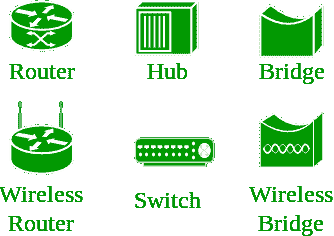
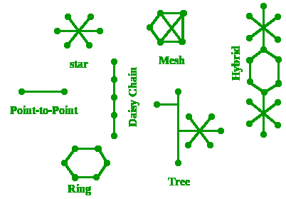
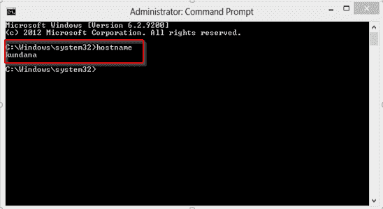
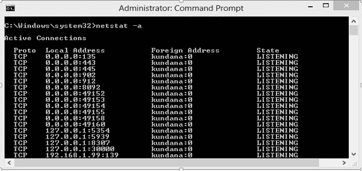
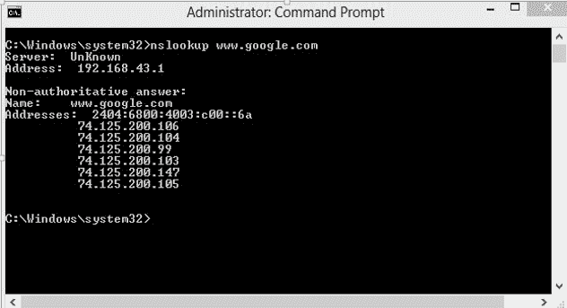

# 计算机网络基础

> 原文:[https://www.geeksforgeeks.org/basics-computer-networking/](https://www.geeksforgeeks.org/basics-computer-networking/)

**开放系统:**
连接到网络并准备通信的系统。

**封闭系统:**
未接入网络，无法通信的系统。

**计算机网络:**
为发送/接收数据或媒体而使用多条路径连接的多个设备(也称为主机)的互连。计算机网络还可以包括多个设备/介质，它们有助于两个不同设备之间的通信；这些被称为**网络设备**，包括路由器、交换机、集线器和网桥等。

**网络拓扑:**
网络中不同设备的布局安排。常见的例子包括:总线、星形、网状、环形和菊花链。

**OSI:**T2【OSI】代表**开放系统互联**。它是一个参考模型，规定了通信协议的标准以及每一层的功能。

**协议:**
协议是一组规则或算法，定义了两个实体如何通过网络通信，并且在现场视察模型的每一层都定义了不同的协议。这样的协议很少有 TCP、IP、UDP、ARP、DHCP、FTP 等等。

**<u>网络的唯一标识符</u>**
**主机名:**
网络中的每个设备都与一个称为主机名的唯一设备名相关联。
在命令提示符(管理员模式)中键入“主机名”，然后按“回车”，这将显示您机器的主机名。

**IP 地址(互联网协议地址):**
也称为逻辑地址，IP 地址是系统跨网络的网络地址。
为了识别万维网中的每台设备，互联网号码分配机构(IANA)为互联网上的每台设备分配一个 IPV4(版本 4)地址作为唯一标识符。
一个 IPv4 地址的长度是 32 位，因此，我们有 2 个 32 可用的 IP 地址。IPv6 地址的长度是 128 位。
*在命令提示符下键入“ipconfig”并按下“回车键”，这将为我们提供设备的 IP 地址。*

**MAC 地址(媒体访问控制地址):**
也称为物理地址，MAC 地址是每台主机的唯一标识符，并与其网卡(网络接口卡)相关联。
在制造时为网卡分配了一个媒体访问控制地址。
MAC 地址的长度为:12-半字节/ 6 字节/ 48 位
*在命令提示符下键入“ipconfig/all”并按下“回车键”，这就给出了 MAC 地址。*

**端口:**
端口可以称为逻辑通道，通过它可以向应用程序发送/接收数据。任何主机都可能有多个运行的应用程序，每个应用程序都是使用运行它们的端口号来标识的。
端口号是 16 位整数，因此，我们有 2 个 16 可用端口，分类如下:

<figure class="table">

| 端口类型 | 范围 |
| 著名的港口 | 0 – 1023 |
| 注册港口 | 1024 – 49151 |
| 短暂的港口 | 49152 – 65535 |

端口数量:65，536
范围:0–65535
*在命令提示符下键入“ **netstat -a** ，然后按“回车”，这将列出所有正在使用的端口。*

**套接字:**
IP 地址和端口号的唯一组合被称为套接字。

**<u>其他相关概念</u>**
**DNS 服务器:**
DNS 代表**域名系统**。
DNS 基本上是一个服务器，它把网址或网址(例如:www.google.com)翻译成它们相应的 IP 地址。我们不必记住每个网站的所有 IP 地址。
命令“ **nslookup** ”给出你要找的域的 IP 地址。这也提供了我们的域名系统服务器的信息。

**ARP:**
ARP 代表**地址解析协议**。
用于将一个 IP 地址转换为其对应的物理地址(即 MAC 地址)。
数据链路层使用 ARP 来识别接收方机器的媒体访问控制地址。

**RARP:**
RARP 代表**反向地址解析协议**。
顾名思义，它提供给定物理地址的设备的 IP 地址作为输入。但是自从 DHCP 问世以来，RARP 就已经过时了。

本文由**昆达娜·蒂亚里**供稿。如果你喜欢 GeeksforGeeks 并想投稿，你也可以使用[contribute.geeksforgeeks.org](http://www.contribute.geeksforgeeks.org)写一篇文章或者把你的文章邮寄到 contribute@geeksforgeeks.org。看到你的文章出现在极客博客主页上，帮助其他极客。

如果你发现任何不正确的地方，或者你想分享更多关于上面讨论的话题的信息，请写评论。

</figure>