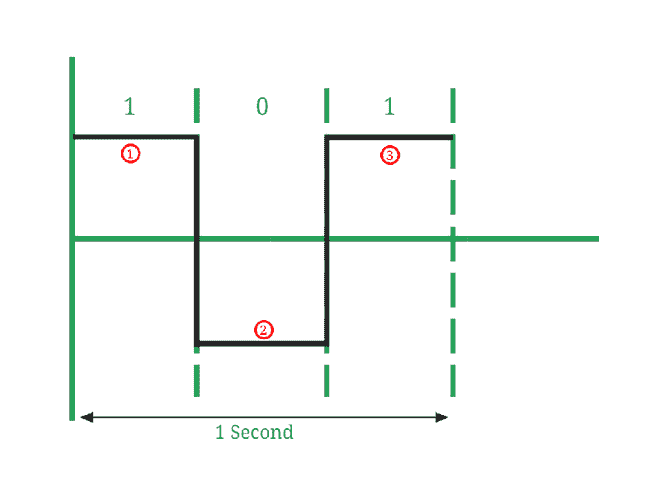

# 波特率及其重要性

> 原文:[https://www.geeksforgeeks.org/baud-rate-and-its-importance/](https://www.geeksforgeeks.org/baud-rate-and-its-importance/)

计算机通过传输介质将数字数据从一台设备传输到另一台设备来进行通信。您可以发送和接收数据，而不必担心设置细节。然而，对于某些设备，我们需要提供波特率和其他细节。

旧设备使用并行和串行通信端口，尽管它们的速度在今天被认为很慢。今天使用的所有设备都在计算机的后台处理所有的通信协调。

例如，当您将新设备插入计算机时，它会在安装设备驱动程序并对设备进行配置后提示类似“安装设备驱动程序”的消息，您永远不必重复此过程。尽管对于工业设备来说可能会有所不同，但他们可能会要求您提供诸如波特率、路由信息的通信端口等信息。

人们经常把波特率和比特率混为一谈，尽管它们完全不同。波特率可以高于或低于比特率，具体取决于所用编码方案的类型(如 NRZ、曼彻斯特等)。).

**1。比特率:**
比特率是每秒传输的二进制位数(1 或 0)。

```
Bit rate = number of bits transmitted/ total time (in seconds)
```

比特率也可以用波特率来定义:

```
Bit rate = Baud rate x bits per signal or symbol
```

**2。波特率:**
波特率是指信号通过传输介质时，每秒钟信号元素数量或信号变化的速率。波特率越高，数据发送/接收越快。

```
Baud rate = number of signal elements/total time (in seconds)
```

**例如:**



图像 1

*   在*图像 1* 中，信号元素的数量(用红色标记)= 3，传输的位数(1，0，1) = 3。所以，这里比特率= 3/1 =每秒 3 比特。并且，波特率= 3/1 =每秒 3 波特。


图像 2

*   在*图像 2* 中，信号元素的数量(用红色标记)= 6，传输的位数(1，1，0) = 3。所以，这里比特率= 3/1 =每秒 3 比特。并且，波特率= 6/1 = 6 波特每秒。

**信号元素:**信号元素是数字信号的最小单位。信号是几种电压、相位变化或频率之一。对于数字信号，1 个信号元素是具有恒定幅度的信号。对于模拟信号，1 个信号元素是具有相同幅度、相位和频率的信号。

**波特率为什么重要？**
波特率之所以重要，是因为:

*   波特率可以决定信号传输的带宽要求。
*   波特率也用于计算通信信道的比特率。
*   它是信号传输的调谐参数(即，它调整数据网络中的网络拥塞)。
*   它指定了通过串行线或串行接口发送数据的速度(这是一种通过单线以一系列位的形式发送数据的接口。).