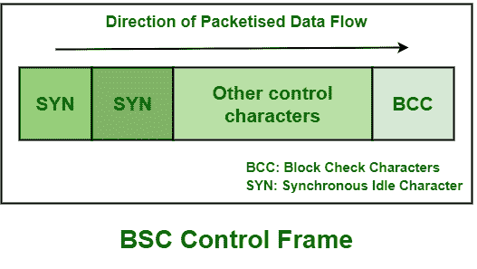
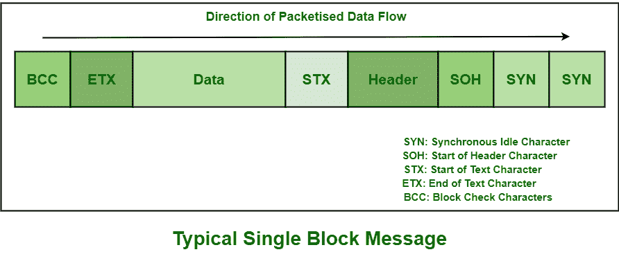
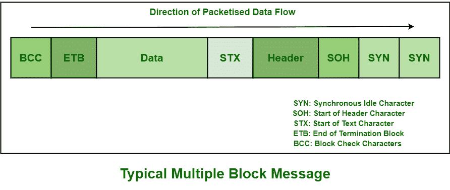

# 二进制同步通信(BISYNC)

> 原文:[https://www . geesforgeks . org/binary-synchronic-communication-bis ync/](https://www.geeksforgeeks.org/binary-synchronous-communication-bisync/)

**二进制同步通信(BISYNC)** 基本上是一种面向字符或字节的通信形式，这意味着比特或字节组是传输的重要元素，而不是比特流。 [BISYNC](https://www.geeksforgeeks.org/difference-between-bisync-and-hdlc-features/) 由 IBM 在 20 世纪 60 年代建立或起源，一般包括简单控制有效连接的建立或发展和数据传输的字符和程序。它是一种半双工链路协议，取代了通常用于第二代计算机的同步发送-接收(STR)协议。

它也被称为基本模式协议，用于传输基本上称为透明模式的面向比特的数据。它也在很大程度上被 IBM 更高效的协议所取代，即通常在 SAN(系统网络架构)下的[同步数据链路控制(SDLC)](https://www.geeksforgeeks.org/sdlc-types-and-topologies/) 。BSC 或 BISYNC 也用于描述各种类型的数据包，如下所示:

*   ENQ(查询)
*   确认(确认)
*   否定应答
*   传输结束

**帧的类型:**
基本上有两种类型的 BSC 或 BISYNC 帧，如下图所示:

**1。控制帧:**
这些帧基本上是设备之间交换信息或数据所必需的，以建立或获得初始连接，提供流量和错误控制，并在会话完全结束时断开设备。此帧不包含任何标头。

**2。数据帧:**
这些帧基本上都是需要承载用户数据的。它也用于显示数据传输的方向。BISYNC 允许两种类型的块消息，即单块和多块消息。这两个块的唯一区别是，单块消息中的数据将以 ETB(传输块结束)字符而不是 ETX(文本结束)字符结束。

**单块数据帧:**

**多块数据帧:**

**双同步的控制字符:**
双同步帧中使用的一些标准控制协议如下:

| 

性格；角色；字母

 | ASCII 码 | 功能 |
| --- | --- | --- |
| 确认 0 | DLE 0 | 已接收或准备接收好的偶数帧 |
| 确认 1 | DLE 1 | 收到良好的奇数帧 |
| DLE | DLE | 数据透明度标记 |
| 磁带结束符 | 磁带结束符 | 发送方终止 |
| 电文终了记号(End-of-Text) | 电文终了记号(End-of-Text) | 消息中文本的结尾 |
| 信息组传送结束(End of Transmission Block) | 信息组传送结束(End of Transmission Block) | 传输块结束:需要确认 |
| 段开销 | 段开销 | 标题信息开始 |
| 世腾船务 | 世腾船务 | 文本开始 |
| synchronizing 同步 | synchronizing 同步 | 提醒接收方收到帧 |

