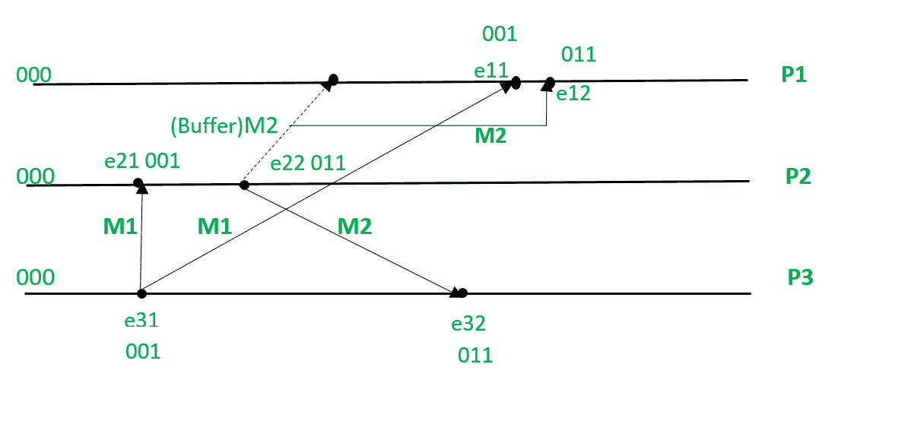

# 比尔曼·希珀·斯蒂芬森协议

> 哎哎哎:# t0]https://www . geeksforgeeks . org/birman-schper-Stephenson-protocol/

该[算法](https://www.geeksforgeeks.org/fundamentals-of-algorithms/)用于保持消息的因果顺序，即首先发送的消息应该首先被接收。如果发送(M1)–>发送(M2)，那么对于接收消息的所有进程，M1 和 M2 应该在 M2 之前接收 M1。

**特征:**

*   基于广播的消息传递。
*   消息的大小很小。
*   发送的消息数量更多。
*   有限的状态信息。

**要点:**

*   每个进程在发送消息时都会将其向量时钟增加 1。
*   如果一个进程已经收到了它之前的所有消息，那么这个消息就会被传递给这个进程。
*   否则缓冲消息。
*   更新进程的矢量时钟。

**参考:**

*   流程:P <sub>i</sub>
*   事件:e <sub>ij</sub> ，其中 i:process 为数字& j:正在进行中的事件。
*   T <sub>m</sub> :消息 m 的矢量时间戳
*   C <sub>i</sub> 与进程 P <sub>i</sub> 关联的矢量时钟；j <sup>第</sup>个元素是 C<sub>I</sub>【j】，包含 P <sub>i</sub> 当前时间在过程 P <sub>j</sub> 中的最新值

**协议:**
**P <sub>i</sub> 向 P<sub>j</sub>–**发送消息

*   P <sub>i</sub> 递增 C<sub>I</sub>【I】并为消息 m 设置时间戳 t<sub>m</sub>= C<sub>I</sub>【I】

**P <sub>j</sub> 收到来自 P<sub>I</sub>–**的消息

*   当 P <sub>j</sub> ，j！= i，接收到带有时间戳 t <sub>m</sub> 的 m，它延迟消息的传递，直到两者都如下。

    ```
    Cj[i] = tm[i] - 1; and
    for all k <= n and k != i, Cj[k] <= tm[k].
    ```

*   当消息传送到 P <sub>j</sub> 时，更新 P <sub>j</sub> 的矢量时钟。
*   检查缓冲区，看看是否有可以交付的。

**示例–**



*   所有进程的初始状态都是 000。*   M1 从 P3 向 P1 和 P2 广播。e31 将矢量时钟更新为(001)并发送 P1 和 P2。*   P2 接受带有时间戳(001)的 M1，因为当它将其与其初始时间戳(即 000)进行比较时，它发现 M1 是它接收的第一条消息。*   现在我们考虑在 M1 到达 P1 之前，P2 将 M2 发送到带有时间戳(011)的 P1 和 P3。*   P1 无法接受 M2，因为在将 M2 的时间戳与其初始时间戳进行比较时，发现了一个差异，因为 P1 没有较早收到时间戳为(001)的消息，所以 M2 存储在缓冲区中。*   现在 M1 被 P1 接受了。*   M2 被从缓冲区中移除，并被 P1 接受。*   M2 被 P3 接受，因为时间戳没有差异。