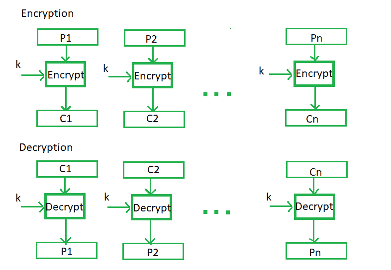
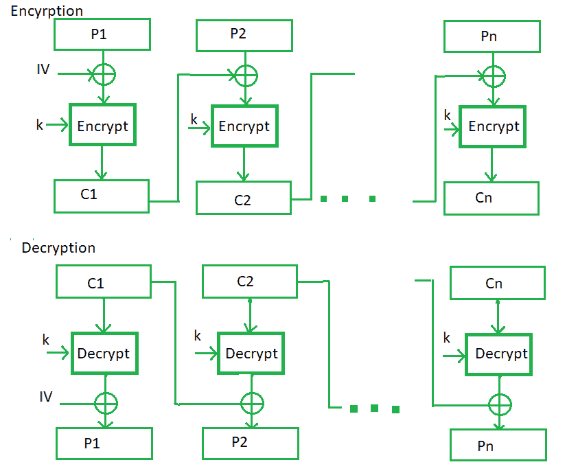
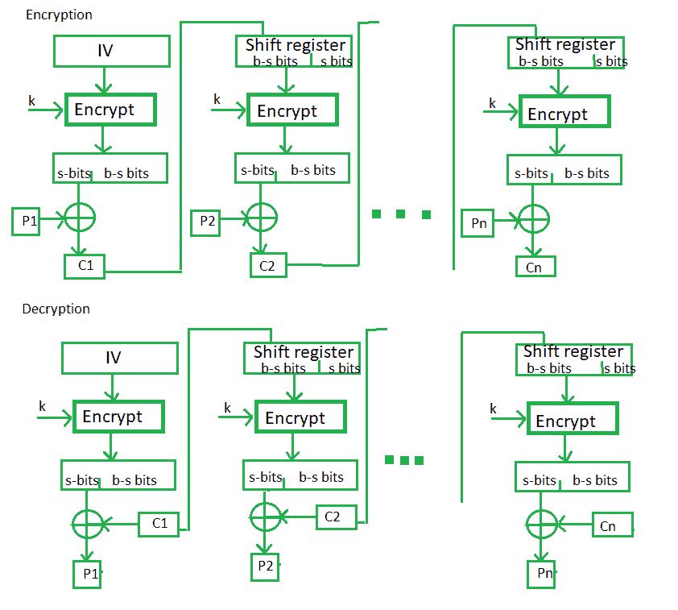
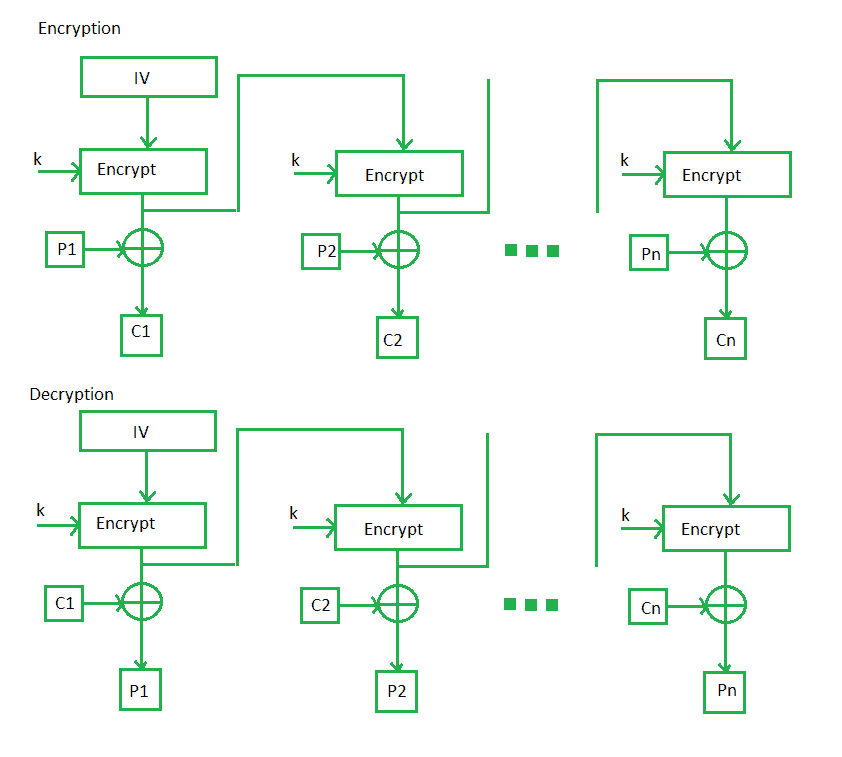
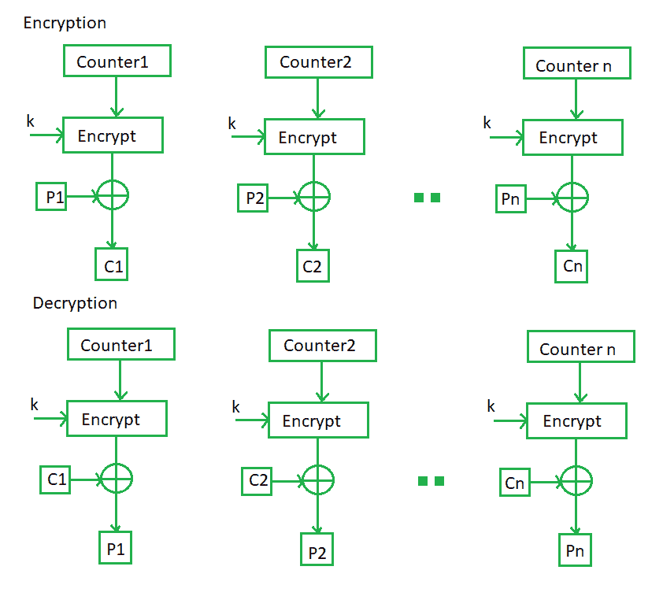

# 分组密码操作模式

> 原文:[https://www . geesforgeks . org/block-cipher-operation-modes/](https://www.geeksforgeeks.org/block-cipher-modes-of-operation/)

加密算法根据输入类型分为两类，即分组密码和流密码。**分组密码**是一种加密算法，它采用固定大小的输入，比如说 *b* 位，并再次产生 *b* 位的密文。如果输入大于 *b* 位，可以进一步划分。对于不同的应用和用途，分组密码有几种操作模式。

**电子码本(ECB)–**
电子码本是最简单的分组密码运行模式。这更容易，因为每个输入明文块直接加密，而输出是加密密文块的形式。一般来说，如果一条消息的大小大于 *b* 位，它可以被分解成一堆块，并重复该过程。

欧洲中央银行的程序如下所示:

**使用 ECB 的优势–**

*   位块的并行加密是可能的，因此这是一种更快的加密方式。
*   分组密码的简单方法。

**使用 ECB 的缺点–**

*   易于进行密码分析，因为明文和密文之间有直接关系。

**密码块链接–**
密码块链接或 CBC 是欧洲央行的一项进步，因为欧洲央行妥协了一些安全要求。在 CBC 中，前一个密码块在与原始明文块异或后作为下一个加密算法的输入。简而言之，密码块是通过对先前密码块和当前明文块的异或输出进行加密而产生的。

该过程如下所示:

**CBC 的优势–**

*   对于大于 *b* 位的输入，CBC 工作良好。
*   CBC 是一种很好的认证机制。
*   对密码分析的抵抗力比欧洲中央银行强。

**CBC 的缺点–**

*   并行加密是不可能的，因为每个加密都需要一个先前的密码。

**密码反馈模式(CFB)–**
在这种模式下，密码以一些新的规范作为对下一个加密块的反馈给出:首先，初始向量 IV 用于第一次加密，并且输出位被划分为一组 *s* 和 *b-s* 位。左侧的 *s* 位被选择，并且被应用与明文位的异或运算。结果作为输入提供给移位寄存器，过程继续。相同的加密和解密过程如下所示，两者都使用加密算法。

**CFB 优势–**

*   由于移位寄存器的使用会导致一些数据丢失，因此很难进行密码分析。

**输出反馈模式–**
输出反馈模式遵循与密码反馈模式几乎相同的过程，只是它发送加密输出作为反馈，而不是作为异或输出的实际密码。在这种输出反馈模式下，发送块的所有位，而不是发送选定的 *s* 位。分组密码的输出反馈模式对比特传输误差有很大的抵抗力。它还减少了密码对明文的依赖或关系。

**OFB 优势–**

*   在 CFB 的情况下，一个块中的单个比特错误被传播到所有后续的块。这个问题由 OFB 解决，因为它在明文块中没有比特错误。

**计数器模式–**
计数器模式或 CTR 是一种简单的基于计数器的分组密码实现。每次计数器启动的值被加密并作为输入与明文进行异或运算，从而产生密文块。CTR 模式独立于反馈使用，因此可以并行实现。

它的简单实现如下所示:

**计数器的优势–**

*   由于每个块有不同的计数器值，避免了直接明文和密文的关系。这意味着相同的纯文本可以映射到不同的密文。
*   加密的并行执行是可能的，因为前几个阶段的输出没有像 CBC 那样被链接。