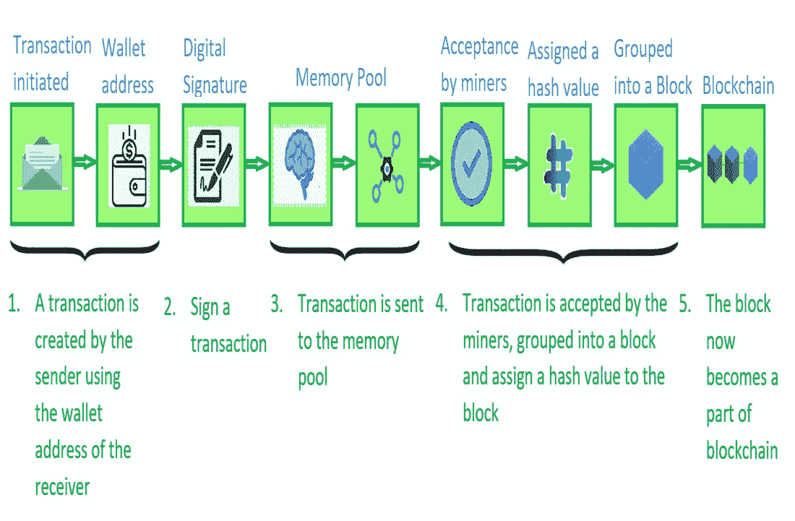

# 区块链交易生命周期

> 原文:[https://www . geeksforgeeks . org/区块链-交易-生命周期/](https://www.geeksforgeeks.org/blockchain-transaction-life-cycle/)

[区块链](https://www.geeksforgeeks.org/blockchain-technology-introduction/)技术主要是关于我们为自己进行数字化的交易。最终，这些事务会到达后来成为区块链一部分的各个区块。所以，了解区块链技术中的**交易生命周期很重要。**

这一生命周期遵循单一交易的历程，因为它经历了加入区块链进程的每个阶段。简单来说，交易就是汇款人汇款，收款人收款的过程。区块链交易也很相似，但它是数字化的。

让我们借助一个例子来理解区块链交易生命周期的各个阶段。
Sourav 和 Suraj 是两个**比特币**用户。Sourav 想给 Suraj 发 1 个比特币。

1.  首先，Sourav 获得 Suraj 的钱包地址(区块链的钱包是一个数字钱包，允许用户管理他们的交易)。利用这些信息，他从钱包中创建了 1 个比特币的新交易，并包括 0.003 个比特币的交易费。
2.  接下来，他验证信息并发送交易。发起的每个事务都由发送者的数字签名签名，该数字签名基本上是发送者的私钥。这样做是为了使交易更加安全，并防止任何欺诈。
3.  然后，Sourav 的钱包启动交易签名算法，该算法使用他的私钥对他的交易进行签名。
4.  事务现在被广播到网络内的内存池。
5.  这笔交易最终被矿工们接受了。这些矿工将该事务分组到一个块中，找到**工作证明**，并为该块分配一个**哈希值**以映射到区块链。
6.  该区块现在位于区块链上。
7.  随着该块获得确认，它被作为网络中的有效交易接受。
8.  一旦这笔交易被接受，苏拉吉最终得到了他的比特币。

下图是上面讨论的事务生命周期中各个阶段的图示。

区块链中的事务生命周期