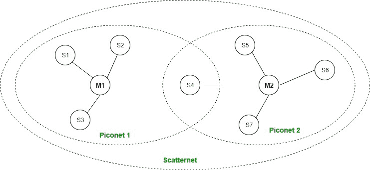
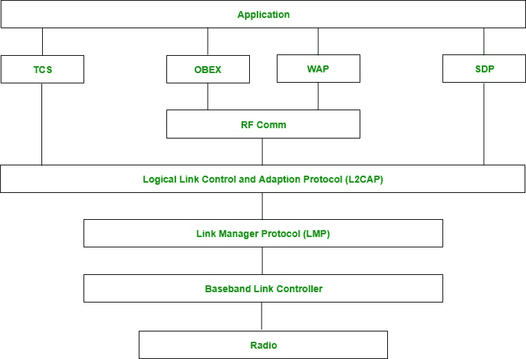

# 蓝牙

> 哎哎哎:# t0]https://www . geeksforgeeks . org/bluetooth/

这是一种无线个人区域网(WPAN)技术，用于较小距离的数据交换。这项技术是埃里克森在 1994 年发明的。它在 2.4 千兆赫至 2.485 千兆赫的未经许可的工业、科学和医疗(ISM)频段运行。最多可同时连接 7 台设备。蓝牙范围可达 10 米。它提供高达 1 Mbps 或 3 Mbps 的数据速率，具体取决于版本。它使用的扩频技术是 FHSS(跳频扩频)。蓝牙网络被称为**微微网**，互连微微网的集合被称为**分散网**。

**蓝牙架构:**

蓝牙的架构定义了两种类型的网络:

```
1\. Piconet
2\. Scatternet
```



**微微网:**

微微网是一种蓝牙网络，它包含一个主节点**和七个活动的次节点**，主节点称为主节点，**称为从节点。因此，我们可以说在 10 米的距离上总共有 8 个活动节点。主节点和辅助节点之间的通信可以是一对一或一对多。可能的通信只在主从之间；从-从通信是不可能的。它还有 **255 个停靠节点**，这些都是辅助节点，除非转换到活动状态，否则无法参与通信。**

**分散网:**

使用**各种微微网**组成。存在于一个微微网中的从设备可以作为主设备，或者我们可以说是另一个微微网中的主设备。这种节点可以从一个微微网中的主节点接收消息，并将该消息传递给它的从节点，进入它作为从节点的另一个微微网中。这种类型节点被称为桥节点。一个站不能在两个微微网中主控。

**蓝牙协议栈:**



1.  **射频层:**
    将数据调制/解调为射频信号。它定义了蓝牙收发器的物理特性。它定义了两种类型的物理链路:无连接和面向连接。

2.  **基带链路层:**
    它执行微微网内的连接建立。

3.  **链路管理器协议层:**
    它执行已经建立的链路的管理。它还包括身份验证和加密过程。

4.  **逻辑链路控制和适配协议层:**
    它也被称为蓝牙协议栈的核心。它允许蓝牙协议栈的上层和下层之间的通信。它将从上层接收的数据包打包成下层期望的形式。它还执行分段和多路复用。

5.  **SDP 层:**
    是服务发现协议的简称。它允许发现另一个支持蓝牙的设备上可用的服务。

6.  **射频通信层:**
    是无线电前端组件的简称。它提供了与 WAP 和 OBEX 的串行接口。

7.  **OBEX:**
    是对象交换的简称。它是一种在两台设备之间交换对象的通信协议。

8.  **WAP:**
    是无线接入协议的简称。它是用来上网的。

9.  **TCS:**
    是电话控制协议的简称。它提供电话服务。

10.  **应用层:**
    它使用户能够与应用程序进行交互。

**优势:**

*   低成本。
*   易于使用。
*   它也能穿透墙壁。
*   它会立即创建一个临时连接，无需任何电线。
*   它用于语音和数据传输。

**缺点:**

*   它可能被黑客攻击，因此不太安全。
*   它的数据传输速率很慢:3 Mbps。
*   它的射程很小:10 米。