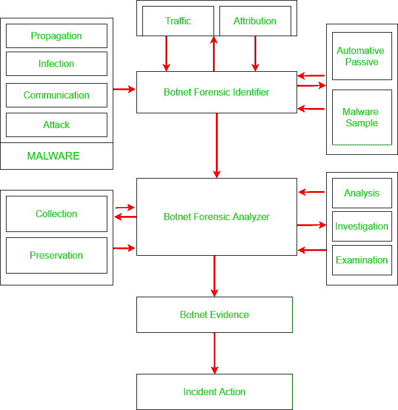

# 僵尸网络取证-简介

> 原文:[https://www . geesforgeks . org/botnet-forensics-an-introduction/](https://www.geeksforgeeks.org/botnet-forensics-an-introduction/)

僵尸网络是由被称为 botmaster 或 botherder 的恶意程序员执行的程序。Botherder 将感染或病毒发送到虚弱用户的计算机，其有效负载是恶意应用程序。它通过命令和控制服务器连接。垃圾邮件发送者从 botherder 购买服务，然后 botherder 自己发出更新的命令。僵尸网络法医处理僵尸网络攻击及其相关漏洞的事后活动。僵尸网络取证在当今至关重要，因为它从外部和内部网络攻击中帮助和阻止组织。

> 在本文中，我们将涵盖以下主题:
> 
> *   **什么是僵尸网络取证？***   **僵尸网络取证的分类。***   **僵尸网络取证框架。***   **僵尸网络取证框架面临的挑战。**

**让我们开始详细介绍这些部分。**

### **什么是僵尸网络取证？**

****僵尸网络取证**是确定入侵范围并应用方法找出感染类型的科学。这是对僵尸网络攻击的调查，包括收集、识别、检测、获取和归因等一系列活动。僵尸网络取证的主要目标是测量入侵的级别，调查入侵，并提供信息以从入侵中恢复，从而加强系统安全。**

**僵尸网络取证提供的信息可用于:**

*   **加强安全工具。**
*   **理解作案手法。**
*   **将来可以用来防止对网络安全的潜在威胁。**

**僵尸网络取证不仅可以确保网络安全，还可以方便执法。**

## **僵尸网络取证系统的分类**

**总体而言，僵尸网络取证领域的整个研究可以分为以下几类**

### **基于有效载荷的分类:**

**在这种情况下，数据包根据有效载荷的字段进行分类。有效负载使用分类技术，如深度数据包检测，利用签名分析对流量进行验证和分类。签名分析可以有其他类型–**

****启发式分析:**启发式分析包括监控网络流量以*识别可疑网络流量*。使用处理器基于对可疑网络流量行为的启发式分析来检测机器人。
这里的可疑网络流量行为包括与僵尸主机相关的命令和控制流量。启发式分析和行为分析并行不悖。一些防病毒软件利用这两种技术来识别病毒和感染。**

****行为分析:**行为分析和启发式分析同时进行，几种抗病毒药物利用这两种技术来识别病毒和感染。**

****模式分析:**应用程序在数据包的有效负载中有一些模式，可以用来识别协议。该模式可以出现在包中的任何位置。**

****数值分析:**这包括考虑数据包的数值特征，如有效载荷大小、响应数据包的数量等。**

### **基于签名的分类:**

**这里的主要目标是检测、调查性质，并找出在给定有效载荷中运行的位串的特征。这种分类方法被用在弗雷德里克顿市经营的免费网络服务提供商 fredezone 上。**

### **基于决策树的分类:**

**在这种方法中，当将数据分割成更小的子集时，同时生成决策树。结果以具有决策节点和叶节点的树的形式呈现。当您处理未知流量时，这是用于分类的最佳技术。**

### **基于集成的分类:**

**Rokach 等人将集合模型分为依赖和独立方法。在从属方法中，最熟悉的模型实例是增强，即重采样和组合。用于提高分布式训练数据的周分类性能。通过迭代过程，AdaBoost 是一种众所周知的集成算法，改进了一种简单的 boosting 算法。独立的众所周知的方法是装袋和摇动。**

## **僵尸网络取证框架**

**在本节中，我们将在现有模型和研究的基础上讨论僵尸网络取证的通用框架。**

****

**僵尸网络取证框架包括 **5 个阶段**–**

### **1.恶意软件:**

**第一个阶段是恶意软件阶段。它涉及传播、感染、通信和攻击，将显示恶意软件的阶段。IRC 是最常见和使用最广泛的信道。此阶段显示恶意软件的类型，无论是僵尸网络还是其他类型的恶意软件。**

### **2.僵尸网络法医调查员:**

**这是僵尸网络取证框架的第二阶段。这一阶段的重点是–**

*   **确定系统是否受到危害或感染。**
*   **万一系统遭到破坏，它将识别这是机器人攻击还是其他类型的攻击。**
*   **它通过侦察流量、属性、汽车被动和恶意软件样本来搜索机器人。**
*   **它还侧重于属性，汽车被动和恶意软件样本。**

### **3.僵尸网络取证分析器:**

**这是僵尸网络取证框架的第三个阶段。该阶段包括–**

*   **分析从标识符阶段生成的结果。**
*   **它在刑事调查后进行搜索。**
*   **如果标识符确保了恶意软件，那么分析器将寻找它是什么类型的恶意软件，它在哪里被感染。**
*   **它用实际信息找出线索，并将所有细节转发给僵尸网络证据阶段。**
*   **这个阶段包括分析、调查、检查、收集和保存等阶段。**

### **4.僵尸网络证据:**

**这是僵尸网络取证框架的第四阶段。此阶段从所有先前阶段收集所有信息，并将其转发到事件响应阶段 3。**

### **5.事件操作:**

**这是僵尸网络取证框架的最后一个阶段。这个阶段包括三个活动——遏制、根除和恢复。该阶段包括以下步骤–**

*   **在收集了所有信息并对事件有所了解后，红外小组将开始打击威胁。**
*   **它包括采取措施防止进一步的损害。**
*   **威胁解决后，恢复步骤包括通过采取加强网络安全、重建系统和替换受损文件等措施，将系统恢复到正常功能。**

## **僵尸网络取证面临的挑战**

**僵尸网络取证在不同阶段有一些限制。我们将突出每个阶段的差距。**

### **1.收集阶段–**

**应该有一种有效的机制来从数据包捕获中识别攻击特征，并通过高速网络实时捕获机器人流量。**

### **2.识别阶段–**

**此阶段有以下限制:**

*   **需要同时识别攻击以触发取证过程。**
*   **应该可以实时识别攻击类型。**
*   **应该有一种有效的技术来识别集中式僵尸网络。**
*   **必须识别恶意网络事件。**

### **3.分析阶段–**

**这个阶段有一些限制，例如:**

*   **对 IRC 流量的深入分析仍然是一个挑战。**
*   **需要机器学习技术来改进算法。**
*   **在 Waledac 流量和 P2P 流量的情况下，很难检测到流量。**
*   **为了侦察，必须考虑来自受损网络的各种主机的信息。**
*   **攻击信息和警报必须来自安全传感器的组合，因为没有任何单一的安全工具能够提供全面的警报信息。**

**僵尸网络取证是对僵尸网络的主动和被动调查。然而，这项研究是基于先前的研究反应调查。本文重点介绍僵尸网络取证的不同分类、框架和挑战。** 

****参考文献–****

*   **[https://en . Wikipedia . org/wiki/botnet](https://en.wikipedia.org/wiki/Botnet)**
*   **[研究之门](https://www.researchgate.net/publication/326247042_BOTNET_FORENSIC_ISSUES_CHALLENGES_AND_GOOD_PRACTICES)**