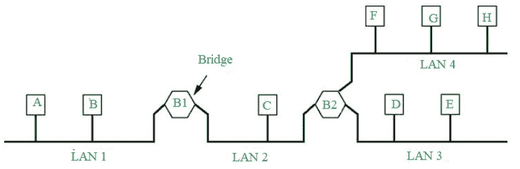

# 网桥(本地互联设备)

> 原文:[https://www . geesforgeks . org/bridges-local-interneting-device/](https://www.geeksforgeeks.org/bridges-local-internetworking-device/)

先决条件–[网络设备](https://www.geeksforgeeks.org/network-devices-hub-repeater-bridge-switch-router-gateways/)、[交换机类型](https://www.geeksforgeeks.org/computer-network-types-of-switches/)、
、**本地互联**是同一组织内的设备，即同一建筑物或同一校园内的设备，那么对于联网，我们可能不需要路由器的全部功率。我们可以用一种叫做网桥的数据链路层设备来实现。

**网桥:**
网桥是数据链路层设备，可以连接不同的网络，也可以连接不同类型的不同网络。从 802.x 到 802.y 的桥，其中 x & y 可以都是以太网，或者一个可以是以太网，另一个可以是令牌环，等等。它在本地连接小型局域网，而如果局域网很大，那么网桥就不能再处理它们了。网桥遵循 IEEE 格式的协议，执行 802.1，它是网桥的生成树。

在上图中，有四个局域网通过两个网桥连接。网桥 1 有两个端口，一个连接到局域网 1，另一个连接到局域网 2，网桥 2 有三个连接到局域网 2、局域网 3 和局域网 4。所以，A 可以通过两个桥与 H 通信。

*   **Bridges (Link Layer Device) –** 
    It stores and forwards Ethernet frames, i.e., it has to do with the MAC address rather than the IP address, they handle the hardware addresses. I also examine the frame header and selectively forward frames based on MAC destination address, such as in the given figure if Bridge 2 receives a packet then it will selectively decide whether to send it to LAN 3 or LAN 4. 

    当帧要在一个段中转发时，它使用 CSMA/光盘来访问该段。这些都是透明的，也就是说，主机不知道网桥的存在，在它们看来，网桥就像一个完整的网络。桥不需要配置，它们是即插即用和自学习设备，即桥有一个学习表，它们学习哪些主机可以通过哪些接口到达。在物理层面，网桥像中继器一样增强信号强度，或者完全再生信号。

*   **以太网网桥–**
    网桥存储从每个接口接收的帧中观察到的硬件地址，并使用该信息来了解网桥需要转发哪些帧。

如果主机移动到另一个网段，或者新主机连接到一个网段，该怎么办？
如果连接了新的主机，那么网桥的学习过程将是一个连续的过程。假设我们将某台机器从局域网 1 移动到局域网 2，即媒体访问控制地址从局域网 1 移动到局域网 2，这意味着表条目应该在一段时间后离开，以便数据保持新鲜和相关。

**桥接生成树:**
为了提高可靠性，希望从源到目的地有冗余的替代路径，如果有多条路径，就会产生周期——桥接可能会成倍增加并永远转发帧，而不会丢失帧。解决方案是通过禁用接口子集来组织生成树中的网桥。