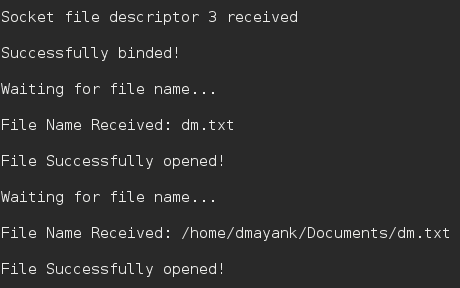
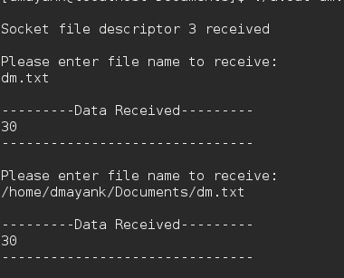

# 使用 UDP 进行文件传输的 C 程序

> 原文:[https://www . geesforgeks . org/c-program-for-file-transfer-use-UDP/](https://www.geeksforgeeks.org/c-program-for-file-transfer-using-udp/)

使用 C 中的 [Socket 编程，可以在两台电脑之间传输数据。](https://www.geeksforgeeks.org/socket-programming-cc/)

同样，可以使用 UDP 协议和简单的客户机/服务器轻松发送文件。

安全性:通过加密处理。

协议:UDP
加密:[异或加密](https://www.geeksforgeeks.org/xor-cipher/)

**算法:**

```
1\. The server starts and waits for filename.
2\. The client sends a filename.
3\. The server receives filename.
   If file is present,
   server starts reading file 
   and continues to send a buffer filled with
   file contents encrypted until file-end is reached.
4\. End is marked by EOF.
5\. File is received as buffers until EOF is 
received. Then it is decrypted.
6\. If Not present, a file not found is sent.

```

**服务器:**

```
// server code for UDP socket programming
#include <arpa/inet.h>
#include <netinet/in.h>
#include <stdio.h>
#include <stdlib.h>
#include <string.h>
#include <sys/socket.h>
#include <sys/types.h>
#include <unistd.h>

#define IP_PROTOCOL 0
#define PORT_NO 15050
#define NET_BUF_SIZE 32
#define cipherKey 'S'
#define sendrecvflag 0
#define nofile "File Not Found!"

// function to clear buffer
void clearBuf(char* b)
{
    int i;
    for (i = 0; i < NET_BUF_SIZE; i++)
        b[i] = '\0';
}

// function to encrypt
char Cipher(char ch)
{
    return ch ^ cipherKey;
}

// function sending file
int sendFile(FILE* fp, char* buf, int s)
{
    int i, len;
    if (fp == NULL) {
        strcpy(buf, nofile);
        len = strlen(nofile);
        buf[len] = EOF;
        for (i = 0; i <= len; i++)
            buf[i] = Cipher(buf[i]);
        return 1;
    }

    char ch, ch2;
    for (i = 0; i < s; i++) {
        ch = fgetc(fp);
        ch2 = Cipher(ch);
        buf[i] = ch2;
        if (ch == EOF)
            return 1;
    }
    return 0;
}

// driver code
int main()
{
    int sockfd, nBytes;
    struct sockaddr_in addr_con;
    int addrlen = sizeof(addr_con);
    addr_con.sin_family = AF_INET;
    addr_con.sin_port = htons(PORT_NO);
    addr_con.sin_addr.s_addr = INADDR_ANY;
    char net_buf[NET_BUF_SIZE];
    FILE* fp;

    // socket()
    sockfd = socket(AF_INET, SOCK_DGRAM, IP_PROTOCOL);

    if (sockfd < 0)
        printf("\nfile descriptor not received!!\n");
    else
        printf("\nfile descriptor %d received\n", sockfd);

    // bind()
    if (bind(sockfd, (struct sockaddr*)&addr_con, sizeof(addr_con)) == 0)
        printf("\nSuccessfully binded!\n");
    else
        printf("\nBinding Failed!\n");

    while (1) {
        printf("\nWaiting for file name...\n");

        // receive file name
        clearBuf(net_buf);

        nBytes = recvfrom(sockfd, net_buf,
                          NET_BUF_SIZE, sendrecvflag,
                          (struct sockaddr*)&addr_con, &addrlen);

        fp = fopen(net_buf, "r");
        printf("\nFile Name Received: %s\n", net_buf);
        if (fp == NULL)
            printf("\nFile open failed!\n");
        else
            printf("\nFile Successfully opened!\n");

        while (1) {

            // process
            if (sendFile(fp, net_buf, NET_BUF_SIZE)) {
                sendto(sockfd, net_buf, NET_BUF_SIZE,
                       sendrecvflag, 
                    (struct sockaddr*)&addr_con, addrlen);
                break;
            }

            // send
            sendto(sockfd, net_buf, NET_BUF_SIZE,
                   sendrecvflag,
                (struct sockaddr*)&addr_con, addrlen);
            clearBuf(net_buf);
        }
        if (fp != NULL)
            fclose(fp);
    }
    return 0;
}
```

**客户:**

```
// client code for UDP socket programming
#include <arpa/inet.h>
#include <netinet/in.h>
#include <stdio.h>
#include <stdlib.h>
#include <string.h>
#include <sys/socket.h>
#include <sys/types.h>
#include <unistd.h>

#define IP_PROTOCOL 0
#define IP_ADDRESS "127.0.0.1" // localhost
#define PORT_NO 15050
#define NET_BUF_SIZE 32
#define cipherKey 'S'
#define sendrecvflag 0

// function to clear buffer
void clearBuf(char* b)
{
    int i;
    for (i = 0; i < NET_BUF_SIZE; i++)
        b[i] = '\0';
}

// function for decryption
char Cipher(char ch)
{
    return ch ^ cipherKey;
}

// function to receive file
int recvFile(char* buf, int s)
{
    int i;
    char ch;
    for (i = 0; i < s; i++) {
        ch = buf[i];
        ch = Cipher(ch);
        if (ch == EOF)
            return 1;
        else
            printf("%c", ch);
    }
    return 0;
}

// driver code
int main()
{
    int sockfd, nBytes;
    struct sockaddr_in addr_con;
    int addrlen = sizeof(addr_con);
    addr_con.sin_family = AF_INET;
    addr_con.sin_port = htons(PORT_NO);
    addr_con.sin_addr.s_addr = inet_addr(IP_ADDRESS);
    char net_buf[NET_BUF_SIZE];
    FILE* fp;

    // socket()
    sockfd = socket(AF_INET, SOCK_DGRAM,
                    IP_PROTOCOL);

    if (sockfd < 0)
        printf("\nfile descriptor not received!!\n");
    else
        printf("\nfile descriptor %d received\n", sockfd);

    while (1) {
        printf("\nPlease enter file name to receive:\n");
        scanf("%s", net_buf);
        sendto(sockfd, net_buf, NET_BUF_SIZE,
               sendrecvflag, (struct sockaddr*)&addr_con,
               addrlen);

        printf("\n---------Data Received---------\n");

        while (1) {
            // receive
            clearBuf(net_buf);
            nBytes = recvfrom(sockfd, net_buf, NET_BUF_SIZE,
                              sendrecvflag, (struct sockaddr*)&addr_con,
                              &addrlen);

            // process
            if (recvFile(net_buf, NET_BUF_SIZE)) {
                break;
            }
        }
        printf("\n-------------------------------\n");
    }
    return 0;
}
```

**输出:**
服务器:
T5】客户端:
