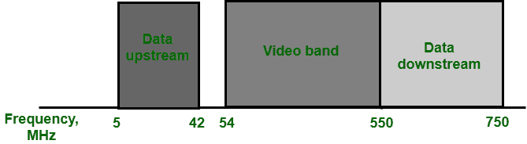

# 数据传输有线电视

> 原文:[https://www.geeksforgeeks.org/cable-tv-for-data-transfer/](https://www.geeksforgeeks.org/cable-tv-for-data-transfer/)

在这个时代，有线电视公司正在与电话公司竞争想要高速数据传输的住宅客户。为了提供高速数据传输，使用了有线电视网络。要了解这项技术，需要考虑以下几点:

**带宽:**

正如我们在 HFC 系统中也研究过的，它使用光纤模式，但在这种情况下，同轴电缆仍然用于光纤节点到用户驻地。同轴电缆的带宽范围为 5 至 750 兆赫。为了提供互联网接入，有线电视公司将该带宽分为三个频段，即视频频段、下行和上行，如下图所示:

有线电视对同轴电缆频带的划分

**下游视频频段:**下游视频频段的频率为上频段，即约 54 至 550 MHz。每个电视频道占用 6 兆赫，因此，它可以容纳 80 多个频道。

**下游数据频段:**频率范围为 550 至 750 兆赫。和下游视频频段一样，也分为 6 MHz 通道。下游数据使用 64-QAM 调制技术进行调制。

**数据速率:**因为 64-QAM 中有 6 位。在这 6 位中，一位用于检查转发错误，其余 5 位为每波特数据。有一个标准规定每个波特率为 1hz。所以，通过计算，我们可以说下行数据可以 30Mbps 接收。但是，通过 10 Base-T 电缆连接到计算机的电缆调制解调器将数据速率限制为 10 兆位/秒。

**上游数据频段:**与下游数据频段截然相反，因为它的频段较低，约为 5 至 42 兆赫。但从划分来看，和下游数据频段是一样的，因为它也把频段划分为 6MHz。由于较低的频率范围，它更容易受到噪声和干扰，因此，调制技术采用 QPSK 方法。

**数据速率:**由于它使用 QPSK 调制技术，所以它使用 2 位/波特。该标准规定每个波特率为 1 Hz。因此，上行数据可以以 12 Mbps 的速度发送。

**共享**

上行和下行频段，均由用户共享。

**上行共享:**上行数据带宽只有 37 MHz，所以上行方向只有 6-MHz 的信道可用。分时方法用于通过用户共享 6 个频道。

**下游共享:**下游频段有 33 个 6MHz 信道，用户数约 33 个。这里采用多播解决方案来在用户组之间共享每个信道。

**CM 和 CMTS**

对于使用电缆网络的数据传输，使用两个关键设备，即电缆调制解调器和电缆调制解调器传输系统。

**电缆调制解调器:**安装在用户驻地。它类似于 ADSL。

**CMTS(电缆调制解调器传输系统):**由电缆公司安装在配电集线器内部。它从互联网上接收数据，并将它们传递给合并器，合并器将它们发送给用户，反之亦然。

**数据传输方案:DOCSIS**

数据传输最常用的方法是由多媒体电缆网络系统设计的，称为**电缆系统接口规范(DOCSIS)。**它指定了从 CMTS 向 CM 传输数据所需的所有协议。

**上行通信:**以下是 DOCSIS 为上行通信定义的非常简化的协议版本。以下是 CM 遵循的步骤:

1.  CM 检查 CMTS 定期发送的特定数据包。数据包本身要求任何新的 CM 在特定的上行信道上通告。
2.  CMTS 通过定义它的上游和下游向 CM 发送一个数据包。
3.  被称为测距的过程由 CM 启动，CM 确定 CM 和 CMTS 之间的距离，用于 CM 和 CMTS 之间的同步。
4.  CM 向 ISP 发送一个数据包，用于访问互联网地址。
5.  为了建立安全参数，CM 和 CMTS 在它们之间交换数据包。
6.  然后 CM 将其唯一标识符发送到 CMTS。
7.  在分配的上行信道中，上行通信开始。

**下游通信:**下游通道的通信要简单得多。只有一个发送方，CMTS 使用分配的下行信道发送带有接收方 CM 地址的数据包。

**有线电视优势:**

*   有线电视服务稳定。
*   它相当便宜。

**有线电视的劣势:**

*   由于只有一个供应商，这就造成了垄断。
*   当我们的电视电缆连接到互联网时，会导致更少的隐私。