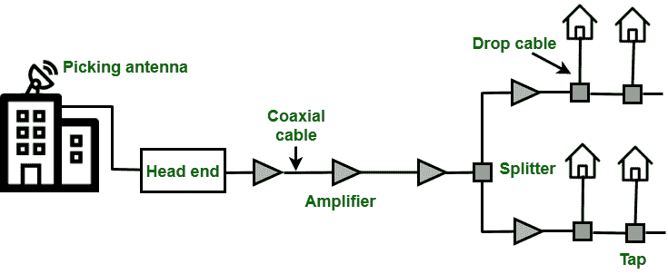
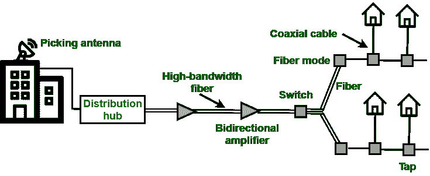

# 有线电视网络

> 原文:[https://www.geeksforgeeks.org/cable-tv-networks/](https://www.geeksforgeeks.org/cable-tv-networks/)

**[有线电视](https://www.geeksforgeeks.org/cable-tv-for-data-transfer/)** 网络开始的业务只是视频服务提供商，但随着技术的新进步，它已经转向了互联网接入业务。也指利用传输媒体分发电视信号的系统。有线电视网络的类型如下

1.  传统的有线网络
2.  混合光纤同轴网络

**传统有线网络:**
该网络开始向接收不良或无接收的地点分发广播视频信号。传统的有线网络也称为社区天线电视，因为这种天线位于建筑物的最高处，用于从电视台接收信号，然后通过同轴电缆将这些信号分配给社区。以下是传统有线电视网络示意图。

**传统有线电视网络**

在这种情况下，有线电视办公室被称为前端，它可以从广播站接收视频信号，然后将信号馈送到同轴电缆中。由于距离的增加，信号越来越弱，为此，通过这个网络安装了放大器来再生信号。在这个网络中，我们在前端和用户驻地之间有超过 35 个放大器。在有线电视网络的另一端，放置了分离器来分离信号，分接电缆和引入电缆连接到用户驻地。这个网络中的通信是单向的。视频信号从前端向下游传输到用户驻地。

**混合光纤-同轴网络:**
混合光纤-同轴网络是指第二代电缆网络。这种类型的网络使用光纤和同轴电缆的组合。使用的传输模式是光纤节点，即光纤模式。HFC 网络的示意图如下

**混合光纤同轴网络**

**区域有线电视头**服务的用户接近 40 万。信号通过光缆发送到光纤节点后，通过**分配集线器**进行调制和解调。光纤节点分离模拟信号，以便将相同的信号发送到每根同轴电缆。近似的 1000 个用户由同轴电缆服务。这方面的交流是双向的。

**有线电视网络优势:**

*   有线电视服务稳定。
*   它相当便宜。

**有线电视网络劣势:**

*   由于单一供应商的供应，造成垄断。
*   当电视电缆连接到互联网或万维网时，它会导致更少的隐私。