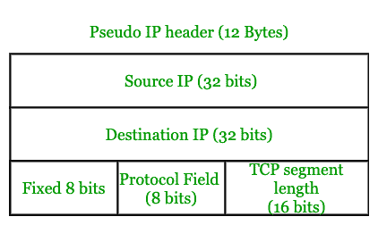
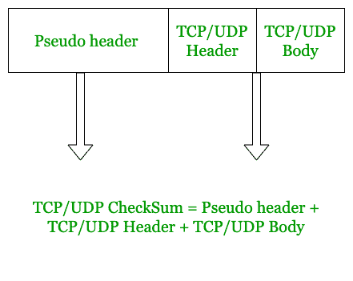

# TCP 校验和的计算

> 原文:[https://www.geeksforgeeks.org/calculation-of-tcp-checksum/](https://www.geeksforgeeks.org/calculation-of-tcp-checksum/)

在本文中，我们将学习如何计算 [TCP/UDP](https://www.geeksforgeeks.org/tcp-and-udp-in-transport-layer/) 校验和的好概念。

当我们从应用程序接收数据时，它被分成更小的数据部分，因为来自应用程序的全部数据不能通过网络发送到接收主机。

我们在 OSI 中传输层使用的协议是 TCP。因此，在将来自应用层的数据分成更小的部分之后。这个断开的部分构成了 TCP 的主体。

TCP 报头通常从 20 字节(不使用选项字段的位)到 60 字节(使用选项字段的所有位)不等。

它有源和目标端口地址、紧急指针、校验和等字段。

在本文中，我们只关注 TCP 的**校验和字段。**

TCP 的校验和是通过考虑 **TCP 报头、TCP 主体和伪 IP 报头**来计算的。

现在，出现的主要模糊性是，当 IP 进入传输层下面的层时，如何在 IP 头上计算校验和。

简单来说，就是我们在传输层，IP 数据包在网络层创建。

那么，我们如何从传输中估计 IP 报头的大小，因为猜测/估计肯定是错误的，因此在开始时计算错误字段的校验和是没有意义的？

传输层中 TCP/UDP 的错误检查功能可以帮助网络层进行正确的错误检测。

但是这里需要注意的重要概念是，我们实际上不使用 IP 头，而是使用 IP 头的一部分。

为了克服所有这些错误并提高错误检查能力，我们使用**伪 IP 报头**。

**伪 IP 头:**
伪头不是 IP 头，而是 IP 头的一部分。我们不直接使用 IP 报头，因为在 IP 报头中有许多在数据包沿网络移动时会不断变化的信息。因此，IP 报头的一部分被考虑在内，该部分不会随着 IP 分组在网络中移动而改变。

伪 IP 报头的字段是:-

1.  来源的 IP

2.  目的地的 IP

3.  TCP/UDP 段长度

4.  协议(说明所用协议的类型)

5.  8 位固定

因此，*伪报头的总大小(12 字节)=源的 IP(32 位)+目的地的 IP(32 位)+TCP/UDP 段长度(16 位)+协议(8 位)+固定的 8 位*



需要注意的一个重要概念是，这个伪报头是在传输层中创建的，用于计算，计算完成后，伪报头被**丢弃**。校验和是用通常的校验和方法计算的。

因此，这个伪报头不是通过网络传输的，而是在网络层形成的实际的 IP 报头被传输。

因此，TCP 校验和包括:-

```
1. Pseudo IP header 
2. TCP header
3. TCP body
```



在使用上述 3 个字段计算校验和之后，校验和结果被放在 TCP 报头的校验和字段中。

如上所述，伪报头被丢弃，并且不被传输到目的主机，那么目的主机如何检查数据是否被正确接收。因此，在目的主机的传输层中再次创建伪报头，然后在目的主机的传输层中再次计算校验和，最后，通过通常的校验和方法计算校验和，并确认接收的数据是否正确。

*为什么需要两次 IP 头检错？*

IP 报头被检查两次，第一次在传输层，第二次在网络层。IP 报头被检查两次，因为双重检查确保 IP 报头中的任何错误都能以适当的精度被检测到。