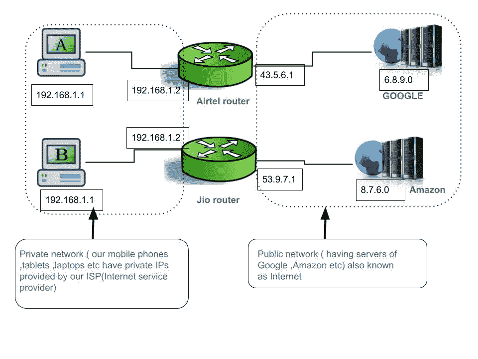

# 两个 IP 地址可以相同吗？

> 原文:[https://www.geeksforgeeks.org/can-two-ip-addresses-be-same/](https://www.geeksforgeeks.org/can-two-ip-addresses-be-same/)

**概述:**
计算机网络的简单定义是两台或多台计算机(包括个人计算机、手机、笔记本电脑等，路由器、交换机、网桥等网络设备)为传输数据而进行的互联。现在一个显而易见的问题出现了，网络中的一台计算机如何识别另一台计算机？这就是答案。通过[媒体访问控制地址](https://www.geeksforgeeks.org/introduction-of-mac-address-in-computer-network/)和 [IP 地址](https://www.geeksforgeeks.org/introduction-of-classful-ip-addressing/)

```
MAC (Media Access Control) is 6 bytes 
=48 bits =12 nibbles
(1 nibble=4bits) long . 
```

**注意–**
这是给每个网卡(网络接口卡)的硬件地址。

1.  两台设备可以有相同的 MAC 地址吗？
    否。
2.  两台设备可以有相同的 IP 地址吗？
    是

**为什么和如何:**
有趣的部分来了，为什么和如何？让我先解释为什么，然后解释我们是如何巧妙地做到这一点的，如下所示。

**为什么:**

*   如今，IP 最广泛使用的两个版本是 IPv4 和 IPv6。
*   IPv4 是 32 位，IPv6 是 128 位
*   如果我们谈论 IPv4，它只有 32 位，意味着 2^32 地址
*   可能的(最大)地址，大约等于 4 个 billion(10^9 地址。
*   但是世界上有超过数十亿的设备是可能的
*   因为现在我们有很多物联网设备、智能手机，甚至智能手机
*   连接到互联网的冰箱。
*   所以我们必须找到一些解决方案，即如何重用已经使用的 IP 地址。否则我们将耗尽知识产权

**如何:**
为了解决这个问题我们引入两个术语公共 IP 地址和私有 IP 地址如下。

**公有 IP 地址和私有 IP 地址:**
这个范围内的任何一个 IP 地址都是私有 IP 地址，剩下的都是公有 IP 地址。

*   私人投资项目是免费的
*   公共 IP 价格昂贵(像 Jio、Airtel 这样的互联网服务提供商购买公共 IP)

```
10.0.0.0        -    10.255.255.255/8
172.16.0.0      -    172.31.255.255/12
192.168.0.0     -    192.168.255.255/16
```

**图示–**
这里我们有两台路由器 Jio 和 Airtel，它们都连接着专用网络和公共网络。请记住，我们不直接与谷歌或亚马逊服务器或任何公共设备交谈，我们通过我们的互联网服务提供商交谈。我们和 ISP 路由器通话，ISP 路由器和互联网通话。所有的 ISP 或公共路由器都有自己购买的公共 IP 地址，并且都有不同的公共 IP 地址，它们不可能相同，如图中 Airtel 公共 IP 是 43.5.6.1，Jio 公共 IP 是 53.9.7.1。现在在每个公共 IP 地址下，可以使用任何私有 IP 地址范围(上面列出的私有 IP 范围)。这就是为什么图中的主机 A 和主机 B 可以有相同的私有 IP 地址。因此，在 ex-Airtel 的一个网络中，所有私有 IP 必须不同，但是对于主机来说，在两个不同的网络中，ex-Airtel 和 Jio 主机可能具有相同的私有 IP 地址。这样，我们可以重用私有 IP。



公共和专用网络

**结论:**
分配给 ISP 路由器或连接到互联网的路由器的所有公共 IP 都是唯一的。但是如果两台主机都连接到不同的公共网络，则两台主机的私有 IP 可能相同。因此，公共和私有 IP 的组合可以唯一地识别您的设备。你可以做一个有趣的活动，拿两个或更多的手机，把所有的手机和任何人手机的热点连接起来。现在在所有的手机上，在谷歌上键入“我的 IP 地址是什么”它会给你你的手机连接的公共 IP，(而不是私有 IP)，你会看到你所有的手机都有相同的公共 IP(因为你们都连接到同一个公共路由器)，要看到你的私有 IP 转到设置，然后是 Wi-Fi，然后是 Wi-Fi 设置。你会看到你的私人 IP 地址(对于你的手机型号，请在谷歌上搜索如何找到私人 IP)。还有一件事你会注意到，你所有的私人 IP 将在一个统一的方式不同。因为你们都有相同的公共网络，所以你们的私有 IP 不可能相同。