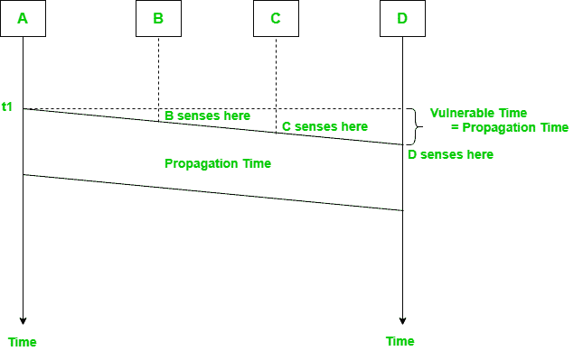
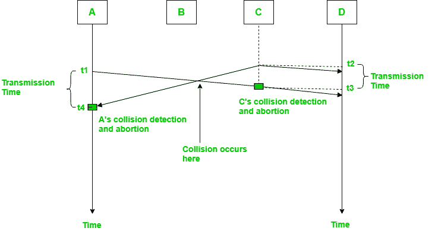
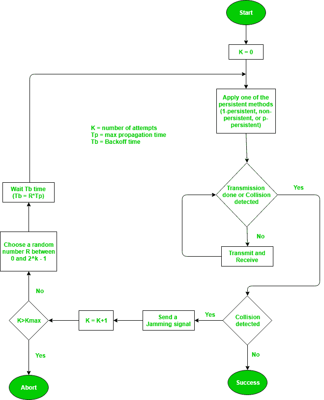
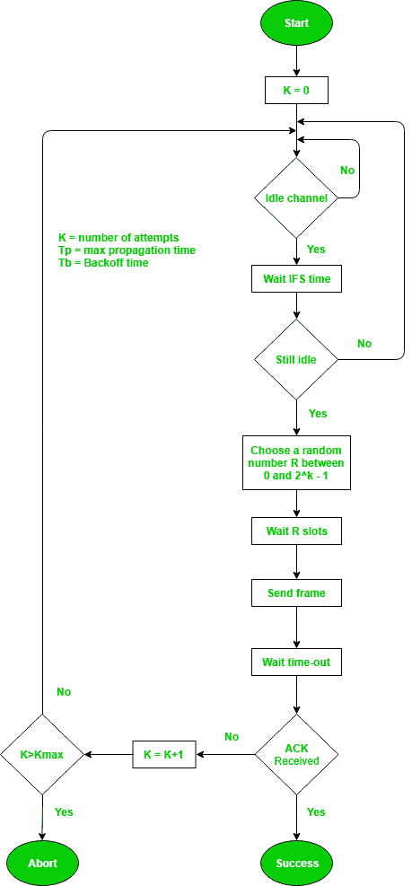

# 载波侦听多路访问(CSMA)

> 原文:[https://www . geesforgeks . org/carrier-sense-multi-access-csma/](https://www.geeksforgeeks.org/carrier-sense-multiple-access-csma/)

先决条件–[多址协议](https://www.geeksforgeeks.org/computer-network-multiple-access-protocols/)
这种方法的开发是为了减少当两个或多个站点开始通过数据链路层发送信号时发生冲突的可能性。载波侦听多路访问要求每个站**在发送前首先检查介质**的状态。

**易受攻击时间–**

```
 Vulnerable time = Propagation time (Tp)
```



当信道繁忙/空闲时，可以应用持久性方法来帮助站采取行动。

### 1.带冲突检测的载波侦听多路访问(CSMA/光盘)–

在这种方法中，站在发送帧后监控媒体，以查看传输是否成功。如果成功，则该站结束，如果不成功，则再次发送该帧。



在图中，A 在 t1 开始发送其帧的第一位，由于 C 在 t2 看到信道空闲，所以在 t2 开始发送其帧。c 在 t3 检测到 A 的帧并中止传输。a 在 t4 检测到 C 的帧并中止其传输。因此，C 帧的传输时间为，A 帧的传输时间为。

因此，**帧传输时间(Tfr)至少应该是最大传播时间(Tp)** 的两倍。当发生碰撞的两个站点相距最远时，就可以推断出这一点。

**流程–**
碰撞检测的整个流程可以解释如下:



**吞吐量和效率–**CSMA/光盘的吞吐量远远大于纯或时隙 ALOHA。

*   对于 1-持久方法，当 G=1 时，吞吐量为 50%。
*   对于非持久性方法，吞吐量可达 90%。

### 2.载波侦听多路访问和冲突避免(CSMA/加州)–

CSMA/加州背后的基本思想是，该站应该能够在发送时接收，以检测来自不同站的冲突。在有线网络中，如果发生了冲突，那么接收信号的能量几乎加倍，并且基站可以检测到冲突的可能性。在无线网络的情况下，大部分能量用于传输，如果发生冲突，接收信号的能量仅增加 5-10%。它不能被车站用来感应碰撞。因此 **CSMA/CA 是专门为无线网络**设计的。

这是三种策略:

1.  **帧间间隔(IFS)–**当电台发现频道繁忙时，它会等待一段时间，称为 IFS 时间。IFS 也可用于定义电台或帧的优先级。IFS 越高，优先级越低。
2.  **争用窗口–**它是划分为时隙的时间量。准备发送帧的站选择随机数量的时隙作为**等待时间**。
3.  **确认–**肯定确认和超时计时器有助于保证帧的成功传输。

**流程–**
整个避碰流程可以解释如下:

