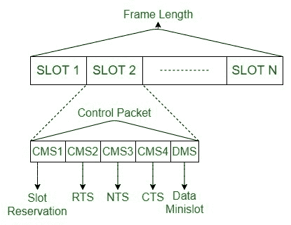

# 计算机网络中的 CATA 协议

> 原文:[https://www . geesforgeks . org/cata-计算机网络协议/](https://www.geeksforgeeks.org/cata-protocol-in-computer-network/)

**冲突避免时间分配(CATA)协议**是基于动态拓扑相关传输调度的带预留的基于竞争的 MAC 协议。在这种情况下，时间被分成帧，每个帧被分成时隙，每个时隙被分成 5 个小时隙。最初的四个小插槽是控制插槽，内容管理系统，仅五分之一用于信息传输，数据管理系统，比内容管理系统长。

CATA 的优势在于可以毫无困难地同时进行广播、组播和单播形式的传输。它的显著缺点是由于控制迷你插槽而滥用数据传输容量。在每个时隙中节省四个小时隙空间降低了为信息包传输保留的可访问传输速度。

**CATA 有两个基本原则:**

1.  流的接收者必须向其他潜在的源节点提供关于时隙预留和时隙干扰的信息。
2.  否定确认用于预留请求和控制分组传输。

**工作:**

1.  CMS1 用于向试图建立传输的发送方提供“忙音”。在该时隙的整个 DMS 中接收信息的每个节点在 CMS1 中发送时隙预留分组(SR)，该分组引起噪声或被其邻居节点接收，并阻止它们尝试订购该时隙。
2.  此外，通过该时隙的 DMS 发送信息的每个节点通过 CMS2 发送参与发送(RTS)分组的呼叫。
3.  此操作会对所有或任何相邻节点造成干扰，这些相邻节点没有听到 CMS1 中接收器节点的 SR，并且正在尝试保留时隙。
4.  在 CMS3 期间，发送方和接收方节点保持安静，在 CM4 期间，发送方发送不发送(NTS)包裹。
5.  利用这种技术，CATA 保证在有效预留之后，下一帧中的类似时隙将保持无冲突，直到消息传输完成和预留结束，消除所有未覆盖和隐藏的终端问题。
6.  对于节点需要为多播或广播传输保留一个点的情况，它在 CMS2 期间发送一个 RTS。
7.  如果计划的接收器准确地获得了即时战略，它们在 CMS3 和 CMS4 期间保持安静，否则它们在 CMS4 发送 NTS 作为对计划的多播或广播预留的否定认可。
8.  多播或广播 RTS 的发送方节点发现，如果在 CMS4 期间发生 NTS 或骚动(因为 NTS 众多)，预留会失败。
9.  否则，它可以开始在当前时隙的需求侧管理中以及在所有随后的轮廓中的类似时隙中传输信息，直到消息结束和预留结束。