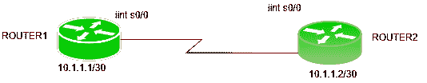

# 挑战握手认证协议(CHAP)

> 原文:[https://www . geesforgeks . org/challenge-handshake-authentication-protocol-chap/](https://www.geeksforgeeks.org/challenge-handshake-authentication-protocol-chap/)

挑战握手认证协议(CHAP)是由 IETF(互联网工程任务组)开发的点对点协议(PPP)认证协议。它在链接的初始启动时使用。此外，它还会执行定期检查，以检查路由器是否仍在与同一台主机通信。

**特征:**

*   它使用 3 路握手协议(不像 TCP)。首先，认证者向对等方发送一个质询包，然后对等方使用其单向散列函数用一个值进行响应。然后，验证器将接收到的值与其自己计算的哈希值进行匹配。如果值匹配，则认证被确认，否则连接将被终止。
*   它使用称为 MD5 的单向散列函数。
*   它还会定期进行身份验证，以检查通信是否发生在同一台设备上。
*   此外，它比 PAP(密码验证程序)提供更多的安全性，因为使用的值(通过散列函数找到)是可变的。
*   CHAP 要求知道秘密的明文，因为它从未通过网络发送。

**CHAP 数据包:**
共有 4 种类型的 CHAP 数据包–

1.  **挑战包**:在 CHAP 三次握手开始时，由认证方发送给对等方的包。质询数据包也会定期发送，以检查连接是否没有改变。它包含标识符值、包含随机值的值字段以及包含验证者名称的名称字段。名称字段用于密码查找。名称字段还被馈送到 MD5 哈希生成器，并生成单向哈希值。
2.  **响应包**:用于响应挑战包。它包含值字段，该字段包含生成的单向哈希值、标识符值和名称字段。响应数据包的名称字段被设置为对等路由器的主机名。现在，在质询包的名称字段中查找密码。路由器会在质询数据包的名称字段中查找与用户名匹配的条目，并获取密码。然后，通过将该密码馈送给 MD5 哈希生成器来对其进行哈希运算，并生成单向哈希值。该值被插入到响应包的值字段中，并被发送到认证器。
3.  **成功包**:现在，认证器也通过在响应包的名称字段(如果它有该用户名的条目)中查找并使用它生成哈希值来执行相同的操作。如果生成的值与对等方的值相同，则发送成功数据包。
4.  **故障包**:如果生成的值不同，则故障包发送到对等端。

**配置:**



有一个包含 2 个路由器的小型拓扑，即路由器 1 和路由器 2。路由器 1 在 s0/0 上的 IP 地址为 10.1.1.1/30，路由器 2 在 s0/0 上的 IP 地址为 10.1.1.2/30。请记住，默认情况下，HDLC 配置在思科路由器上，因此，首先将封装更改为 PPP。

配置 R1:

```
Router1(config)# int s0/0
Router1(config-if)# encapsulation ppp
```

配置 R2:

```
Router2(config)# int s0/0
Router2(config-if)# encapsulation ppp
```

更改两台路由器的主机名。

```
Router1(config)# hostname R1
Router2(config)# hostname R2
```

逐一提供用户名和密码。

```
R1(config)# username R2 password GeeksforGeeks  
```

```
R2(config)# username R1 password GeeksforGeeks 
```

请注意，用户名和密码区分大小写。此外，在路由器 R1 上，我们必须给出其他路由器的用户名，即 R2，反之亦然。