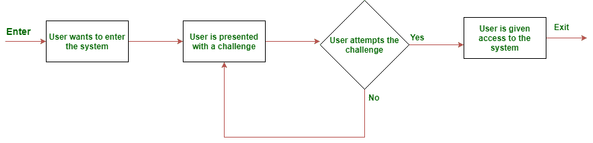

# 挑战响应认证机制(CRAM)

> 原文:[https://www . geesforgeks . org/challenge-response-authentication-mechanism-cram/](https://www.geeksforgeeks.org/challenge-response-authentication-mechanism-cram/)

**挑战响应认证机制(CRAM)** 是最常用的动作认证方式。它们是一组协议，其中一方提出质询(待回答)，另一方必须提出质询的正确答案(待检查/验证)，以便通过身份验证。

**Figure –** CRAM activity flow diagram

**两类问题(挑战)–**

*   **静态**问题，顾名思义，涉及挑战选择的静态方法。用户可以选择他的质询并验证自己。例如，以电子邮件服务中的忘记密码为例。静态挑战是您作为帐户设置的一部分保存的“安全问题”。这些问题的正确答案预计不会随着时间的推移而改变。
*   **动态**问题涉及挑战选择和认证的动态方法。挑战是随机选择的，假设用户知道挑战的有效答案，认为用户是真实的。

【CRAM 的执行方式–

*   **验证码:**
    完全自动化的公共图灵测试，区分计算机和人类。验证码用于防止垃圾邮件和自动注册电子邮件或网站的新帐户。
*   **SSH(Secure SHell):**
    SSH 是一种加密网络协议，用于在不安全的网络上安全地运行网络服务。
*   **密码:**
    密码通过匹配正确的密码发送到服务器进行验证。
*   **加盐挑战响应认证机制(SCRAM，CRAM 的变体):**
    用哈希加盐挑战，以确保密码仅使用一次。哈希被发送到服务器，以便与正确密码的哈希匹配，而不是与纯文本密码本身匹配。因此，密码不会被泄露，以防止中间人攻击和重放攻击，因为密码只能使用一次。
*   **生物识别:**
    唯一的生物识别细节(视网膜扫描、指纹扫描)被记录下来，每次用户想要认证自己时，他都必须向认证系统出示他的生物识别凭证以进行验证。

**用例–**

*   **为了区分计算机和人类:**
    向用户呈现图像(通常难以清楚地阅读)，并且用户将被要求通过从图像中读取字符来输入。然后将输入与实际字符进行匹配，以防止机器人进入系统。
*   **在训练机器学习模型时:**
    一幅图像被拼凑并混杂在一起，呈现给用户，进行某种真实人类用户可以做的验证。输入用于用户验证。用户给出的答案与 ML 模型给出的答案相匹配。混乱的图像是“挑战”，选择合适的作品就是一个例子。常见于谷歌验证码认证。
*   **出于登录(认证)目的:**
    输入的密码将与正确的密码(已存储在您尝试访问的服务器中)进行匹配(直接或间接)。

**对 CRAMs 的常见攻击–**

*   偷听
*   网络钓鱼攻击
*   药物攻击
*   中间人攻击
*   域名系统缓存中毒攻击
*   特洛伊木马攻击
*   电话中的人攻击
*   浏览器中毒攻击
*   字典攻击
*   暴力攻击
*   零知识密码证明
*   可重复使用的密码攻击

**局限性–**
密码的一个根本问题是密码被重复使用。当服务器收到密码时，服务器无法确定真实用户是否正在输入密码。

较新的 CRAMs 也采用了加密技术，因此密码的散列是匹配的，而不是普通密码。
**密码 CRAMs 的一些例子–**

*   加盐挑战响应认证机制
*   CRAM-MD5