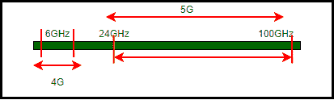
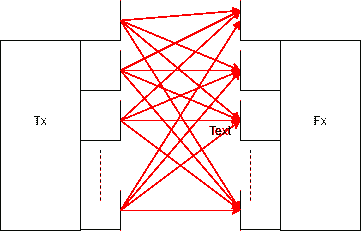

# 5G 的挑战

> 原文:[https://www.geeksforgeeks.org/challenges-for-5g/](https://www.geeksforgeeks.org/challenges-for-5g/)

[第五代(5G)网络](https://www.geeksforgeeks.org/what-is-5g-wireless-technology-and-how-it-works/)预计将支持巨大的数据流量。它旨在为数百万无线连接提供服务。通过使用某些先进技术，如小蜂窝、海量多输入多输出等，5G 可以支持广泛的设备和应用，这将进一步增强物联网的未来(IOT)。然而，这些技术有其自身的挑战，使得 5G 的建立变得困难。

**技术和挑战:**
这些解释如下。

*   **毫米波:**
    5G 使用毫米波，之所以这么叫是因为它们的波长在 1 毫米到 10 毫米之间

*   **Figure –** Range of Millimeter Waves for 5G 
    These are high frequency waves ranging between 3 GHz and 300 GHz out of which the range from 24 GHz to 100 GHz has been proposed for 5G. This will enable a huge amount of devices and technologies to be able to use the bandwidth as well as result in better streaming of higher quality videos and other multimedia content. 

    然而，这进一步暴露了 5G 的某些障碍。
    由于毫米波是高频波，因此更容易被建筑物、树木等结构堵塞。此外，它们会被云和雨削弱。出于这个原因，今天大规模使用的传统蜂窝塔可能会徒劳无功。之所以如此，是因为波频与天线尺寸成反比。这就是下一个技术的来源。

*   **Small Cell :** 
    ‘Small cells’ is a term for low powered radio access nodes that help in providing services to both indoor and outdoor areas. Small cell antennas have a range between 10 m to 2 km. 
    To extend the coverage of a macrocell, distributive antenna systems (DASs) are used in conjunction with the cell tower. DASs take a signal from the base station and boost it to increase the area the signal can reach. Small cells will be a crucial component for 5G networks, because they increase network capacity, density, speed and coverage. 

    除了小单元提供的所有便利之外，在它们的实现中还有一些挑战或缺点，它们是:

    1.  小蜂窝必须是低成本的，因为它们是在较小的范围内为较少的用户建立的。

    2.  建设 5G 网络所需的小蜂窝数量可能会使其难以在农村地区建立。

    3.  对于移动网络运营商来说，诊断潜在问题和维护小小区应该很容易。

    4.  它们应该体积小、重量轻，以便安装在路灯杆上、建筑物墙壁的侧面等。

    5.  这些应该有很高的天气可靠性。

*   **海量 MIMO :**
    MIMO 是一种无线通信技术，代表多输入多输出。因为多输入多输出的基本框架是在发射机和接收机处具有多个天线。多输入多输出确保高数据速率下的可靠通信，因为它利用了不同发射机和接收机之间存在的多条路径。

对于较旧的技术，一个小区最多只能有 10 个天线，但是对于 5G，这个小区最多可以有 100 个天线，这意味着一个小区可以同时服务更多的用户，并且效率和速度更高。但任何事情都有代价，这意味着大规模多输入多输出有其自身的复杂性；天线同时向各个方向广播信息，这可能会造成巨大的干扰。这个问题可以通过使用另一种称为波束成形的 5G 技术来解决。

*   **Beamforming :** 
    Beamforming is a MIMO technique in which the transmitter or antenna focuses a narrow signal beam in the direction of the receiver. It requires that the transmitter knows the wireless channel. 
    Multiple antennas placed in proximity, broadcasting a signal at slightly varied timings are deployed in the working of beamforming. The overlapping waves will produce constructive or destructive interference that will make the signal strong or weak respectively.If this is executed properly, beamforming focuses the signal to its path. 

    接入点形成窄波束，该波束在特定方向上具有高增益，而不是在宽角度上。该波束指向用户，从该用户接收数据，与用户波束相交并接收其数据。这些限制包括所需的计算资源，因为它们需要更多的时间和功率。波束形成在计算上是可以用来计算波束的元素的输出的线性组合。

*   **Non-Orthogonal Multiple Access (NOMA) :** 
    NOMA is used to address the challenges such as high spectral efficiency and massive connectivity. The typical approach to NOMA is to group users and superpose their data signals using different transmission powers before transmitting the group’s signal in the same way, using the same beamforming. NOMA superposes multiple users in the power domain although its basic signal waveform could be based on (Orthogonal frequency division multiple access) OFDMA. 

    这项技术有一定的局限性和挑战。这些是:

    1.  码域复用具有提高频谱效率的潜力，但是需要高传输带宽，并且不容易适用于当前系统

    2.  在 NOMA，由于每个用户在解码自己的信号之前都需要解码一些用户的信号，因此与 OMA 相比，接收机的计算复杂度将会增加，从而导致更长的延迟。

    3.  所有用户的信道增益信息应该反馈给基站，但是这导致了显著的信道状态信息反馈开销

    4.  此外，如果在任何用户的 SIC 过程中出现任何错误，则连续解码的错误概率将增加。

*   **Software Defined Network (SDN) :** 
    In SDN, the control plane is segregated from its respective data plane physically i.e. the application and OS layer are separated from the hardware centralizing its intelligence and abstracting its architecture. A single control plane is made up of all the individual control planes and it does exactly the same job as earlier, just for a larger number of devices as a whole which means that there is a defined control logic in a centralized manner. Communication between the two planes is done through APIs. For making controller to switch communication, protocols like OpenFlow can be used. 

    SDN 的实现有两个主要挑战:
    **(i)。规则放置问题–**

    *   SDN 中的转发是使用由中央控制器定义的流表来完成的。称为三进制内容可寻址存储器(TCAM)的存储器的大小是有限的。

    *   除此之外 TCAM 很贵。

    *   控制器根据需求定义流程规则，并且必须能够处理所有容易导致延迟的请求。

    *   如果一个大网络的控制器非常少，它可能会变得拥挤。

尽管第五代网络已经为最先进的技术做好了准备，但还有大量其他挑战阻碍着 5G 在全球的成功建立。下面列出了这些内容:

*   全球频率缺乏协调。据观察，不同的国家有不同的频率。

*   对频率和带宽进行校准测量非常昂贵、耗时且需要大量专业知识。

*   由于 5G 自然资源和传统长期演进系统的频带接近，可能会导致互调失真(IMD)。

*   能够覆盖大范围的地理频谱，并以高频率范围适应当今蜂窝网络的足迹，这本身就是一个巨大的挑战。

*   农村和郊区不太可能享受 5G 投资，这可能会扩大数字鸿沟。

然而，独立经济研究预测，5G 网络和服务将在本十年内带来非常显著的经济收益。