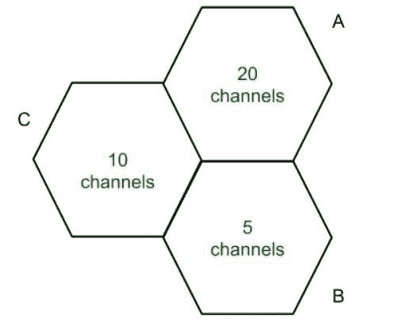

# 计算机网络中的信道分配策略

> 原文:[https://www . geesforgeks . org/channel-allocation-strategies-in-computer-network/](https://www.geeksforgeeks.org/channel-allocation-strategies-in-computer-network/)

[信道分配](https://www.geeksforgeeks.org/channel-allocation-problem-in-computer-network/)是指在蜂窝系统中将可用信道分配给小区。当用户想要发出呼叫请求时，通过使用信道分配策略，他们的请求被满足。信道分配策略的设计使得频率、时隙和带宽得到有效利用。

**信道分配策略的类型:**
这些是固定、动态和混合信道分配，解释如下。

*   **Fixed Channel Allocation (FCA):**
    Fixed Channel Allocation is a strategy in which fixed number of channels or voice channels are allocated to the cells. Once the channels are allocated to the specific cells then they cannot be changed. In FCA channels are allocated in a manner that maximize *Frequency reuse*.

    

    在小区 A 20 中，分配了信道或语音信道。如果所有频道都被占用，用户拨打电话，则该呼叫被阻止。*借用渠道*处理这类问题。这个细胞从其他细胞借用通道。

*   **动态信道分配(DCA):**
    动态信道分配是一种不将信道永久分配给小区的策略。当用户发出呼叫请求时，基站向移动站中心发送该请求，以分配信道或语音信道。这样就减少了阻塞呼叫的可能性。随着流量的增加，会分配更多的信道，反之亦然。
*   **混合信道分配(HCA):**
    混合信道分配是固定信道分配(FCA)和动态信道分配(DCA)的组合。频道或语音频道的总数分为固定集和动态集。当用户进行呼叫时，使用第一组固定信道，但是如果所有固定信道都忙，则使用动态信道。人机交互的主要目的是在交通拥挤的情况下高效工作，并保持最低的信噪比。