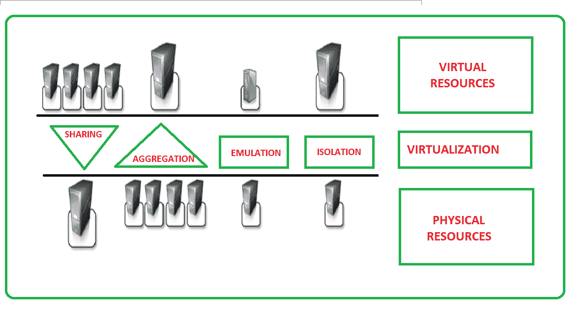

# 虚拟化的特点

> 原文:[https://www . geesforgeks . org/虚拟化特征/](https://www.geeksforgeeks.org/characteristics-of-virtualization/)

先决条件–[云计算中的虚拟化及其类型](https://www.geeksforgeeks.org/virtualization-cloud-computing-types/)

### **1。增强安全性–**

以完全透明的方式控制客户程序执行的能力为交付安全、受控的执行环境打开了新的可能性。客户程序的所有操作通常是针对虚拟机执行的，然后虚拟机将它们翻译并应用到主机程序。
虚拟机管理器可以控制和过滤来宾程序的活动，从而防止一些有害操作的执行。然后，主机暴露的资源可以隐藏起来，或者对来宾进行简单的保护。处理不受信任的代码时，需要提高安全性。
**示例-1:** 可以在布谷鸟沙盒环境中分析不可信代码。
沙盒这个术语标识了一个隔离的执行环境，在这个环境中，指令在真正的执行环境中被翻译和执行之前可以被过滤和阻止。
**示例-2:**Java 虚拟机(JVM)的沙盒版本这一表述是指 JVM 的一种特定配置，在这种配置中，通过安全策略，被认为是潜在有害的指令可以被阻止。

### **2。托管执行–**

特别是，共享、聚合、仿真和隔离是最相关的特性。

托管执行启用的功能

### **3。共享–**

虚拟化允许在同一台主机内创建单独的计算环境。这一基本功能用于减少活动服务器的数量并限制功耗。

### **4。聚合–**

可以在几个来宾之间共享物理资源，但虚拟化也允许聚合，这是相反的过程。一组独立的主机可以捆绑在一起，并作为单个虚拟主机呈现给来宾。该功能通过集群管理软件实现，该软件利用同类机器组的物理资源，并将它们表示为单一资源。

### **5。仿真–**

来宾程序在由虚拟化层控制的环境中执行，虚拟化层最终是一个程序。此外，可以模拟与主机完全不同的环境，从而允许执行需要物理主机中不存在的特定特性的客户程序。

### **6。隔离–**

虚拟化允许为来宾(无论是操作系统、应用程序还是其他实体)提供一个完全独立的执行环境。客户程序通过与抽象层交互来执行其活动，抽象层提供对底层资源的访问。虚拟机可以过滤来宾的活动，并防止针对主机的有害操作。

除了这些特性之外，虚拟化支持的另一项重要功能是性能调整。鉴于支持虚拟化的硬件和软件的巨大进步，这一特性目前已成为现实。通过微调通过虚拟环境暴露的资源的属性，控制来宾的性能变得更加容易。这种能力提供了一种有效实现服务质量基础设施的方法。

### **7。便携性–**

根据所考虑的虚拟化的具体类型，可移植性的概念以不同的方式应用。
在硬件虚拟化解决方案的情况下，来宾被打包成虚拟映像，在大多数情况下，可以在不同的虚拟机上安全地移动和执行。
在编程级虚拟化的情况下，由 JVM 或实现。NET 运行时，表示应用程序组件(jar 或程序集)的二进制代码可以在相应虚拟机的任何实现上运行，而无需任何重新编译。