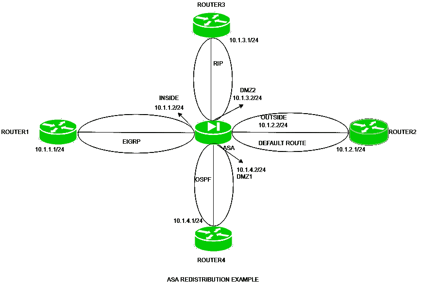

# 思科 ASA 再分发示例

> 原文:[https://www . geesforgeks . org/Cisco-asa-再分发-示例/](https://www.geeksforgeeks.org/cisco-asa-redistribution-example/)

先决条件–[自适应安全设备(ASA)](https://www.geeksforgeeks.org/computer-network-adaptive-security-appliance-asa-features/)
在实际场景中，可能会出现组织路由使用多种路由协议(EIGRP、OSPF 或 RIP)的情况。此外，正在使用静态或默认路由。现在，通过一种方式(动态或静态路由)获知的路由应该重新分配给其他方式(动态路由协议)。这个过程叫做再分配。

例如，如果路由器在一个接口上运行 EIGRP，在另一个接口上运行 RIP，则 EIGRP 获知的路由应该在 RIP 中重新分配，反之亦然。

**重分发–**
是将静态路由、直连路由或动态路由协议学习到的路由通告到另一个路由协议中的过程。


例如，在这里，路由器 2 的一个接口(fa0/0)正在运行 EIGRP，而另一个接口(fa0/1)正在运行 OSPF，那么我们必须将 OSPF 的路由通告到 EIGRP，反之亦然，以便这些路由协议所获知的路由可以互相通告。这个过程叫做再分配。
否则，路由器 1 将无法获知路由器 3 的路由，路由器 3 也无法获知路由器 1 的路由，因此无法到达。

**再分发(在 ASA 中)–**
我们知道思科 ASA 可以在两种模式下运行:路由模式和透明模式。

1.  **路由防火墙模式–**
    默认情况下，ASA 处于路由防火墙模式。在这种模式下，思科 ASA 表现为路由器跳，因此可以在这种模式下执行路由。

2.  **透明防火墙模式–**
    在此模式下，防火墙表现为第 2 层设备。在路由防火墙模式下，ASA 上的路由和重新分发的执行方式与在 Cisco 路由器上的执行方式相同。

**配置示例–**
进入配置之前，请记住以下几点:

1.  默认情况下，允许从较高安全级别到较低安全级别的流量，但如果从较低安全级别到较高安全级别发起流量，流量将被拒绝。

2.  默认情况下，允许从较高安全级别到较低安全级别的流量是 TCP 和 UDP。



有 4 个路由器，即路由器 1 (IP 地址-10 . 1 . 1 . 1/24)、路由器 2 (IP 地址-10.1.2.1/24)、路由器 3 (IP 地址-10.1.3.1/24)、路由器 4(IP 地址-10.1.4.1/24)和 ASA(IP 地址-10.1.1.2/24 和名称-内部在 e0、10.1.2.2/24 和名称-外部在 e1、10 在本任务中，我们将从内部到外部检查 ICMP。

请注意，通过检查或使用访问列表，可以允许流量从较低安全级别到较高安全级别。
在路由器 1 上配置 IP 地址:

```
Router1(config)#int fa0/0
Router1(config-if)#ip address 10.1.1.1 255.255.255.0 
Router1(config-if)#no shut 
```

在路由器 2 上配置 IP 地址。

```
Router2(config)#int fa0/0
Router2(config-if)#ip address 10.1.2.1 255.255.255.0 
Router2(config-if)#no shut 
```

在路由器 3 上配置 IP 地址。

```
Router3(config)#int fa0/0
Router3(config-if)#ip address 10.1.3.1 255.255.255.0 
Router3(config-if)#no shut 
```

在路由器 2 上配置 IP 地址。

```
Router4(config)#int fa0/0
Router4(config-if)#ip address 10.1.4.1 255.255.255.0 
Router4(config-if)#no shut 
```

现在，在 ASA 的接口上配置 IP 地址和名称。

```
asa(config)#int e0
asa(config-if)#no shut
asa(config-if)#ip address 10.1.1.2 255.255.255.0
asa(config-if)#nameif INSIDE
asa(config-if)#security level 100
asa(config-if)#exit
asa(config)#int e1
asa(config-if)#no shut
asa(config-if)#ip address 10.1.2.2 255.255.255.0
asa(config-if)#nameif OUTSIDE
asa(config-if)#security level 0
asa(config-if)#exit
asa(config)#int e2
asa(config-if)#no shut
asa(config-if)#ip address 10.1.3.2 255.255.255.0
asa(config-if)#nameif DMZ2
asa(config-if)#security level 60
asa(config-if)#exit
asa(config)#int e3
asa(config-if)#no shut
asa(config-if)#ip address 10.1.4.2 255.255.255.0
asa(config-if)#nameif DMZ1
asa(config-if)#security level 50
```

现在，在路由器 1 上配置 EIGRP

```
Router1(config)#router eigrp 100
Router1(config-router)#network 10.1.1.0
Router1(config-router)#no auto-summary
```

现在，在路由器 2 上配置默认路由。

```
Router2(config)#ip route 0.0.0.0 0.0.0.0 10.1.2.2
```

在路由器 3 上配置 RIP。

```
Router3(config)#router rip
Router3(config-router)#network 10.1.3.0
Router3(config-router)#no auto-summary
```

在路由器 4 上配置 OSPF。

```
Router4(config)#router OSPF 1
Router4(config-router)#network 10.1.4.0 0.0.0.255 area 0
```

现在，我们必须在 ASA 上启用路由。

```
asa(config)#router rip 
asa(config-router)#network 10.1.3.0
asa(config-router)#no auto-summary
asa(config-router)#exit
asa(config)#router OSPF 1
asa(config-router)#network 10.1.4.0 0.0.0.255 area 0
asa(config-router)#exit
asa(config)#router eigrp 100
asa(config-router)#network 10.1.1.0
asa(config-router)#exit
```

在 ASA 上给出默认路由

```
asa(config)#route outside 0 0 10.1.2.1
```

这里，outer 是接口名称，0 0 表示任意 IP 任意掩码，10.1.2.1 是下一跳 IP 地址。
现在，在 eigrp 中，在 ASA 上重新分配路由。

```
asa(config)#router eigrp 100
asa(config-router)#redistribute ospf 1 metric 1 1 1 1 1
asa(config-router)#redistribute rip metric 1 1 1 1 1 
asa(config-router)#redistribute static metric 1 1 1 1 1
```

现在，在 OSPF 重新分配路线。

```
asa(config)#router ospf 1
asa(config-router)#redistribute rip subnets
asa(config-router)#redistribute eigrp 100 subnets
asa(config-router)#default-information originate 
```

在 RIP 中重新分配路由。

```
asa(config)#router rip
asa(config-router)#redistribute eigrp 100 metric 1
asa(config-router)#redistribute ospf 1 metric 1
asa(config-router)#default-information originate 
```

正如我们已经完成的路由，现在我们将检查 ICMP。

```
asa(config)#fixup protocol ICMP 
```

现在，防火墙将能够允许来自较低安全级别的 ICMP 回应回复进入较高安全级别。

```
Router1#ping 10.1.2.1
```

不仅从外部，如果流量是从内部发起的，它还将允许来自 DMZ1 和 DMZ2 的回复(对于内部)。