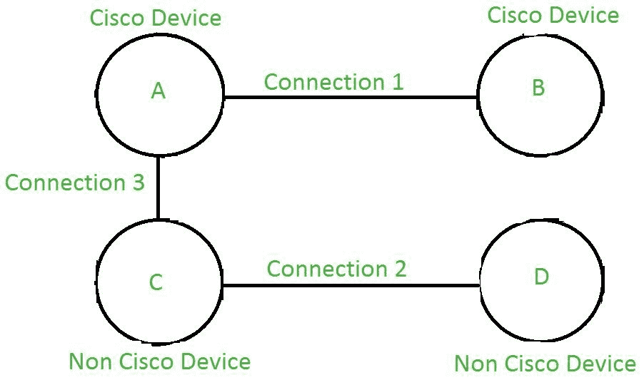

# 数据链路层的思科发现协议(CDP)和链路层发现协议(LLDP)

> 原文:[https://www . geesforgeks . org/Cisco-discovery-protocol-CDP-and-link-layer-discovery-protocol-lldp-in-data-link-layer/](https://www.geeksforgeeks.org/cisco-discovery-protocol-cdp-and-link-layer-discovery-protocol-lldp-in-data-link-layer/)

第 2 层或[数据链路层](https://www.geeksforgeeks.org/layers-of-osi-model/)提供物理寻址和介质访问。它定义了如何格式化数据以便传输，以及如何控制对网络的访问。它还提供错误检测，确保更高层的数据格式正确，便于传输。

数据链路层中的思科发现协议(CDP)和链路层发现协议(LLDP)是第 2 层(数据链路层)协议。它们都有助于发现设备在网络中是如何相互连接的。它们都独立于协议 [IPv4/IPv6](https://www.geeksforgeeks.org/differences-between-ipv4-and-ipv6/) 运行。它们还有助于验证和创建文档。

**思科发现协议(CDP):**
CDP 是思科系统开发的思科专有协议。它用于发现其他思科设备，并可用于共享信息，如操作系统版本 IP 地址等。CDP 使用组播帧进行传输，不依赖更高层协议。它还可以用于*按需路由*在 CDP 公告中包含路由信息，这样动态路由协议就不需要在简单的网络中使用。

**链路层发现协议(LLDP):**
另一方面，LLDP 是 CDP 的行业标准版本。网络设备使用它在基于 IEEE 802 技术的局域网上为自己和邻居做广告。

考虑下图:

在上图中:连接 1 是可能的，因为连接是在两台思科设备之间，并且都将使用 CDP 来发现它们的邻居并共享它们的信息。两个非思科设备之间的连接 2 也是如此。它将利用 LLDP 而不是 CDP 来发现它的邻居。思科设备无法使用 CDP 找到非思科设备，反之亦然。因此，我们可以说连接 3 是不可能的。