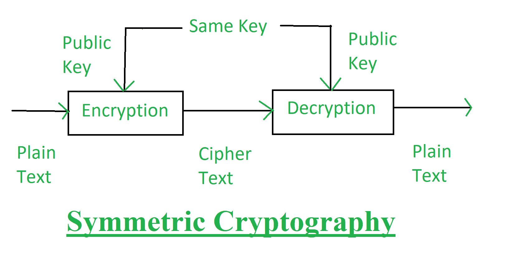
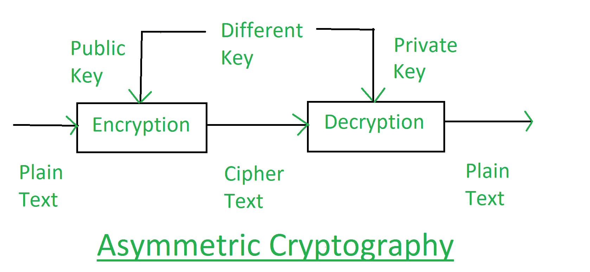

# 经典密码和量子密码

> 原文:[https://www . geeksforgeeks . org/古典加密和量子加密/](https://www.geeksforgeeks.org/classical-cryptography-and-quantum-cryptography/)

[密码学](https://www.geeksforgeeks.org/cryptography-introduction-to-crypto-terminologies/)是用于在存在未授权用户和恶意攻击者的公共环境中进行双方之间的安全通信的技术。在密码学中，有两个过程，即分别在发送端和接收端执行的加密和解密。加密是将简单的多媒体数据与一些附加数据(称为密钥)结合，并转换成不可读的编码格式(称为密码)的过程。解密是与加密相反的方法，在加密中使用相同或不同的附加数据(密钥)对密码进行解码，并将其转换为真实的多媒体数据。

密码技术可以根据其遵循的基本原则或协议进行分类。但是在这里，我们将集中讨论两种类型的密码技术:**经典密码**和**量子密码**。这些解释如下。

**1。经典密码学:**
经典密码学以数学为基础，依赖于分解大数的计算难度。经典密码学的安全性是基于大数的实例因式分解这一数学问题的高度复杂性。

在经典密码学中，原始数据(即纯文本)被转换为编码格式(即密文)，这样我们就可以通过不安全的通信通道传输这些数据。一种称为密钥的数据字符串，用于控制数据从纯文本到密文的转换。这种安排有助于保持数据安全，因为它需要密钥来从密文中提取原始信息。没有钥匙，没有人能读取数据。在这种技术中，假设只有授权的接收者拥有密钥。

经典密码学有两种技术:

1.  **Symmetric Cryptography:**
    In the symmetric cryptography a single key is used for encrypting and decryption the data. This encryption key is private key. This is the limitation of this encryption technique that this private key must be distributed only among the authorized sender and receiver.

    

2.  **Asymmetric Cryptography:**
    In the asymmetric cryptography a pair of key, i.e., public key and private key is used for encryption and decryption. A sender can use its public key to encrypt the data and on receiver end receiver can decrypt the data by using its private key. This technique overcomes the problem of key distribution.

    

    **经典密码学的优势:**

    *   使用一次性垫时，它是牢不可破的。
    *   手动操作很容易，不需要电脑。
    *   它保护纯文本不被随意窥探。

    **经典密码学的缺点:**

    *   虽然使用一次性垫子，但它很麻烦，需要个人聚会来交换垫子。
    *   如果不使用动态口令，任何对知道你写了什么和密码学有一点兴趣的人都可以破解加密。

**2。量子密码学:**
量子密码学以物理学为基础，它依赖于量子力学的定律。它是强调量子物理现象的新兴技术，在这种技术中，双方可以基于量子力学定律的不变性进行安全通信。量子力学是构建物理理论的数学框架或一套规则。

量子密码所依赖的量子力学有两个重要元素:**海森堡测不准原理**和**光子偏振原理**。这些解释如下。

1.  **海森堡测不准原理:**
    这个原理说的是，如果你测量一个东西，你就不能精确地测量另一个东西。例如，如果你把这个原理应用到人类身上，你可以测量一个人的身高，但是你不能测量他的体重。这个原理唯一奇怪的地方是，它只在你试图测量某样东西的瞬间变成真。这个原理适用于光子。光子具有波状结构，并在一定方向上偏振或倾斜。在测量光子偏振时，所有后续测量都会受到我们为偏振所做的测量选择的影响。这一原理在量子密码中对防止攻击者的努力起着至关重要的作用。
2.  **光子偏振原理:**
    这个原理是指，由于不克隆原理，窃听者无法复制唯一的量子比特，即未知的量子态。如果试图测量任何属性，将会干扰其他信息。

**量子密码的优势:**

*   它通过提供基于物理基本定律的安全性来建立安全通信，而不是今天使用的数学算法或计算技术。
*   它实际上是不可破解的。
*   使用起来很简单。
*   维护它需要更少的资源。
*   它用于检测 QKD 的窃听(量子密钥分发)。这是因为不可能复制量子态编码的数据。
*   这种密码系统的性能不断提高。

**量子密码的缺点:**

*   全球范围内的实施会占用大量工作岗位，因此失业率将会上升。
*   当光子穿过通道时，由于各种原因，光子的偏振会发生变化。
*   量子密码缺乏许多重要的特征，如数字签名、认证邮件等。
*   QKD 支持的最大距离约为 250 公里，通过引导介质的速度为 16 bps。