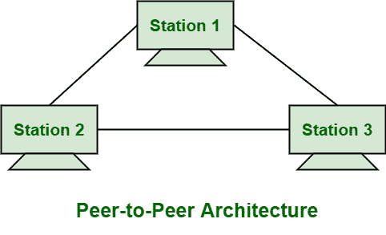
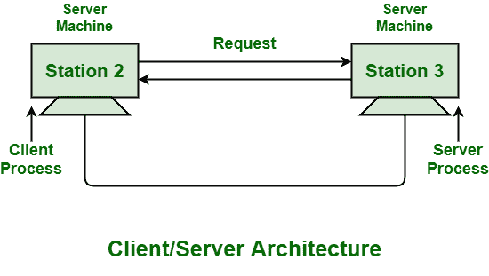

# 基于架构的计算机网络分类

> 原文:[https://www . geesforgeks . org/基于体系结构的计算机网络分类/](https://www.geeksforgeeks.org/classification-of-computer-network-on-basis-of-architecture/)

计算机网络通常是为了满足客户和用户的需求而开发的。

网络体系结构一般指计算机网络或通信网络的设计。它简单地描述了网络中所有计算机之间的分配任务。这只是一种组织和管理所有网络设备和服务以连接笔记本电脑、平板电脑、服务器等客户端的方式。以及如何将任务分配给计算机。它还促进了系统级的功能，甚至是健壮性、可扩展性和可进化性。它基本上被定义和描述为软件、硬件、协议和数据传输介质的物理和逻辑设计。

**基于计算机节点使用的网络分类:**
网络体系结构分为以下几类:

1.  **Peer-to-Peer Network :**
    In the P2P (Peer-to-Peer) network, “peers” generally represent computer system. These peers are connected to each other with help of Internet. Files might be shared directly without requirement of central server among these systems on the network. It can be said that each of computers on P2P network usually becomes file server even as client also. In this architecture, system is generally decomposed into various computational nodes that contain the same and equivalent capabilities, abilities, and responsibilities.

    在这个网络中，任务被分配给网络上每一个可用的设备。该网络对于小型环境非常重要，通常至少有 10 台计算机。客户端和服务器也没有分开。这个网络中的每一台计算机都被同等对待，甚至可以直接发送甚至接收信息。这种 P2P 网络通常用于商业、教育、军事等各个领域。

    

    **优势:**

    *   专用服务器或集中式不是很必要，所以 P2P 网络成本较低，非常便宜。价格实惠。
    *   P2P 很简单，不复杂。这是因为在网络通信中连接的所有计算机都以高效和礼貌的方式相互通信。
    *   安装和管理非常简单，因为安装和设置不那么费力，而且计算机可以自己管理。这是因为现代操作系统的内置支持。

    **缺点:**

    *   安全性是这类网络的主要问题之一。这是因为发送的消息在连接的计算机之间自由流动。
    *   如果使用某些资源的计算机出现故障，资源共享可能会成为主要问题。
    *   随着网络上计算机数量的增加，性能、安全性和访问也可能成为主要问题和令人头痛的问题。
2.  **Client/Server Network :**
    CSN (Client/Server Network) is type of computer network in which one of centralized and powerful computers (commonly called as server) is hub to which many of personal computers that are less powerful or workstations (commonly known as clients) are connected. It is type of system where clients are connected to server to just share or use resources. These servers are generally considered as heart of system.

    与 P2P 网络相比，这种类型的网络更加稳定和可扩展。在这种体系结构中，系统通常被分解成客户机和服务器处理器或进程。这种体系结构支持通常基于服务概念的功能分离。

    

    **优势:**

    *   服务器提供了一个特殊的网络操作系统，为许多请求资源的用户提供资源。
    *   设置和管理数据更新也非常简单。这是因为数据通常以集中的方式存储在服务器上。
    *   服务器通常控制资源和数据安全。
    *   这个网络也提高了资源共享的速度。

    **缺点:**

    *   无论如何如果服务器宕机或崩溃，整个都会受到影响。
    *   与 P2P 相比，它非常昂贵。这是因为需要具有更大内存的服务器以及许多网络设备，如集线器、路由器、交换机等。
    *   提供一氧化氮合酶的成本非常高。