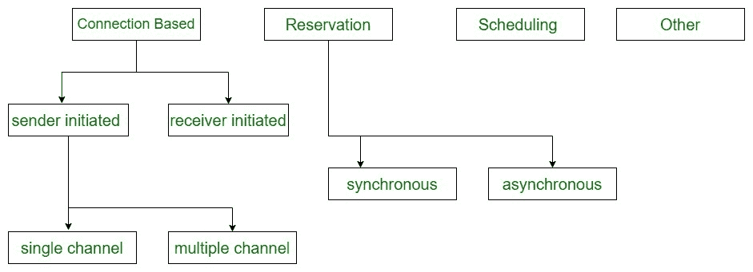

# 媒体访问控制协议分类

> 原文:[https://www . geeksforgeeks . org/MAC 协议分类/](https://www.geeksforgeeks.org/classification-of-mac-protocols/)

[MAC 协议](https://practice.geeksforgeeks.org/problems/what-is-media-access-controlmac)是 ad hoc 中物理层之上的第一个协议层。任何媒体访问控制协议的主要任务都是控制节点对共享介质的访问。

**MAC 协议分类:**
这些如下。

1.  **无预留/调度的基于争用的协议–**
    *   带宽未预留。
    *   不保证。
2.  **带预留机制的基于竞争的协议–**
    *   带宽是为传输预留的。
    *   可以给予保证。
3.  **具有调度机制的基于争用的协议–**
    *   分布式调度在节点之间完成。
    *   可以给予保证。
4.  **其他协议–**
    *   结合其他协议的多种功能。
    *   它也可以使用一种全新的方法。

**1。无预留/调度的基于竞争的协议–**

*   <u>发送方发起的协议</u> :
    数据包的传输由发送方节点发起。
    *   单通道发送程序已启动。例如，FAMA 的 MACAW。
    *   多通道发送方发起的协议。例如，BTMA、DBTMA、ICSMA。
*   <u>接收器发起的协议</u> :
    连接由接收器节点发起。比如 RI-BTMA，MACA-BI，马奇。

**2。带有预留机制的基于竞争的协议–**

*   <u>同步协议</u> :
    所有节点保持同步。例如，PRMA 特区、农场工人支援委员会、HRMA、SRMA/巴勒斯坦权力机构、FPRP。
*   <u>异步协议</u> :
    相对时间信息用于实现预约。比如 MACA/PR，RTMAC..

**具有调度机制的基于争用的协议–**
所有节点都被平等对待，没有节点被剥夺带宽。例如，DPS，DWOP，DLPS。

**其他协议–**
这些 MAC 协议严格来说不属于以上任何一类。例如，MMAC、马里稳定团、相变材料、阿拉伯国家区域局。