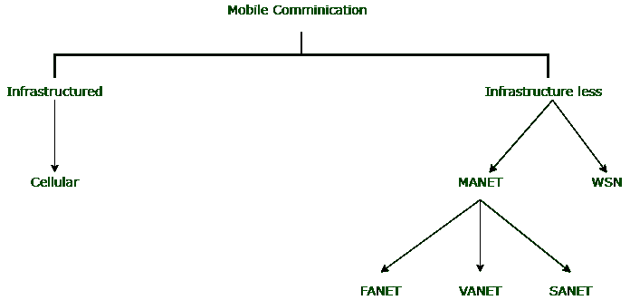

# 移动通信分类

> 原文:[https://www . geesforgeks . org/移动通信分类/](https://www.geeksforgeeks.org/classification-of-mobile-communication/)

随着移动和[无线通信](https://www.geeksforgeeks.org/wireless-communication-set-1/)的引入，技术时代已经彻底改变了通信。**移动通信**系统可以定义为允许人们在不使用任何物理链路的情况下进行通信的通信系统，而不考虑位置、时间和距离。无线通信的思想是由 **Macroni** 在 **1985** 随着**无线电报**的发明而提出的。

**移动通信分类:**

**1。基础设施移动通信:**
在这种类型的通信中，服务提供商需要布局基础设施来建立通信网络，因此网络依赖于基础设施。

**示例:**

**蜂窝通信:**
蜂窝通信被归类为基础设施，因为它涉及使用基站收发系统进行通信。基站使用两类天线进行通信，即:

*   **垂直天线:**
    又称射频天线或 [GSM](https://www.geeksforgeeks.org/gsm-full-form/) 天线。它以射频工作，即以兆赫为单位，负责发送和接收信号。
*   **鼓形天线:**
    又称微波天线。它负责在基站之间创建连接链路。它在微波上工作，频率为千兆赫。

**2。无基础设施移动通信:**
这类通信消除了对通信基础设施的需求，因此使移动通信具有成本效益，基站独立，效率更高。它分为以下几类:

1.  [**Mobile Adhoc Network (MANET)**](https://www.geeksforgeeks.org/introduction-of-mobile-ad-hoc-network-manet/) **:** 
    Mobile Adhoc network is an improvised network which is established when need arises. Once the job is done, the network is terminated. MANET is used in military organisation for communication purpose during war like emergency. There are several fields in MANET which are under research. 

    移动自组网应用于各个领域，分为以下几种类型:

    *   **(i) FANET :**
        FANET 代表飞行自组织网络。它被用于多无人机系统，以解决基于基础设施的通信系统所产生的问题，这些问题限制了多无人机系统的能力。利用 FANET，无人机集群通过自组织网络连接，形成一个团队，提高无人机在各个领域的能力。
    *   **(二)VANET :**
        VANET 代表车载自组网。它是在车辆中使用的移动自组网的另一个子集，以便实现车辆间通信。VANET 在交通监控、避免碰撞、加强安全等方面提供援助，但这一领域仍在研究中，尚未完全实施。
    *   **(三)SANET :**
        SANET 代表智能手机特设网。在这种情况下，智能手机之间使用 adhoc 网络进行蜂窝通信，消除了对基站的使用。
2.  [**无线传感器网络(WSN)**](https://www.geeksforgeeks.org/wireless-sensor-network-wsn/) **:**
    无线传感器网络是一种无基础设施的网络，它采用传感设备(即传感器)来分析和收集数据并将其传输到远程服务器。这些传感器智能、体积小、性价比高，并通过无线方式连接，实现无障碍远程通信。WSN 主要用于远程环境监测系统，其中传感器分析和记录环境的物理和化学因素，包括温度、压力、污染物、声音等，并将数据传输到主要的集中位置。它也用于跟踪目标。WSN 的另一个用途是跟踪水体中污染物的数量。