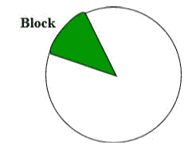

# 无类域间路由(CIDR)

> 原文:[https://www . geesforgeks . org/无类-域间-路由-cidr/](https://www.geeksforgeeks.org/classless-inter-domain-routing-cidr/)

由于我们已经了解了[有类寻址](https://www.geeksforgeeks.org/ip-addressing-introduction-and-classful-addressing/)，因此在本文中，我们将了解无类域间路由。也称为[无类寻址](https://www.geeksforgeeks.org/ip-addressing-classless-addressing/)。在有类寻址中，根据网络的类别，网络中的主机数量始终保持不变。

```
Class A network contains 224 Hosts,
Class B network contains 216 Hosts,
Class C network contains 28 Hosts 
```

现在，让我们假设一个组织需要 2 <sup>14</sup> 台主机，那么它必须购买一个 B 类网络。在这种情况下，将浪费 49152 台主机。这是有类寻址的主要缺点。

为了减少 IP 地址的浪费，引入了**无类域间路由**的新概念。现在一天 *IANA* 正在使用这种技术提供 IP 地址。每当任何用户要求 IP 地址时，IANA 都会给用户分配这么多的 IP 地址。



**表示法:**它也是一个 32 位地址，包括一个特殊的数字，代表块标识中的位数。

```
 a . b . c . d / n 
```

其中，n 是块标识/网络标识中的位数。
**例:**

```
20.10.50.100/20 
```

**CIDR 区块形成规则:**

1.  所有的 IP 地址必须是连续的。
2.  Block size must be the power of 2 (2<sup>n</sup>).
    If the size of the block is the power of 2, then it will be easy to divide the Network. Finding out the Block Id is very easy if the block size is of the power of 2.
    **Example:**
    If the Block size is 2<sup>5</sup> then, Host Id will contain 5 bits and Network will contain 32 – 5 = 27 bits.

    

3.  块的第一个 IP 地址必须能被块的大小整除。简单地说，主机标识中最不重要的部分应该总是以零开始。由于主机标识的所有最低有效位都为零，因此我们可以将其用作块标识部分。

**例:**
检查 100.1.2.32 到 100.1.2.47 是否是有效的 IP 地址块？

1.  所有的 IP 地址都是连续的。
2.  块中的 IP 地址总数= 16 = 2 <sup>4</sup> 。
3.  第一个 IP 地址:100.1.2.00100000
    因为，主机标识将包含最后 4 位，所有最低有效的 4 位都为零。因此，第一个 IP 地址可以被块的大小整除。

这三个规则都被这个区块所遵循。因此，它是一个有效的 IP 地址块。