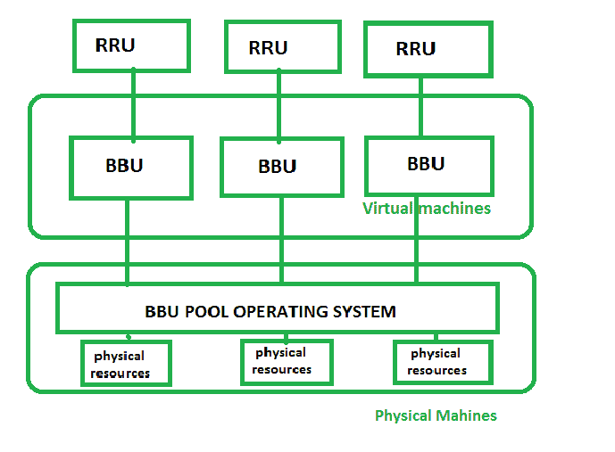

# 云无线接入网(C-RAN)

> 原文:[https://www . geesforgeks . org/cloud-radio-access-network-c-ran/](https://www.geeksforgeeks.org/cloud-radio-access-network-c-ran/)

由于移动数据流量的快速增长，传统的蜂窝网络架构面临着巨大的挑战。有限的频谱可用性使得数据流量消耗高功率。由于这些缺点，行业和研究团体不断寻求开发新的网络架构，以支持爆炸式增长的用户需求，同时降低网络运营商的资本和运营支出。因此，网络运营商正通过采用云/集中式接入网来满足这种需求

这种 C-RAN 网络方法有两个主要优点:-

1.  资本支出(资本支出)或运营支出减少(OPEX)
2.  通过更少的干扰改善用户体验

**C-RAN 解决方案:**
网络用户集中程度高的区域，如交通站点或大型商业综合体，对为其服务的基站收发台(BTS)的压力很大。随着更多基站的增加，如果 E-UTRAN 节点 B (eNB)没有被适当地协调，则增加了成本并增加了信号推断。

如果网络分为以下两部分–

```
1. Baseband Unit (BBU) 
2. Remote Radio Head (RRH) 
```

然后，网络运营商可以增加网络接入点的数量，同时将基带处理功能集中到“主基站”中。

**C-RAN 系统结构:**
C-RAN 系统结构分为 3 个部分:-

1.  **完全集中–**
    完全集中的结构将所有物理层、媒体访问控制层和网络层移动到基带单元。该基带单元能够处理管理和处理资源的所有功能，因此这种结构可以显著受益于简单的操作和维护。
2.  **部分集中–**
    在这个部分集中的结构中，物理层功能在 BBU 基带单元完成，而媒体访问控制层在 RRU 远程无线电单元执行。这将简单地减少无线资源单元-基站单元通信的开销，因为物理层承担了无线资源单元的主要计算负担。
3.  **混合集中式–**
    在这个集中式系统中，物理层功能在 RRU 完成，而其他功能在 BBU 层完成。远程无线电股(RRU)承担主要用户责任，主要负责信号处理。

**虚拟化概念:**
在 C-RAN 中，网络可视化是在基带单元(BBU)池级别完成的。BBU 将充当虚拟节点，它们之间的链接是虚拟链接。该池将在一个共享中央处理器的物理虚拟机上运行。远程无线电单元(RRU)将连接到 BBU，后者将通过虚拟机分发它们。这项技术将提供许多优势，如降低成本和最小化时间要求，最重要的是可扩展性。

添加和删除更容易，因为 BBU 的是虚拟机，比物理机更容易关闭和启动。

下图显示了 BBU 在 C-RAN 中的虚拟化–



**C-RAN 的优势:**

*   实施先进技术的可能性。
*   资源虚拟化
*   边缘服务部署促进
*   与传统网络不同，资源共享变得可行，因此分配可以更加灵活和按需。
*   提高资源利用率，减轻骨干服务器压力。
*   由于资源池更大，用户满意度更高。