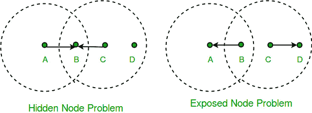

# 无线网络中的冲突避免

> 原文:[https://www . geesforgeks . org/无线网络中的碰撞避免/](https://www.geeksforgeeks.org/collision-avoidance-in-wireless-networks/)

我们仔细看看所谓的 WiFi，它也被称为 802.11 标准

考虑图中描述的情况，其中四个节点中的每一个都能够发送和接收仅到达其紧邻的左侧和右侧节点的信号。
比如 B 可以和 A、C 交换帧但不能到达 D，C 可以到达 B、D 但不能到达 A(图中未显示 A、D 的到达范围。)假设 A 和 C 都想与 B 通信，因此他们各自向 B 发送一帧。a 和 C 彼此不知道，因为它们的信号没有传播那么远。这两个帧在 B 处相互冲突，但与以太网不同，A 和 C 都没有意识到这种冲突。a 和 C 被称为相对于彼此的隐藏节点。

根据维基百科，隐藏节点问题可以定义为“在无线网络中，当一个节点对无线接入点(AP)可见，但对与该 AP 通信的其他节点不可见时，就会出现**隐藏节点问题或**隐藏终端问题。”

### 隐藏节点问题中无法检测到冲突

这是因为节点 **A** 和 **C** 在彼此的范围之外(因此在传输时无法检测到冲突)。因此，带有冲突检测(CSMA/光盘)的载波侦听多路访问不起作用，并且会发生冲突。由于冲突，接入点收到的数据已损坏。为了克服隐藏节点问题，除了具有冲突避免的载波侦听多路访问(CSMA/加州)方案之外，还实现了 RTS/CTS 握手(IEEE 802.11 RTS/CTS)。

一个相关的问题，称为暴露节点问题，发生在下列情况下:

假设 B 正在发送给 A(如上图所示)。节点 C 知道这个通信，因为它听到了节点 B 的传输。如果 C 仅仅因为能听到 B 的传播就断定自己不能向任何人传播，那将是一个错误。
例如，假设 C 想向节点 D 传输，这不是问题，因为 C 向 D 的传输不会干扰 A 从 b 接收的能力。

我们通过一种被称为避免冲突的多址接入的算法来解决这些问题。发送方和接收方在传输数据之前相互交换帧。这通知所有附近的节点传输即将开始。发送方向接收方发送**发送请求(RTS)** 帧。然后，接收方回复**清除发送(CTS)** 帧给发送方。任何接收到 CTS 帧的节点都知道它离接收器很近，因此不能发送帧。任何接收到 RTS 帧但没有接收到 CTS 帧的节点都知道它不靠近接收器来干扰它，因此它可以自由传输数据。

**参考–**
[维基百科](https://en.wikipedia.org/wiki/Multiple_Access_with_Collision_Avoidance_for_Wireless)

本文由 [**尼基尔·兰詹 10**](https://auth.geeksforgeeks.org/profile.php?user=Nikhil Ranjan 10) 和帕拉克·贾恩供稿。如果你喜欢 GeeksforGeeks 并想投稿，你也可以使用[contribute.geeksforgeeks.org](http://www.contribute.geeksforgeeks.org)写一篇文章或者把你的文章邮寄到 contribute@geeksforgeeks.org。看到你的文章出现在极客博客主页上，帮助其他极客。

如果你发现任何不正确的地方，或者你想分享更多关于上面讨论的话题的信息，请写评论。