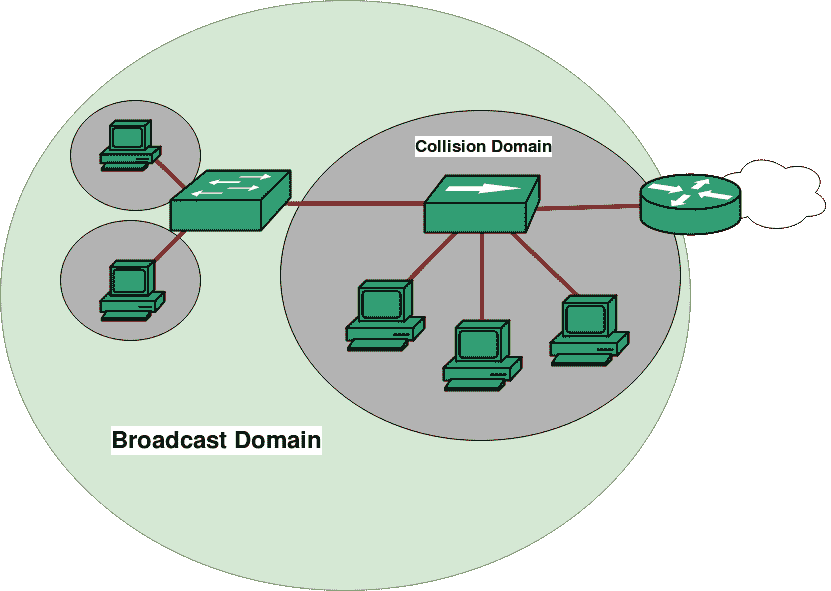

# 计算机网络中的冲突域和广播域

> 原文:[https://www . geesforgeks . org/冲突域和广播域计算机网络/](https://www.geeksforgeeks.org/collision-domain-and-broadcast-domain-in-computer-network/)

**先决条件–**[网络设备](https://www.geeksforgeeks.org/network-devices-hub-repeater-bridge-switch-router-gateways/)、[传输模式](https://www.geeksforgeeks.org/transmission-modes-computer-networks/)

最常用的网络设备是路由器和交换机。但是我们仍然听到人们谈论集线器、中继器和网桥。你有没有想过为什么前者比后者更受欢迎？一个原因可能是:“因为他们更有效率，更强大”。但是他们效率背后的原因究竟是什么呢？这就是像**【冲突域】****【广播域】**这样的术语出现的时候。

在继续之前，让我们回忆一下集线器是一个多端口中继器。同样，交换机是一个多端口网桥，因此您可以理解为什么中继器和网桥通常不在生产网络中使用(因为端口数量较少)。

现在，将范围缩小到集线器、交换机和路由器，让我们参考下面的域来讨论它们。

1.  **冲突域–**
    冲突域是这样一种场景:当一个设备向网络发送消息时，其冲突域中包含的所有其他设备都必须关注它，无论该消息是否发往它们。这导致了一个问题，因为在两个设备同时发送它们的消息的情况下，将会发生冲突，导致它们一次一个地等待并重新发送它们各自的消息。请记住，它仅在半双工模式下发生。
2.  **Broadcast Domain –** 
    A Broadcast Domain is a scenario in which when a device sends out a broadcast message, all the devices present in its broadcast domain have to pay attention to it. This creates a lot of congestion in the network, commonly called LAN congestion, which affects the bandwidth of the users present in that network. 

    由此，我们可以认识到，冲突域的数量越多，广播域的数量越多，网络为其所有用户提供更好带宽的效率就越高。

那么，我们的哪些网络设备打破了冲突域，哪些打破了广播域呢？

*   **HUB–**
    我们从一个 HUB 开始，因为我们应该尽快摆脱它。原因是，它既不会破坏冲突域，也不会破坏广播域，即集线器既不是冲突域分隔符，也不是广播域分隔符。所有连接到集线器的设备都在一个冲突和广播域中。请记住，集线器不会分割网络，它们只是连接网段。
*   **SWITCH–**
    说到交换机，我们比集线器更有优势。交换机上的每个端口都位于不同的冲突域中，即交换机是冲突域分离器。因此，来自连接到不同端口的设备的消息永远不会发生冲突。这有助于我们设计网络，但交换机仍然存在问题。他们从不破坏广播域，这意味着它不是广播域分隔符。交换机上的所有端口仍然在一个广播域中。如果设备发送广播消息，仍然会造成拥塞。
*   **路由器–**
    最后但同样重要的是，我们有了我们的救世主。路由器不仅会破坏冲突域，还会破坏广播域，这意味着它既是冲突，也是广播域分隔符。路由器在两个网络之间建立连接。来自一个网络的广播消息永远不会到达另一个网络，因为路由器永远不会让它通过。

此外，由于中继器和网桥与集线器和交换机的区别仅在于端口数量，所以中继器不会破坏冲突域和广播域，而网桥只会破坏冲突域。

**参考文献–**
[CCNA、托德·拉姆勒](http://www.innos.in/downloads/CISCO%20-%20640-802-ccna.pdf)

本文由 [**阿契夫·肖汉**](https://www.linkedin.com/in/achiv-chauhan-b67863109/) 供稿。如果你喜欢 GeeksforGeeks 并想投稿，你也可以使用[write.geeksforgeeks.org](https://write.geeksforgeeks.org)写一篇文章或者把你的文章邮寄到 review-team@geeksforgeeks.org。看到你的文章出现在极客博客主页上，帮助其他极客。

如果你发现任何不正确的地方，或者你想分享更多关于上面讨论的话题的信息，请写评论。