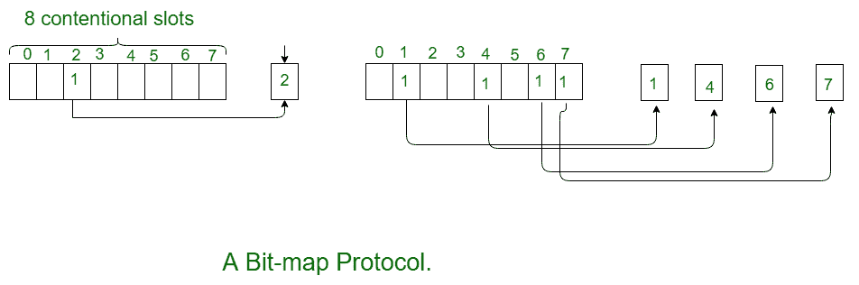
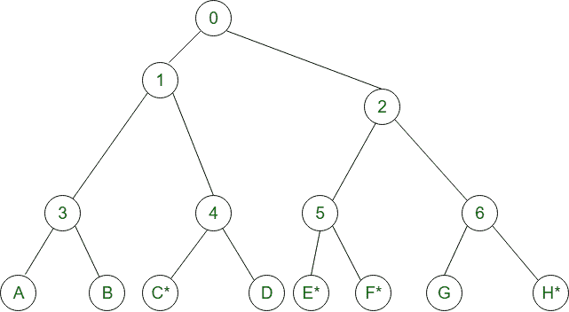

# 计算机网络中的无冲突协议

> 原文:[https://www . geesforgeks . org/无冲突计算机网络协议/](https://www.geeksforgeeks.org/collision-free-protocols-in-computer-network/)

在 **CSMA/CD** 几乎可以避免碰撞。它们仍然可能在竞争期间发生，竞争期间的冲突会对系统性能产生不利影响，当电缆较长而数据包长度较短时就会发生这种情况。随着光纤网络的投入使用，这个问题变得越来越严重。在这里，我们将讨论一些在争用期间解决冲突的协议。

*   位图协议
*   二进制倒计时
*   有限竞争协议
*   自适应树行走协议

纯和时隙 Aloha、CSMA 和 CSMA/CD 是**基于争用的协议:**

*   尝试-如果冲突-重试
    *   No guarantee of performance
        *   如果网络负载很高会发生什么？

        **无冲突协议:**

        *   支付恒定的开销以实现性能保证
        *   网络负载高时很好

        **1。位图协议:**
        位图协议是位图协议方法中的无冲突协议，每个争用周期正好由 N 个时隙组成。如果任何站必须发送帧，那么它在相应的时隙中发送 1 比特。例如，如果站 2 有帧要发送，它在第二个时隙发送 1 比特。

        一般来说，站 1 通过在时隙 1 中插入 1 比特来宣布它有帧问题的事实。这样，每个站都完全知道哪个站希望传输。永远不会有任何碰撞，因为每个人都同意谁是下一个。像这样的协议，其中传输的愿望是广播的实际传输被称为*保留协议*。

        

        为了分析该协议的性能，我们将以竞争比特时隙为单位来测量时间，数据帧由 *d* 个时间单位组成。在低负载条件下，由于缺少数据帧，位图将被一遍又一遍地重复。所有站点在高负载时都有东西要发送，N 位竞争周期按比例分配给 N 个帧，产生的开销仅为每帧 1 位。

        通常，高编号站在开始发送之前必须等待半次扫描，低编号站在开始发送之前必须等待半次扫描(N/2 位时隙)，低编号站平均必须等待 1.5 N 个时隙。

        **2。二进制倒计时:**
        二进制倒计时协议用于克服每个二进制站 1 比特的开销。在二进制倒计时中，使用二进制站地址。想要使用信道的电台以二进制位串的形式广播其地址，从高位开始。假设所有地址的长度相同。在这里，我们将看到例子来说明二进制倒计时的工作。

        在这种方法中，不同的站地址被“或”在一起，它们决定传输的优先级。如果这些站 0001、1001、1100、1011 都试图抢占传输信道。所有站首先广播它们的最高有效地址位，分别是 0、1、1、1。最高有效位一起进行“或”运算。站 0001 看到另一个站地址中的 1MSB，知道一个编号更高的站在争夺信道，所以放弃本轮。

        其他三个站 1001、1100、1011 继续。站 1100 的下一位是 1，瑞士站 1011 和 1001 放弃。然后站 110 开始发送帧，之后另一个投标周期开始。

        

        **有限竞争协议:**

        *   当网络负载较低时，基于冲突的协议(纯协议和时隙 ALOHA、CSMA/光盘)很好。
        *   当负载较高时，无冲突协议(位图、二进制倒计时)很好。
        *   How about combining their advantages
            1.  在轻负载下的行为类似于 ALOHA 方案
            2.  在高负载下表现得像位图方案。

            **自适应树行走协议:**

            *   划分站组并限制每个时隙的争用。
            *   在轻负载下，每个人都可以像 aloha 一样尝试每个插槽
            *   在高负载下，每个插槽只能有一个组尝试
            *   **我们怎么做:**
                1.  把每一个站都当作一棵二叉树的叶子
                2.  第一个时隙(传输成功后)，所有站
                    可以尝试获取该时隙(根节点下)。
                3.  如果没有冲突，没问题
                4.  在冲突的情况下，只有子树下的节点才能尝试下一个。(深度优先搜索)

            **举例:**

            

            *   **插槽-0:** C*、E*、F*、H*(节点 0 下的所有节点都可以尝试将要发送的节点)，冲突
            *   **Slot-1:** C*(节点 1can 尝试下的所有节点)，C 发送
            *   **槽-2:** E*、F*、H*(节点 2 下的所有节点都可以尝试}，冲突
            *   **时隙-3:** E*、F*(节点 5 下的所有节点都可以尝试发送)，冲突
            *   **槽-4:**E *(E 下所有节点均可尝试)，E 发送
            *   **槽-5:**F *(F 下所有节点都可以尝试)，F 发送
            *   **时隙-6:** H*(节点 6 下的所有节点都可以尝试发送)，H 发送。