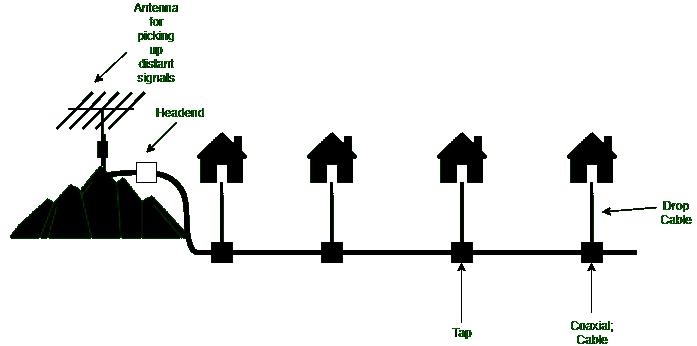

# 社区天线电视

> 原文:[https://www.geeksforgeeks.org/community-antenna-television/](https://www.geeksforgeeks.org/community-antenna-television/)

引入有线电视是为了给生活在农村或山区的人们提供更好的接收。最初，该系统由山顶上的一个大天线组成，用于从空中接收电视信号，一个称为头端的放大器用于增强信号，一根同轴电缆用于将信号传送到人们的家中。

早期的有线电视系统

**有线电视系统术语:**

1.  **天线–**
    它被放置在像小山一样的一些高度上，这样它就可以接收远处的信号。它把电磁波转换成电信号。这是关键因素。
2.  **头端–**
    是用于接收通信信号并将其分发到本地的设备。它接受信号并将其处理成电缆信号。

*   **分接头–**
    它们用于连接引入电缆和配线电缆。*   **同轴电缆–**
    它是一种内部导体被绝缘材料隔开的导电屏蔽所包围的电缆。它们有保护性的外壳。它们以低损耗传输信号。*   **Drop Cable –**
    They are used to connecting individual homes with the coaxial cable so that cable can reach a person’s home. In the early years, cable television was called Community Antenna Television.

    **有线电视系统特点:**
    旨在为生活在农村和地势较高地区的人们提供有线电视服务。想要有线电视服务的人必须支付月费和建立费。

    整个系统包括山上的一个天线，因此它可以接收信号。前端对信号进行放大、校正和增强。信号通过同轴电缆传输。在引入电缆的帮助下，我们可以将同轴电缆与各个家庭和机构连接起来。随着用户数量的增长，需要增加额外的电缆和放大器。传输是从前端到用户的。

    时代公司开始了一个新的频道，家庭票房，新的内容通过有线传播。另一个有线电视频道专注于体育、烹饪和许多其他话题。

    这一发展导致了该行业的两个变化。即大公司开始购买现有的电缆系统并铺设新的电缆以获得新的用户，现在需要连接多个系统。电缆公司开始在城市之间铺设电缆，将它们连接成一个单一的系统。