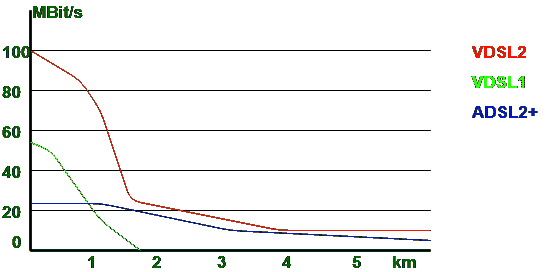

# 【ADSL 对比 VDSL

> 原文:[https://www . geeksforgeeks . org/对比-adsl-vs-vdsl/](https://www.geeksforgeeks.org/comparison-between-adsl-vs-vdsl/)

先决条件–[数字用户线路(DSL)](https://www.geeksforgeeks.org/digital-subscriber-line-dsl/)
**ADSL** 代表**非对称数字用户线路**，而 **VDSL** 代表非常**高比特率数字用户线路**。

主要的分歧在于信息传输的速度或速率，只要 VDSL 比 ADSL 快得多。

让我们看看 ADSL 和 VDSL 的区别:

| S.NO | 非对称数字式用户线路 | VDSL |
| 1. | ADSL 代表非对称数字用户线路。 | VDSL 代表甚高比特率数字用户线路。 |
| 2. | 它使用无载波幅度相位或离散多音技术进行调制。 | 而它使用离散多音技术进行调制。 |
| 3. | 它使用点对点协议，而不是异步传输模式协议。 | 而它使用异步传输模式协议。 |
| 4. | ADSL 的覆盖范围是 18000 英尺。 | 而 VDSL 的覆盖范围是 4500 英尺。 |
| 5. | ADSL 上行速率的变化范围是 Kbps 到 1Mbps。 | 而 VDSL 上行速率的变化范围为 1.5-2.5 兆比特/秒。 |
| 6. | ADSL 的下行速率从 Kbps 到 8Mbps 不等。 | 而 VDSL 的下行速率从 50 兆比特每秒到 55 兆比特每秒不等。 |
| 7. | ADSL 提供数据业务和 POTS 业务。 | 它还提供 POTS 服务以及对称数据服务。 |

