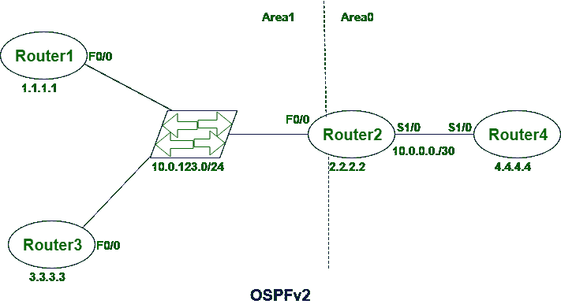
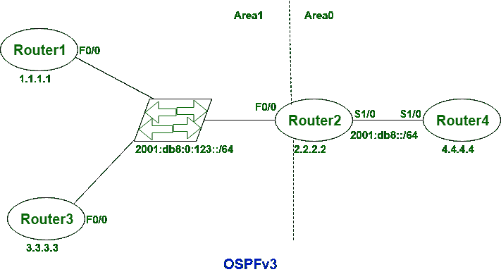

# OSPF v2 与 OSPFv3 的对比

> 原文:[https://www . geesforgeks . org/comparison-by-OSPF v2-vs-OSPF v3/](https://www.geeksforgeeks.org/comparison-between-ospfv2-vs-ospfv3/)

**OSPFv2** 代表**开放最短路径优先版本 2** 、 **OSPFv3** 代表**开放最短路径优先版本 3。** OSPFv2 是 IPv4 的 OSPF 版本，而 OSPFv3 是 IPv6 的 OSPF 版本。在 OSPFv2 中，每个接口不支持许多 OSPF 实例，而在 OSPFv3 中，每个接口支持许多 OSPF 实例。

OSPFv3 和 OSPFv2 之间几乎没有相似之处，它们是:

1.  数据包类型
2.  接口类型
3.  邻居发现模式
4.  LSA 洪水和老化

除了这些相似之处，还有一些不同之处，如下所示:

<figure class="table">

| S.NO | OSPFv2 | OSPFv3 |
| --- | --- | --- |
| 1. | OSPFv2 是 IPv4 的 OSPF 版本。 | 而 OSPFv3 是 IPv6 的 OSPF 版本。 |
| 2. | OSPFv2 的报头大小为 24 字节。 | 而 OSPFv2 的报头大小为 16 字节。 |
| 3. | OSPFv2 有七个链路状态通告。 | OSPFv3 有九个链路状态通告。 |
| 4. | 在 OSPFv2 中，每个链路只有一个实例。 | 虽然每个链接都有许多实例，但在 OSPFv3 中。 |
| 5. | 在 OSPFv2 中，每个接口不支持许多 OSPF 实例。 | 而在 OSPFv3 中，每个接口支持许多 OSPF 实例。 |
| 6. | OSPFV2 中没有泛洪空间。 | 而 OSPFv3 中存在泛洪空间。 |
| 7. | OSPFv2 运行在子网而不是链路上。 | 而 OSPFv3 运行在链路上，而不是子网上。 |
| 8. | 需要网络掩码来形成邻接。 | 邻接形成不需要网络掩码。 |
| 9. | MD5 哈希用于身份验证。 | IPSec 用于身份验证。 |
| 10. | 来自不同子网的节点无法通信。 | 来自不同子网的节点可以通信。 |

</figure>