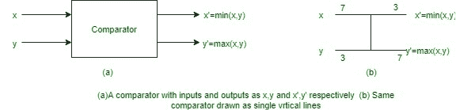

# 比较网络

> 原文:[https://www.geeksforgeeks.org/comparison-networks/](https://www.geeksforgeeks.org/comparison-networks/)

**比较网络**是一种总是对输入进行排序的排序网络。电线和比较器组成比较网络。一个*比较器*是一个有两个输入(x，y)和输出(x’，y’)的设备。它执行以下功能:

```
x' = min(x, y),
y' = max(x, y) 
```



比较器通常绘制为单垂直线，输入在左边，输出在右边。较小的输入值放在顶部输出，而较大的输入值放在底部输出。因此，比较器可以被认为是对其两个输入进行排序。假设每个比较器在 0(1)时间内工作，即输入值出现和输出产生之间的时间是恒定的。

比较网络的第二个组成部分，即**导线**执行将值从一个地方传输到另一个地方的功能。这些是网络输入线或网络输出线。电线能够将一个比较器的输入连接到另一个比较器的输出。

只有当比较器的两个输入值都可用时，它才会产生输出。现在，假设每个比较器花费单位时间，可以定义“运行时间”。运行时间是输入线接收到值后，输出线接收值所花费的时间。形式上定义如下。比较网络的输入线深度为 0。现在，如果 d1 和 d2 是两条输入线的深度，那么输出线的深度是 max(d1，d2) + 1。比较器的深度定义为其输出线的深度。

**属性:**

*   图形必须是非循环的。
*   只有当输入可用时，才会产生输出。
*   如果输入可用，比较器并行处理。
*   排序网络是对输出进行排序的比较网络。
*   不是所有的比较网络都是分类网络。
*   A comparison network is like a procedure which specifies how comparisons are to occur.

    **定理:**

    1.  如果一个有 n 个输入的比较网络能正确地对所有 2n 个可能的 0 和 1 序列进行排序，那么它就能正确地对所有任意数字序列进行排序。
    2.  如果比较网络转换输入 a = ha1，a2，.。。，ani 进入输出 b = hb1，b2，。。。，bni，那么对于任何单调递增的函数 f，网络变换

        ```
        f(a) = hf(a1), f(a2), . . ., f(an)i 
        into 
        f(b) = hf(b1), f(b2), . . ., f(bn)i 
        ```