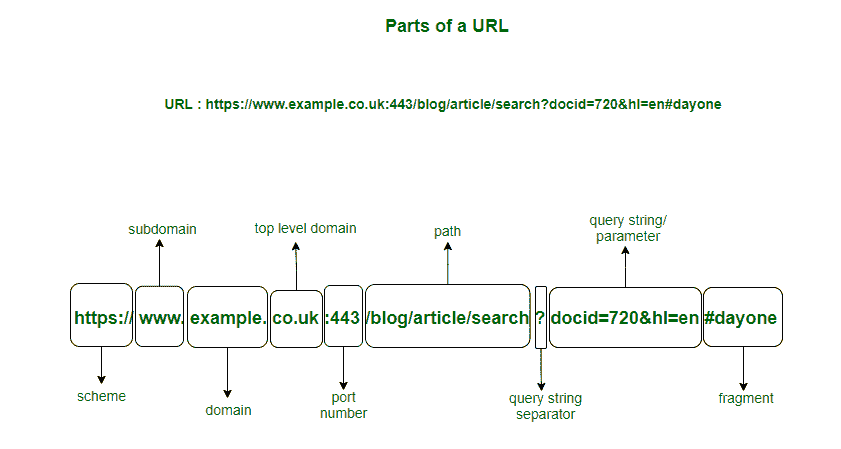

# 网址的组成部分

> 原文:[https://www.geeksforgeeks.org/components-of-a-url/](https://www.geeksforgeeks.org/components-of-a-url/)

如果你是海绵宝宝，那么你的网址是太平洋海底比基尼岛，但如果你不是，你的网址绝对是你住的房子的地址！网址代表**[](https://www.geeksforgeeks.org/url-full-form/)****。**对于一个网站来说，网址基本上就是网站在线的地方，它可以帮助访问者轻松识别网站，并了解网站的内容。****

****一个典型的网站在其网址中至少有 3 个部分，像 www.google.com，但是一些复杂的网址也可能有 8 到 9 个部分，即方案，子域，域名，顶级域名，端口号，路径，查询，参数和片段。****

****

网址的组成部分**** 

******1。方案:******

```
*****<u>https://</u>*****
```

****网址的协议或方案部分，并表示决定数据传输和交换的**规则集**。代表超文本传输协议安全的 HTTPS 告诉浏览器**以超文本(HTML)格式**显示页面，同时**加密用户在页面中输入的任何信息**。其他协议包括用于在客户端和服务器之间传输文件的 **FTP** 或文件传输协议，用于发送电子邮件的 **SMTP** 或单邮件传输协议。****

******2。子域:******

```
**https://***<u>www.</u>*****
```

****子域用于分隔网站的不同部分，因为它**指定了要交付给客户端的资源类型**。这里使用的子域“www”是网络上任何资源的通用符号。像“博客”这样的子域直接指向博客页面，“音频”表示资源类型为音频。****

******3。域名:******

```
**https://www.***<u>example.</u>*****
```

****域名**指定该网址所属的组织或实体**。就像在*www.facebook.com*一样，域名“facebook”表示拥有该网站的组织。****

******4。顶级域名:******

```
**https://www.example.***<u>co.uk</u>*****
```

****TLD(顶级域名)**表示网站注册到的组织类型**。就像**一样。*www.facebook.com*中的 com** 表示**商业实体**。同样地，。org 表示组织，.co.uk 为英国的商业实体。****

******5。端口号:******

```
**https://www.example.co.uk***<u>:443</u>*****
```

****端口号指定了**客户端请求的服务类型**，因为**服务器通常提供多种服务**。一些默认端口号包括 HTTP 的 80 和 HTTPS 服务器的 443。****

******6。路径:******

```
**https://www.example.co.uk:443***<u>/blog/article/search</u>*****
```

****路径**指定用户想要访问的网页、文件或任何**资源的确切位置****。像这里一样，路径表示博客网页中的特定文章。****

****7。查询字符串分隔符:****

```
https://www.example.co.uk:443/blog/article/search***<u>?</u>***
```

**包含特定搜索参数的**查询字符串**前面是问号(？).问号告诉浏览器**正在执行特定查询**。**

****8。查询字符串:****

```
https://www.example.co.uk:443/blog/article/search?***<u>docid=720&hl=en</u>***
```

**查询字符串**指定从网站数据库中查询的数据的参数。**每个查询字符串都是由一个参数和值组成的**，并用等号(=)连接。在有多个参数的情况下，使用&符号(&)连接查询字符串。参数可以是数字、字符串、加密值或数据库中的任何其他形式的数据。****

****9。片段:****

```
https://www.example.co.uk:443/blog/article/search?docid=720&hl=en***<u>#dayone</u>***
```

**URL 的片段标识符是**可选的**，通常出现在末尾，以哈希(#)开头。它表示页面中的一个特定位置**，比如一个 HTML 元素**的‘id’或‘name’属性。**

**你可能会惊讶，虽然网址看起来本质上是微不足道的，但你的网址看起来像什么实际上是搜索引擎优化的一个重要因素。欢迎从这里查看更多网址:**

*   ***https://developer . Mozilla . org/enUS/docs/Learn/Common _ questions/What _ is _ a _ URL***
*   ***https://www.hostgator.com/blog/best-url-structure-seo/***
*   **来源:https://amberwilson.co.uk/blog/urls/**