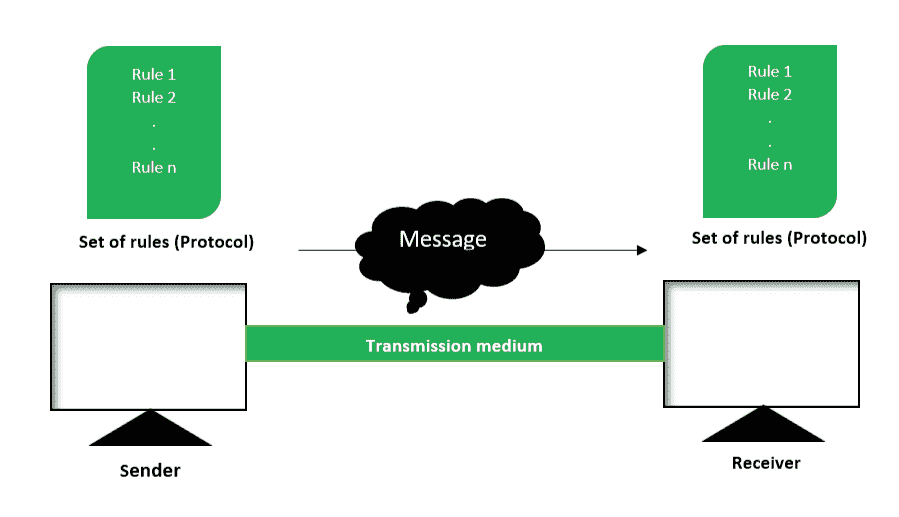

# 数据通信系统组件

> 原文:[https://www . geesforgeks . org/components-of-data-communication-system/](https://www.geeksforgeeks.org/components-of-data-communication-system/)

[数据通信](https://www.geeksforgeeks.org/difference-between-computer-network-and-data-communication/)定义为两个设备之间通过某种形式的传输介质(如电缆、电线或空气或真空)进行的数据交换。为了进行数据通信，通信设备必须是由硬件或软件设备和程序组合而成的通信系统的一部分。

**数据通信系统组件:**
数据通信系统主要有五个组件:

```
1. Message
2. Sender
3. Receiver
4. Transmission Medium
5. Set of rules (Protocol) 
```

所有上述要素描述如下:



<center>**Figure –** Components of Data Communication System</center>

1.  **Message :**
    This is most useful asset of a data communication system. The message simply refers to data or piece of information which is to be communicated. A message could be in any form, it may be in form of a text file, an audio file, a video file, etc.
2.  **Sender :**
    To transfer message from source to destination, someone must be there who will play role of a source. Sender plays part of a source in data communication system. It is simple a device that sends data message. The device could be in form of a computer, mobile, telephone, laptop, video camera, or a workstation, etc.
3.  **Receiver :**
    It is destination where finally message sent by source has arrived. It is a device that receives message. Same as sender, receiver can also be in form of a computer, telephone mobile, workstation, etc.
4.  **[Transmission Medium :](https://www.geeksforgeeks.org/types-transmission-media/)**
    In entire process of data communication, there must be something which could act as a bridge between sender and receiver, Transmission medium plays that part. It is physical path by which data or message travels from sender to receiver. Transmission medium could be guided (with wires) or unguided (without wires), for example, twisted pair cable, fiber optic cable, radio waves, microwaves, etc.
5.  **规则集(协议):**
    为了管理数据通信，通信系统的设计者已经设计了各种规则集，它们代表了通信设备之间的一种协议。这些被定义为协议。简单来说，协议是一组管理数据通信的规则。如果连接了两个不同的设备，但是它们之间没有协议，那么这两个设备之间就不会有任何类型的通信。因此，该协议对于数据通信的发生是必要的。

数据通信系统的一个典型例子是发送电子邮件。发送电子邮件的用户充当发送者，消息是用户想要发送的数据，接收者是用户想要发送消息的人，整个过程涉及到很多协议，其中之一是[简单邮件传输协议(SMTP)](https://www.geeksforgeeks.org/simple-mail-transfer-protocol-smtp/) ，发送者和接收者都必须有一个使用无线介质发送和接收电子邮件的互联网连接。