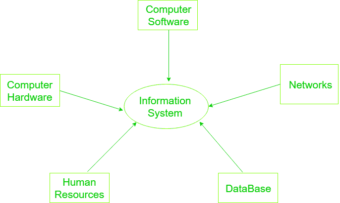

# 信息系统组件

> 原文:[https://www . geesforgeks . org/components-of-information-system/](https://www.geeksforgeeks.org/components-of-information-system/)

一个**信息系统**是硬件和软件以及电信网络的组合，人们构建这些网络来收集、创建和分发有用的数据，通常是在一个组织中。它定义了系统内的信息流。信息系统的目标是向用户提供适当的信息，收集数据，处理数据，并向系统用户传递信息。

信息系统的组成部分如下:

**1。计算机硬件:**
用于输入、输出和处理的物理设备。硬件结构取决于组织的类型和规模。它由输入和输出设备、操作系统、处理器和媒体设备组成。这也包括计算机外围设备。

**2。计算机软件:**
用于控制和协调硬件组件的程序/应用程序。它用于分析和处理数据。这些程序包括一组用于处理信息的指令。

软件进一步分为 3 种类型:

1.  系统软件
2.  应用软件
3.  程序

**3。数据库:**
数据是未经组织的原始事实和数字，随后被处理以生成信息。软件用于组织数据并为用户提供服务，管理媒体和虚拟资源的物理存储。因为没有软件硬件就不能工作，就像软件需要数据来处理一样。使用数据库管理系统管理数据。
数据库软件用于有效访问所需数据和管理知识库。

**4。网络:**

*   网络资源是指像内联网、外联网和互联网这样的电信网络。
*   这些资源促进了组织中的信息流动。
*   网络由网卡、路由器、集线器和电缆等物理设备以及操作系统、网络服务器、数据服务器和应用服务器等软件组成。
*   电信网络由计算机、通信处理器和其他由通信介质互连并由软件控制的设备组成。
*   网络包括通信媒体和网络支持。

**5。人力资源:**
它与运行和管理系统所需的人力相关联。人是信息系统的最终用户，最终用户利用信息为自己的目的而产生，信息系统的主要目的是使最终用户受益。最终用户可以是会计师、工程师、销售员、客户、职员或经理等。人们还负责开发和操作信息系统。他们包括系统分析员、计算机操作员、程序员和其他文书信息系统人员，以及管理技术。