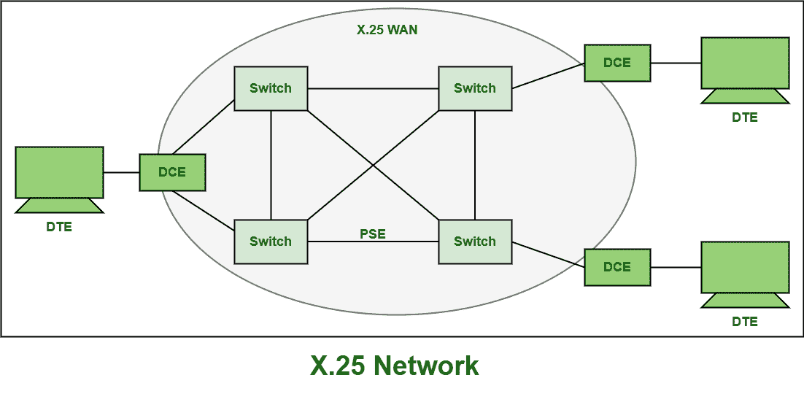

# x . 25 网络组件

> 原文:[https://www.geeksforgeeks.org/components-of-x-25-network/](https://www.geeksforgeeks.org/components-of-x-25-network/)

X.25 是国际电信联盟电信标准化部门(ITU-T)协议标准，仅用于[广域网(WAN)](https://www.geeksforgeeks.org/wan-full-form/) 通信，基本上描述了用户设备和网络设备之间的连接是如何建立和维护的。

该协议也称为用户网络接口(SNI)协议。这是很久以前就使用的分组交换网络技术。它基本上允许所有远程设备通过高速数字链路相互通信，而无需单独租用线路。X.25 基本上是为用于终端或分时连接的计算机连接开发的。它还解释了节点终端如何连接到网络，以分组模式进行简单通信。它也是一个面向连接的协议，解释了[现场视察模型](https://www.geeksforgeeks.org/osi-model-full-form-in-computer-networking/)的三层，即物理层、数据链路层和网络层。它支持两种类型的虚电路，如下所示:

1.  **Switched Virtual Circuit (SVC) :**
    This virtual circuit Is established among a computer and network when the computer transfers a packet or data to the network that is requesting to make a call to another computer. SVCs are less costly than PVCs. It is generally a virtual connection between two different DTE’s. S

    VCs are simply implemented and established in connection-oriented systems like analog telephone networks and ATM networks. An SVC range not at all allowed to overlap any other range. These are simply voice calls and are a part of X.25 Network. SVCs are also similar to PVC but it rather allows users to dial into the network of virtual circuits. They are also required as seldom-used data transfer.

2.  **永久虚电路(PVC) :**
    它是两个 DTE 之间的永久关联，只有当用户订阅公共网络时才能建立。聚氯乙烯比 SVC 贵。这也类似于用于链接所有数据设备的租用线路。还需要设置阶段，因为它是永久性的。它还支持在连续或频繁通信的所有节点之间的物理连接之上创建或开发逻辑连接。它基本上是广域网的一种电信服务形式，需要在电路交换网络中的两个节点之间提供专用交换电路。例子可以在异步传输模式(ATM)和帧中继网络中找到。聚氯乙烯主要是为繁忙的网络开发的，总是需要虚电路的服务。

**X.25 网络设备和组件:**
建立 X.25 网络还需要一些设备和条款。
X.25 网络设备通常分为不同的类别，如下所示:

1.  **Data Terminal Equipment (DTE) :**
    DTE is basically an instrument or equipment that acts as a source or destination in digital communication and is used to convert user information or data into signals and then also reconverts all received signals into user information. It also communicates with DCE. Usually, DCE is a terminal device or might be a voice or data terminal. It can also be a printer, file servers, routers, etc.

    These are basically the end systems that are used to communicate across the X.25 network. It does not even need to know about how data is sent or data is received. DTE usually required DCE to communicate with each other. It does not communicate with each other. It also used any of the devices that are used to store or generate data for the user.
2.  **Data Circuit-Terminating Equipment (DCE) :**
    DCE is sometimes also known as data communication equipment and data carrier equipment. It is a device that is fitted between the DTE and Data transmission circuit. All the communications details regarding sending and receiving data are left to the DCE.

    一般是将信号从 DTE 转换成更适合通过传输通道传输的另一种形式的信号转换设备。它还将这些信号转换，并在电路的接收端转换回原始形式。它还负责通过串行链路提供时序。它还执行各种功能，例如信号转换、编码，甚至数据站中的线路时钟。

3.  **Packet Switching Exchange (PSE) :**
    PSE is basically the switches that compose the bulk of the carrier’s network and are located in the carrier’s facilities. PSE is synchronous i.e., there is a clocking circuit that controls the timing of communication among the routers. These PSEs are also PADs, and even they disassemble and reassemble the packets.

    There can various PSE stop known as hops along the way. PSE is generally used to transmit the data from one DTE device to another through the use of X.25 PSN and is simply considered as the backbone of X.25 Network.

    