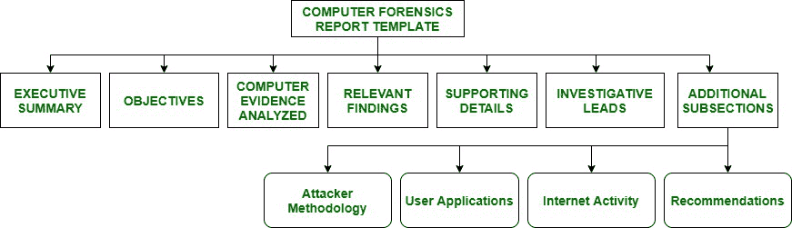

# 计算机取证报告格式

> 原文:[https://www . geesforgeks . org/computer-forcer-report-format/](https://www.geeksforgeeks.org/computer-forensic-report-format/)

**[计算机取证](https://www.geeksforgeeks.org/introduction-of-computer-forensics/)** 的主要目标是在计算设备上执行结构化调查，以找出发生了什么或谁对发生的事情负责，同时在正式报告中维护适当的证据记录链。计算机取证报告的语法或模板如下:

1.  **Executive Summary :**
    Executive Summary section of computer forensics report template provides background data of conditions that needs a requirement for investigation. Executive Summary or the Translation Summary is read by Senior Management as they do not read detailed report. This section must contain short description, details and important pointers. This section could be one page long. Executive Summary Section consists of following :
    *   考虑到谁授权了法医检查。
    *   简短详细的重要证据清单。
    *   解释为什么需要对计算设备进行法医检查。
    *   包括一个签名块，供执行工作的审查员使用。
    *   与案件相关或涉及案件的所有人员的完整、合法和适当的姓名、职务、初次接触或沟通的日期。

2.  **Objectives :**
    Objectives section is used to outline all tasks that an investigation has planned to complete. In some cases, it might happen that forensics examination may not do a full fledged investigation when reviewing contents of media. The prepared plan list must be discussed and approved by legal council, decision makers and client before any forensic analysis. This list should consist tasks undertaken and method undertaken by an examiner for each task and status of each task at the end of report.
3.  **Computer Evidence Analyzed :**
    The Computer Evidence Analyzed section is where all gathered evidences and its interpretations are introduced. It provides detailed information regarding assignment of evidence’s tag numbers, description of evidence and media serial numbers.
4.  **Relevant Findings :**
    This section of Relevant Findings gives summary of evidences found of **probative Value** When a match is found between forensic science material recovered from a crime scene e.g., a fingerprint, a strand of hair, a shoe print, etc. and a reference sample provided by a suspect of case, match is widely considered as strong evidence that suspect is source of recovered material. However, probative value of evidence can vary widely depending on way in which evidence is characterized and hypothesis of its interest. It answers questions such as “What related objects or items were found during investigation of case ?”.
5.  **Supporting Details :**
    Supporting Details is section where in-depth analysis of relevant findings is done. ‘How we found conclusions outlined in Relevant Findings?’, is outlined by this section. It contains table of vital files with a full path name, results of string searches, Emails/URLs reviewed, number of files reviewed and any other relevant data. All tasks undertaken to meet objectives is outlined by this section. In Supporting Details we focus more on technical depth. It includes charts, tables and illustrations as it conveys much more than written texts. To meet outlined objectives, many subsections are also included. This section is longest section. It starts with giving background details of media analyzed. It is not easy to report number of files reviewed and size of hard drive in a human understandable language. Therefore, your client must know how much data you wanted to review to arrive at a conclusion.
6.  **Investigative Leads :**
    Investigative Leads performs action items that could help to discover additional information related to the investigation of case. The investigators perform all outstanding tasks to find extra information if more time is left. Investigative Lead section is very critical to law enforcement. This section suggests extra tasks that discovers information needed to move on case. e.g. finding out if there are any firewall logs that date any far enough into past to give a correct picture of any attacks that might have taken place. This section is important for a hired forensic consultant.
7.  **附加小节:**
    法医报告中包含了各种附加小节。这些部分取决于客户的需求。以下小节在特定情况下很有用:
    *   **攻击者方法–**
        帮助读者理解所执行的一般或确切攻击的附加简报在攻击者方法的这一部分给出。本节在计算机入侵情况下很有用。检查攻击是如何进行的，以及标准日志中的攻击片段是什么样子。
    *   **用户应用程序–**
        在本节中，我们讨论安装在所分析介质上的相关应用程序，因为我们观察到，在许多情况下，系统上存在的应用程序非常相关。如果您正在调查攻击者使用的任何系统，例如网络攻击工具，请给这一部分起一个标题。
    *   **互联网活动–**
        互联网活动或网页浏览历史部分给出被分析媒体用户的网页浏览历史。浏览历史对于暗示意图、恶意工具的下载、未分配的空间、在线研究、安全删除程序的下载或清除文件松弛和临时文件的证据移除类型程序也是有用的，这些文件通常藏有对调查非常重要的证据。
    *   **建议–**
        本部分建议态势感知客户端为下一次计算机安全事件做好更多准备和培训。我们调查了一些基于主机、基于网络和程序的对策，以降低或消除事故安全风险。