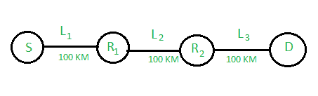

# 计算机网络|第二集

> 原文:[https://www.geeksforgeeks.org/computer-networks-set-2/](https://www.geeksforgeeks.org/computer-networks-set-2/)

GATE 2012 CS 考试中提出了以下问题。

**1)考虑源计算机(S)通过由两台路由器(R1 和 R2)和三条链路(L1、L2 和 L3)组成的网络向目标计算机(D)传输大小为 106 位的文件。L1 连接南到 R1；L2 连接 R1 和 R2；L3 连接 R2 和 d .假设每条链路的长度为 100 公里。假设信号以每秒 10^8 米的速度通过每条链路。假设每条链路上的链路带宽为 1Mbps。让文件分解成 1000 个数据包，每个数据包大小为 1000 位。求从 S 到 D 传输文件的传输和传播延迟的总和？**
(甲)1005 毫秒
(乙)1010 毫秒
(丙)3000 毫秒
(丁)3003 毫秒

答(一)

[从 s 到 R1 的传播延迟](http://en.wikipedia.org/wiki/Propogation_delay)=(距离)/(链路速度)= 10^5/10^8 = 1 毫秒
从 s 到 d 的传播总延迟= 3*1 毫秒= 3 毫秒

1 个数据包的总[传输延迟](http://en.wikipedia.org/wiki/Transmission_delay)= 3 *(位数)/带宽= 3*(1000/10^6 = 3 毫秒。

第一个数据包到达 D 需要 6 毫秒。当第一个数据包到达 D 时，其他数据包必须已经并行处理。因此，D 将从 R2 接收剩余的数据包，每 1 毫秒 1 个数据包。因此，剩余的 999 个数据包需要 999 毫秒，总时间为 999 + 6 = 1005 毫秒

**2)考虑 TCP 的加法增加乘法减少(AIMD)算法的一个实例，其中慢启动阶段开始时的窗口大小为 2 MSS，第一次传输开始时的阈值为 8 MSS。假设在第五次传输期间出现超时。找出第十次传输结束时的拥塞窗口大小。**
(A) 8 个 MSS
(B) 14 个 MSS
(C) 7 个 MSS
(D) 12 个 MSS

答案(三)

由于使用了[慢速启动](http://en.wikipedia.org/wiki/Slow-start)，窗口大小会随着成功发送的段数而增加。这种情况会一直持续到达到阈值或超时。
在上述两种情况下 [AIMD](http://en.wikipedia.org/wiki/Additive_increase/multiplicative_decrease) 用于避免拥堵。如果达到阈值，窗口大小将线性增加。如果超时，窗口大小将减少一半。

第一次传输的窗口大小= 2 MSS
第二次传输的窗口大小= 4 MSS
第三次传输的窗口大小= 8 MSS
达到阈值，线性增加(根据 AIMD)
第四次传输的窗口大小= 9 MSS
第五次传输的窗口大小= 10 MSS
发生超时，重新发送第五次，窗口大小以作为慢速开始。
第 6 次传输的窗口大小= 2 MSS
第 7 次传输的窗口大小= 4 MSS
达到阈值，现在线性增加(根据 AIMD 的说法)
附加增加:5 MSS(因为不再允许 8 MSS)
第 8 次传输的窗口大小= 5 MSS
第 9 次传输的窗口大小= 6 MSS
第 10 次传输的窗口大小= 7 MSS

**所有往年论文/解答/说明、教学大纲、重要日期、笔记等请见[门角](http://geeksquiz.com/gate-corner-2/)。**

如果您发现任何答案/解释不正确，或者您想分享关于上述主题的更多信息，请写评论。