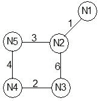

# 计算机网络|第 3 集

> 原文:[https://www.geeksforgeeks.org/computer-networks-set-3/](https://www.geeksforgeeks.org/computer-networks-set-3/)

GATE 2011 CS 考试中提出了以下问题。

**1)第 4 层防火墙(可以查看所有协议报头直至传输层的设备)无法**
(A)在晚上 9:00 和早上 5:00
期间阻止 HTTP 流量(B)阻止所有 ICMP 流量
(C)阻止来自特定 IP 地址的传入流量，但允许来自同一 IP 的传出流量
(D)在晚上 9:00 和早上 5:00 期间阻止来自多用户系统上特定 IP 地址的特定用户的 TCP 流量

答(A)
HTTP 是应用层协议。由于防火墙位于第 4 层，因此它无法阻止 HTTP 数据。

**2)考虑与邮件相关的不同活动。**

```
   m1:Send an email from a mail client to mail server
   m2:Download an email from mailbox server to a mail client
   m3:Checking email in a web browser
```

**每个活动中哪个是适用级别的协议用户？**
(A) m1:HTTP，m2:SMTP，m3:POP
(B) m1:SMTP，m2:FTP，m3:HTTP
(C) m1:SMTP，m2:POP，m3:HTTP
(D) m1:POP，m2:SMTP，m3:IMAP

答案(C)
[简单邮件传输协议(SMTP)](http://en.wikipedia.org/wiki/Simple_Mail_Transfer_Protocol) 通常由用户客户端用于发送邮件。
[邮局协议](http://en.wikipedia.org/wiki/Post_Office_Protocol)被客户用于接收邮件。
在网页浏览器中查看邮件是一个简单的 HTTP 流程。

**3)考虑一个有五个节点的网络，从 N1 到 N5，如下图所示。**



**网络使用距离矢量路由距离矢量路由协议。一旦路线稳定下来，不同节点的距离矢量如下。**
**N1:(0、1、7、8、4)**
**N2:(1、0、6、7、3)**
**N3:(7、6、0、2、6)**
**N4:(8、7、2、0、4)**
**N5:(4、3、6、4、0)**
**每个距离矢量都是已知最佳路径的距离此外，所有链路都是对称的，并且成本在两个方向上都是相同的。在每一轮中，所有节点都与其各自的邻居交换距离矢量。然后所有节点更新它们的距离向量。在两轮之间，链路成本的任何变化都将导致两个事件节点仅改变其距离矢量中的那个条目。**

**连接 N2-N3 的成本降低到 2(双向)。在下一轮更新后，节点 N3 的新距离矢量会是多少？**
(A) (3、2、0、2、5)
(B) (3、2、0、2、6)
(C) (7、2、0、2、5)
(D) (7、2、0、2、6)

答案(A)
下一轮，每个节点都会与邻居收发距离向量，并更新其距离向量。
N3 将从 N2 接收(1，0，2，7，3)，并将到 N1 和 N5 的距离分别更新为 3 和 5。

**4)上一题更新后，N1-N2 的链接下去了。N2 将立即在其距离矢量中反映这种变化，作为成本。下一轮更新后，N3 的距离矢量对 N1 来说会是什么代价？**
(甲)3
(乙)9
(丙)10
(丁)∨

答案(C)
下一轮，N3 将获得从 N2 到 N1 的无限距离。它将接收从 N4 到 N1 的距离为 8。所以它将更新到 N1 的距离为 8 + 2。

**请参见**[**GATE Corner**](http://geeksquiz.com/gate-corner-2/)**查看往年所有论文/解答/说明、教学大纲、重要日期、笔记等。**

如果您发现任何答案/解释不正确，或者您想分享关于上述主题的更多信息，请写评论。