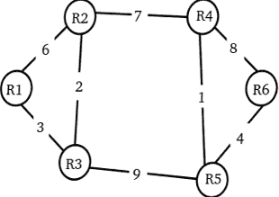

# 计算机网络|第 4 集

> 原文:[https://www.geeksforgeeks.org/computer-networks-set-4-2/](https://www.geeksforgeeks.org/computer-networks-set-4-2/)

GATE 2010 CS 考试中提出了以下问题。

**1)IP 数据报中的报头字段之一是生存时间(TTL)字段。以下哪种说法最能解释对该领域的需求？**
(A)可用于优先处理数据包
(B)可用于减少延迟
(C)可用于优化吞吐量
(D)可用于防止数据包循环

答案(D)
[生存时间](http://en.wikipedia.org/wiki/Time_to_live)可以认为是一个 IP 数据报在网络中存在的时间上限。TTL 字段的目的是避免无法传送的数据报不断循环的情况。

**2)假设计算机 A 和 B 的 IP 地址分别为 10.105.1.113 和 10.105.1.91，并且它们都使用相同的网络掩码 N。如果 A 和 B 应该属于同一个网络，下面给出的 N 值中哪一个不应该使用？**
(A)255 . 255 . 255 . 0
(B)255 . 255 . 255 . 128
(C)255 . 255 . 255 . 192
(D)255 . 255 . 255 . 224

(D)
A 和 B 的 IP 地址最后八位是 113 ( **011** 10001)和 91 ( **010** 11011)。选项(D)中的网络掩码在最后一个八位字节中设置了前三位。如果网络掩码设置了前 3 位，那么这些位在 A 和 B 中必须相同，但事实并非如此。简而言之，我们可以说选项(D)不是有效的网络掩码，因为用 A 和 B 的地址对其进行二进制“&”不会给出相同的网络地址。它必须是相同的地址，因为 A 和 B 在同一个网络上。详见[本](http://support.microsoft.com/kb/164015)。

**3)考虑一个网络，其中有 6 台路由器从 R1 到 R6，连接的链路权重如下图所示**
 
**所有路由器都使用基于距离矢量的路由算法来更新其路由表。每台路由器都从其路由表开始，该路由表被初始化为包含每个邻居的条目以及相应连接链路的权重。所有路由表稳定后，网络中有多少链路永远不会用于承载任何数据？**
(甲)4
(乙)3
(丙)2
(丁)1

答案(C)
我们可以逐个检查所有最短距离。当我们检查 Ri 的所有最短距离时，我们不需要检查它到 R0 到 Ri-1 的距离，因为网络图是无向的。
下面是所有节点的距离矢量。

从 R1 到 R2、R3、R4、R5 和 R6 的最短距离
R1 (5、3、12、12、16)
使用的链路:R1-R3、R3-R2、R2-R4、R3-R5、R5-R6

从 R2 到 R3、R4、R5 和 R6 的最短距离
R2 (2、7、8、12)
使用的链路:R2-R3、R2-R4、R4-R5、R5-R6

从 R3 到 R4、R5 和 R6 的最短距离
R3 (9，9，13)
使用的链路:R3-R2、R2-R4、R3-R5、R5-R6

从 R4 到 R5 和 R6 的最短距离
R4 (1，5)
使用的链路:R4-R5，R5-R6

从 R5 到 R6 的最短距离
R5 (4)
使用的链路:R5-R6

如果我们逐个标记所有使用过的链接，我们可以看到下面的链接从未使用过。
R1-R2
R4-R6

**4)假设将上一题中所有未使用链路的权重改为 2，再次使用距离矢量算法，直到所有路由表稳定。现在有多少链接仍未使用？**
(甲)0
(乙)1
(丙)2
(丁)3

回答(B)
未使用链接的权重()更改为下图后。

以下是所有节点的距离矢量
R1 (2，3，9，10，11)
使用的链路:R1-R2，R1-R3，R2-R4，R4-R5，R4-R6

R2 (2，7，8，9)
使用的链接:R2-R3、R2-R4、R4-R5、R4-R6

R3 (9，9，11)
使用的链路:R3-R2、R2-R4、R3-R5、R4-R6

R4 (1，2)
使用的链接:R4-R5、R4-R6

R5 (3)
使用的链接:R5-R4、R4-R6

如果我们逐个标记所有使用过的链接，可以看到除了下面的链接，所有链接都被使用过。
R5-R6

**所有往年论文/解答/说明、教学大纲、重要日期、笔记等请见[门角](http://geeksquiz.com/gate-corner-2/)。**

如果您发现任何答案/解释不正确，或者您想分享关于上述主题的更多信息，请写评论。