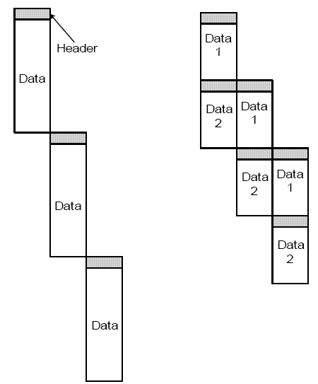
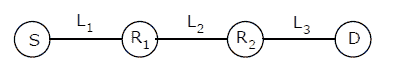

# 计算机网络|第 6 集

> 原文:[https://www.geeksforgeeks.org/computer-networks-set-6/](https://www.geeksforgeeks.org/computer-networks-set-6/)

GATE CS 2005 考试提出了以下问题。

**1)某机构拥有 B 类网络，希望形成 64 个部门的子网。子网掩码为:**
(a)255 . 255 . 0 . 0
(b)255 . 255 . 64 . 0
(c)255 . 255 . 128 . 0
(d)255 . 255 . 252 . 0

回答(d)
B 类网络中网络 ID 的大小为 16 位。所以第 16 位之后的位必须用来创建 64 个部门。总共需要 6 位来识别 64 个不同的部门。因此，子网掩码将是 255.255.252.0。

**2)在分组交换网络中，分组沿着具有两个中间节点的单个路径从源路由到目的地。如果消息大小为 24 字节，并且每个数据包包含 3 字节的报头，则最佳数据包大小为:**
(a)4
(b)6
(c)7
(d)9

答案(d)
如下图所示，由于并行性，将消息分成包可能会减少传输时间。

[](https://media.geeksforgeeks.org/wp-content/cdn-uploads/gate20051.png)

但是在某个限制之后，减小分组大小也可能增加传输时间。

下图显示了上述情况。

[](https://media.geeksforgeeks.org/wp-content/cdn-uploads/GATE2005CN12.png)

假设所有节点传输 1 字节的传输时间为 t。第一个数据包将花费时间=(数据包大小)*3*t。第一个数据包到达目的地后，由于并行性，剩余数据包将花费等于(数据包大小)*t 的时间。

```
If we use 4 bytes as packet size, there will be 24 packets
Total Transmission time = Time taken by first packet + 
                          Time taken by remaining packets 
                       = 3*4*t + 23*4*t = 104t

If we use 6 bytes as packet size, there will be 8 packets
Total Transmission time = 3*6*t + 7*6*t = 60t

If we use 7 bytes as packet size, there will be 6 packets
Total Transmission time = 3*7*t + 5*7*t = 56t

If we use 9 bytes as packet size, there will be 4 packets
Total Transmission time = 3*9*t + 3*9*t = 54t

```

**3)假设具有 48 位干扰信号的 10 Mbps 以太网的往返传播延迟为 46.4 ms，最小帧大小为:**
(a)94
(b)416
(c)464
(d)512

回答(c)
传输速度= 10Mbps。
往返传播延迟= 46.4 ms
最小帧大小=(往返传播延迟)*(传输速度)= 10*(10^6)*46.4*(10^-3)= 464 * 10^3 = 464 kbit

上述公式背后的概念是碰撞检测。考虑一种情况，其中节点 A 想要向另一个节点 b 发送帧。当节点 A 开始传输时，信号必须传播网络长度。在最坏的冲突情况下，节点 B 在节点 A 的帧信号到达它之前开始传输。节点 A 和节点 B 的帧的冲突信号必须传回节点 A，以便节点 A 检测到冲突已经发生。
信号从网络一端传播到另一端所需的时间称为传播延迟。在这种最坏的碰撞情况下，节点 A 检测到其帧被碰撞所需的时间是传播延迟的两倍。节点 A 的帧必须一路传到节点 B，然后冲突信号必须一路从节点 B 传回到节点 A，这个时间称为时隙。以太网节点必须在时隙内传输帧，才能检测到与该帧的冲突。这就是最小以太网帧大小的原因。

来源:[微软 Windows Server 2003 TCP/IP 协议和服务技术作者:约瑟夫·戴维斯](http://books.google.co.in/books?id=BS7vAFa07FoC&pg=PT38&lpg=PT38&dq=The+time+it+takes+for+a+signal+to+propagate+from+one+end+of+the+network+to+the+other+is+known+as+the+propagation+delay.+In+this+worst-case+collision+scenario,+the+time+that+it+takes+for+Node+A+to+detect+that+its+frame+has+been+collided+with+is+twice+the+propagation+delay.+Node+A%E2%80%99s+frame+must+travel+all+the+way+to+Node+B,+and+then+the+collision+signal+must+travel+all+the+way+from+Node+B+back+to+Node+A.&source=bl&ots=B60C9oOKo0&sig=gC3-Ce2q853deH2eYZCNAJmXMjk&hl=en&sa=X&ei=qQzoT_vEMsamrAevt-n2CA&ved=0CEsQ6AEwAQ#v=onepage&q=The%20time%20it%20takes%20for%20a%20signal%20to%20propagate%20from%20one%20end%20of%20the%20network%20to%20the%20other%20is%20known%20as%20the%20propagation%20delay.%20In%20this%20worst-case%20collision%20scenario%2C%20the%20time%20that%20it%20takes%20for%20Node%20A%20to%20detect%20that%20its%20frame%20has%20been%20collided%20with%20is%20twice%20the%20propagation%20delay.%20Node%20A%E2%80%99s%20frame%20must%20travel%20all%20the%20way%20to%20Node%20B%2C%20and%20then%20the%20collision%20signal%20must%20travel%20all%20the%20way%20from%20Node%20B%20back%20to%20Node%20A.&f=false)

**所有往年论文/解答/说明、教学大纲、重要日期、笔记等请见[门角](http://geeksquiz.com/gate-corner-2/)。**

如果您发现任何答案/解释不正确，或者您想分享关于上述主题的更多信息，请写评论