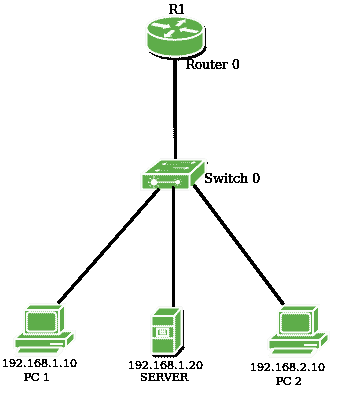
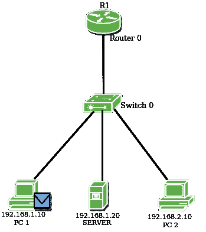
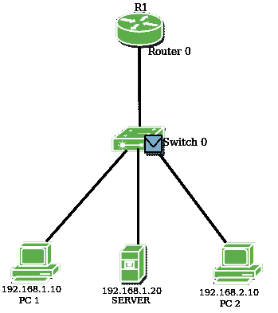
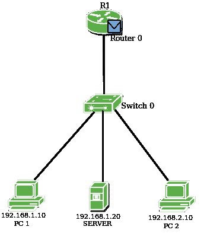
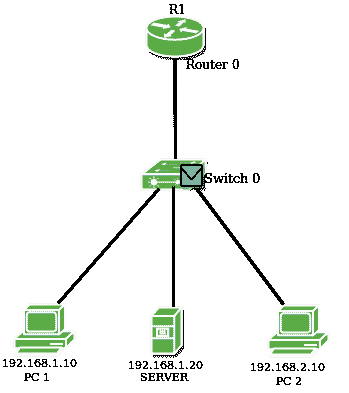
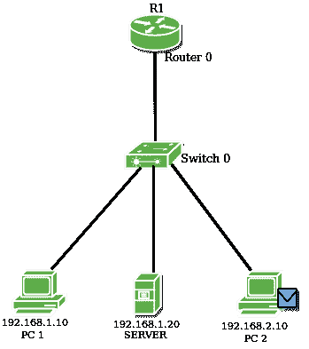

# 棒上路由器的配置

> 原文:[https://www . geeksforgeeks . org/棒上路由器配置/](https://www.geeksforgeeks.org/configuration-of-router-on-a-stick/)

先决条件–[接入端口和中继端口](https://www.geeksforgeeks.org/access-trunk-ports/)
交换机通过 VLAN(虚拟局域网)划分广播域。VLAN 是一个由单一广播域划分的广播域。交换机本身不会跨不同的虚拟局域网转发数据包。如果我们想让这些虚拟局域网相互通信，就要使用**VLAN 间路由**的概念。

**VLAN 内部路由:**

内部 VLAN 路由是一个过程，在这个过程中，我们使不同的虚拟局域网相互通信，而不管虚拟局域网在哪里(在同一个交换机或不同的交换机上)。内部 VLAN 路由可以通过第三层设备实现，即路由器或第三层交换机。当通过路由器完成 VLAN 间路由时，它被称为“棍上路由器”。

**棍子上的路由器:**

路由器的接口分为子接口，作为各自虚拟局域网的默认网关。

**配置:**



这是一个拓扑，其中有一台路由器、一台交换机和一些终端主机。交换机上创建了 2 个不同的虚拟局域网。路由器的接口分为两个子接口(因为有两个不同的虚拟局域网)，它们将作为各自虚拟局域网的默认网关。然后路由器将执行 VLAN 间路由，虚拟局域网将相互通信。

> 首先，我们将主机 PC1 的 IP 地址分配为 192.168.1.10/24，服务器 192.168.1.20/24，另一台主机 PC2 将手动分配 IP 地址 192.168.2.10/24。
> 
> 现在，我们将 fa0/0 的子接口设为 fa0/0.1 和 fa0/0.2，并在路由器的端口上分别分配 IP 地址为 192.168.1.1/24 和 192.168.2.1/24。

```
r1# int fa0/0.1
r1# encapsulation dot1q 2
r1# ip address 192.168.1.1  255.255.255.0
r1# int fa0/0.2
r1# encapsulation dot1q 3
r1# ip address 192.168.2.1 255.255.255.0
```

**注:**此处封装类型 **dot1q** 用于两个不同 VLAN 之间的帧标记。当交换机将一个 VLAN 的数据包转发到另一个时，它会在以太网报头中插入一个 VLAN。

现在，我们将在交换机上创建两个不同的虚拟局域网，即 VLAN 2 和 VLAN 3，命名为*人力资源部*和*销售部*。

```
Switch# vlan 2
Switch# name HR_dept
Switch# vlan 3
Switch# name sales_dept
```

```
Switch# int range fa0/1-2
Switch# switchport mode access
Switch# switchport access vlan 2
Switch# int fa0/3
Switch# switchport mode access
Switch# switchport access vlan 3
```

这里，我们已经将 VLAN 2 分别分配给特定的交换机端口 fa0/1、fa0/2 和 vlan 3。

**注意:** *int range fa0/1-2* 命令被使用，因为在单个 VLAN 中存在多个主机。

现在来检查 PC2 从 PC1 的可达性，我们将尝试从 PC1 PING PC2。









从上面的图中，我们可以看到数据包是由交换机传送到路由器的，因为现在广播域已经被交换机上存在的不同虚拟局域网划分了。因此，数据包将被传送到默认网关(因为 PC2 存在于不同的网络上)，然后到达目的地。