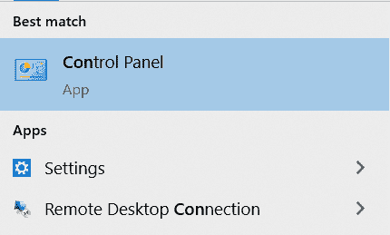
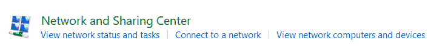
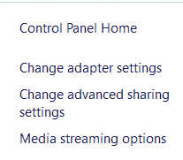
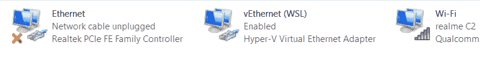
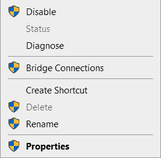
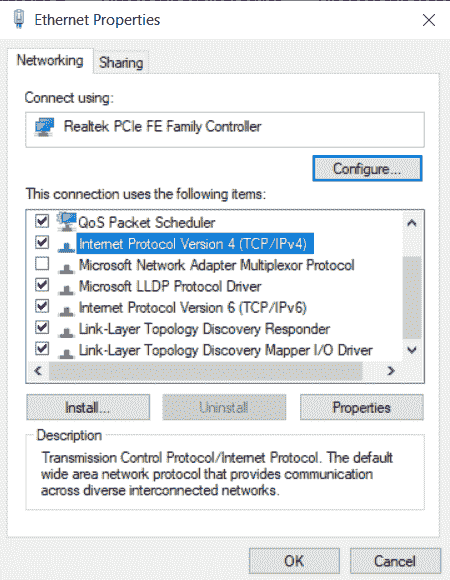
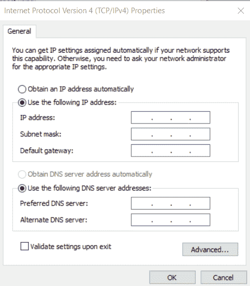
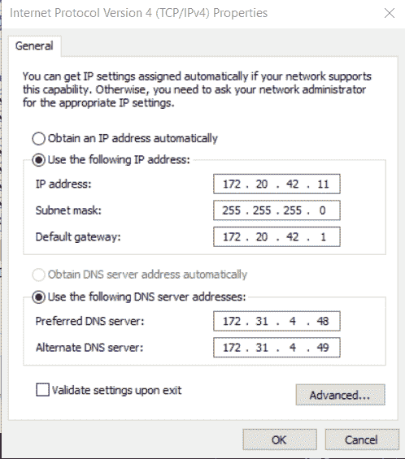

# 在 Windows 10 中配置 IP

> 原文:[https://www.geeksforgeeks.org/configure-ip-in-windows-10/](https://www.geeksforgeeks.org/configure-ip-in-windows-10/)

**先决条件:** [**IP 地址**](https://www.geeksforgeeks.org/structure-and-types-of-ip-address/#:~:text=An%20IP%20address%20represents%20an,or%20through%20a%20local%20network.)**[**子网掩码**](https://www.geeksforgeeks.org/role-of-subnet-mask/)**[**DNS 服务器**](https://www.geeksforgeeks.org/domain-name-system-dns-in-application-layer/) **。******

******简介:**
IP 地址基本上是网络上某个设备的标识符，它有助于在网络上特定设备之间发送和接收信息。IP 地址是由句点分隔的一串数字。IP 地址表示为一组四个数字，例如 192.168.0.10。集合中的每个数字的范围可以从 0 到 255。因此，完整的 IP 寻址范围从 0.0.0.0 到 255.255.255.255。****

****互联网需要一种方法来区分不同的计算机、路由器和网站。IP 地址提供了这样做的一种方式，并构成了互联网工作方式的一个重要部分。****

****让我们看看知识产权在幕后是如何运作的–****

1.  ****您的设备通过首先连接到连接到互联网的网络来间接连接到互联网，然后该网络授予您的设备访问互联网的权限。****
2.  ****当你在家时，这个网络可能就是你的互联网服务提供商。在工作中，这将是你的公司网络。****
3.  ****您的 IP 地址是由您的 ISP 分配给您的设备的。****
4.  ****你的互联网活动通过互联网服务提供商，他们用你的 IP 地址把它路由回给你。由于他们让您访问互联网，因此他们的职责是为您的设备分配一个 IP 地址。****
5.  ****但是，您的 IP 地址可以更改。例如，打开或关闭调制解调器或路由器可以改变它。或者你可以联系你的 ISP，他们可以为你更换。****
6.  ****当你外出旅行时，你带着你的设备，你的家庭 IP 地址不在身边。这是因为您将使用另一个网络(酒店、机场或咖啡店等的无线网络)。)访问互联网，并将使用酒店、机场或咖啡店的 ISP 分配给您的不同(和临时)IP 地址。****

****本文介绍了配置 IP 以连接到互联网的步骤。****

******要遵循的步骤:**
1。转到搜索栏并搜索控制面板。一旦它出现，然后双击它。将出现一个对话框。****

********

****2.在对话框中，找到“网络和互联网”选项并点击它。****

********

****3.将出现一个新的菜单，在左侧显示“网络和共享中心”。点击它。****

********

****4.单击菜单左侧的“更改适配器设置”。****

********

****5.右键单击您希望计算机连接到的所需网络。如果您找不到所需的网络，请执行以下操作–****

*   ****检查路由器是否打开。****
*   ****检查以太网线路是否正确插入。****
*   ****如果您正在使用热点，请检查该设备是否对其他设备可见。您可以前往手机的共享热点设置进行检查。****

********

****6.点击“属性”。****

********

****7.选择 IPv4。
IP v4 地址是一个 32 位数字，唯一标识机器上的网络接口。它被广泛使用，即使它的后继协议，即 IPv6 更有效。****

********

****8.转到“属性”并单击“使用以下 IP 地址”单选按钮手动添加 IP 地址。****

********

****9.输入您的互联网服务提供商提供的详细信息。这些包括–****

*   ****[**IP 地址**](https://www.geeksforgeeks.org/structure-and-types-of-ip-address/)**–**
    IP 地址是一个唯一的地址，用于识别互联网或本地网络上的设备。IP 代表“互联网协议”，这是一套管理通过互联网或本地网络发送的数据格式的规则。****
*   ****[**子网掩码**](https://www.geeksforgeeks.org/role-of-subnet-mask/)**–**
    子网掩码用于将一个 IP 地址分成两部分。一部分标识主机(计算机)，另一部分标识它所属的网络。****
*   ****[**DNS 服务器**](https://www.geeksforgeeks.org/domain-name-system-dns-in-application-layer/)**–**
    它基本上是一个把 IP 地址映射到自己域名的互联网电话簿。****

********