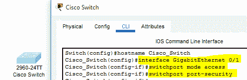
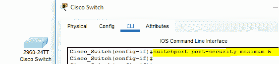
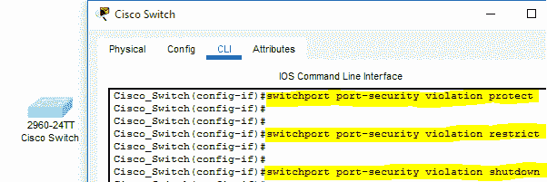
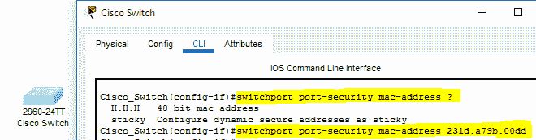
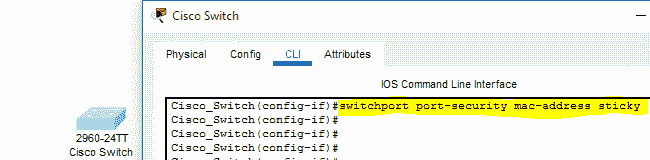
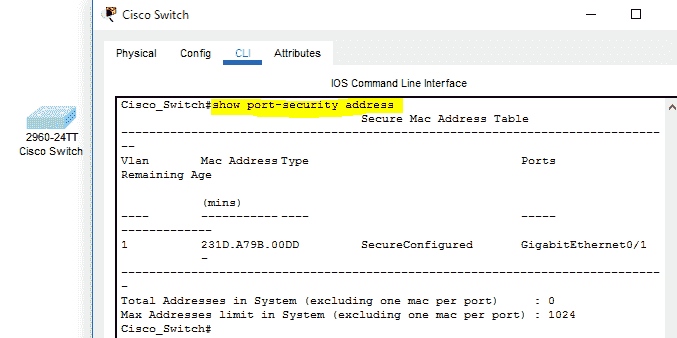
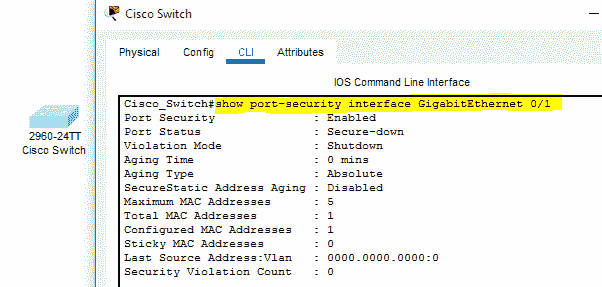

# 在思科 IOS 交换机上配置端口安全性

> 原文:[https://www . geesforgeks . org/configuration-port-security-on-Cisco-IOs-switch/](https://www.geeksforgeeks.org/configuring-port-security-on-cisco-ios-switch/)

**概述:**
交换机是一种网络设备，被配置为连接和维护各种设备之间的通信通道。以太网端口位于交换机上，用于连接网络中的设备，如路由器、计算机系统和笔记本电脑。为了连接所有这些网络，使用以太网电缆。交换机使用这些连接设备的媒体访问控制地址来识别它们，并向它们提供所请求的服务。保护这些端口是一项至关重要的任务，这样只有授权用户才能通过交换机将其系统连接到网络中。在配置组织网络中的任何交换机之前，都要考虑端口安全性，因为它可以确保网络中连接了可信且经过授权的用户。思科 IOS 交换机的此安全功能只能在接入端口上配置，默认情况下，此功能是禁用的。

**在思科交换机上启用端口安全:**
以下提供的步骤和命令可用于在思科交换机上启用端口安全，确保数据的机密性、真实性和完整性得到维护。

**配置-1 :**
**港口安全配置–**

**步骤-1 :**
首先，访问思科交换机的命令行接口，使用“接口千兆以太网 0/1”命令连接一个端口千兆以太网 0/1。然后，执行“交换机端口模式访问”和“交换机端口端口-安全性”命令，分别将端口模式更改为访问和启用安全性。无论何时连接任何其他端口，并且需要在其上启用端口安全，都必须执行这些命令。

**步骤-2 :**
默认情况下，Cisco 交换机在单个端口上只允许 1 个 MAC 地址，如果任何其他设备尝试使用该端口进行连接，交换机会自动关闭其端口以限制未经授权的访问。为了增加单个端口上的用户数量，将执行“switchport 端口-安全最大值 5”命令。这样，现在五个设备可以连接到一个端口并执行它们的功能。

**步骤-3 :**
思科 IOS 交换机提供了一项安全功能，即所谓的违规。此功能用于定义当端口安全受到侵犯时将由交换机执行的操作。可以使用三种主要的预定义模式，即保护、限制和关闭。

1.  **保护模式–**
    在此模式下，来自定义的 MAC 地址的数据包仅在网络内传输。

2.  **限制模式–**
    当启用此模式且违反端口安全时，所有数据传输都会被阻止，数据包也会被丢弃。此外，还会同时生成日志，以检查哪台设备与思科交换机连接。

3.  **关闭模式–**
    该模式默认启用，端口状态更改为错误禁用，这将限制连接的设备执行任何功能，并禁用该特定端口。

预定义安全违规模式的配置

**配置-2 :**
**媒体访问控制地址端口安全–**

**步骤-1 :**
要仅允许具有定义的媒体访问控制地址的设备与思科交换机连接，可以使用 **'** 交换机端口端口安全媒体访问控制地址媒体访问控制地址 _ 设备地址'命令。成功执行此命令后，具有指定媒体访问控制地址的设备将仅被交换机授权通过可用的以太网端口进行连接。

**Step-2:**
MAC 地址命令的另一种模式称为粘性。启用此模式可允许交换机学习新的媒体访问控制地址并将其存储在内存中。交换机自动收集并存储连接设备的媒体访问控制地址。

**配置-3 :**
**检查端口安全配置–**

**步骤-1 :**
要检查和分析交换机上的端口安全配置，用户需要访问命令行界面的特权模式。执行“显示端口安全地址”命令来检查当前端口安全状态。

检查端口安全状态的命令

**步骤-2 :**
如果用户想要检查交换机上可用的特定接口的端口安全性，那么可以使用‘显示端口安全性接口 interface _ name’命令。

**步骤-3 :**
在本场景中，配置了千兆以太网接口上的安全性，并显示了下面执行的命令供参考。

特定端口的端口安全状态