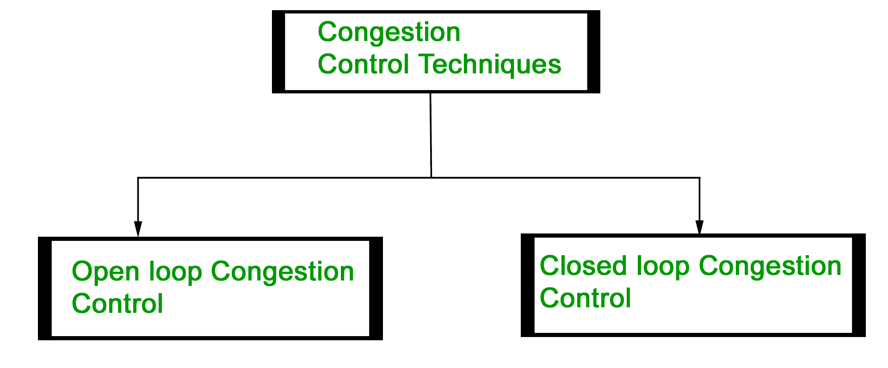
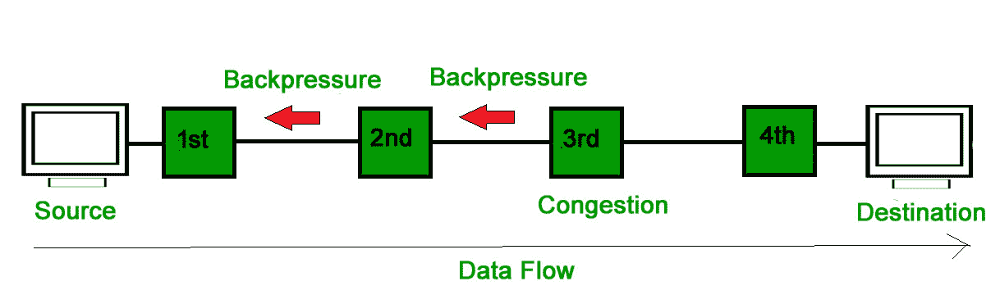
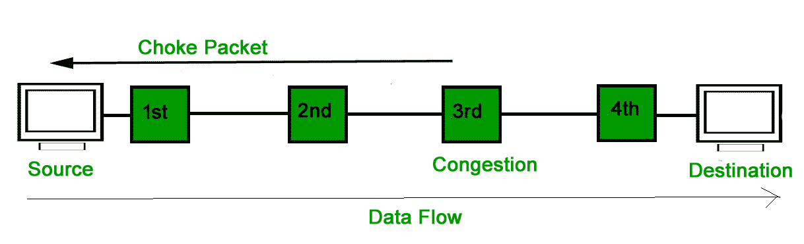

# 计算机网络中的拥塞控制技术

> 原文:[https://www . geeksforgeeks . org/拥塞控制-计算机网络技术/](https://www.geeksforgeeks.org/congestion-control-techniques-in-computer-networks/)

拥塞控制是指用于控制或防止拥塞的技术。拥塞控制技术可以大致分为两类:

### **开环拥塞控制**

开环拥塞控制策略用于在拥塞发生之前防止拥塞。拥塞控制由源或目的地处理。

**开环拥塞控制采用的策略–**

1.  **重传策略:**
    这是处理数据包重传的策略。如果发送方认为发送的数据包丢失或损坏，则需要重新传输该数据包。这种传输可能会增加网络中的拥塞。
    为了防止拥塞，重传定时器必须设计成防止拥塞并且还能够优化效率。

2.  **窗口策略:**
    发送方的窗口类型也可能影响拥塞。“返回”窗口中的几个数据包会被重新发送，尽管有些数据包可能会在接收端成功接收。这种重复可能会增加网络中的拥塞，并使情况变得更糟。
    因此，应采用选择性重复窗口，因为它会发送可能已丢失的特定数据包。

3.  **丢弃策略:**
    路由器采用的好的丢弃策略是，路由器可以防止拥塞，同时部分丢弃损坏的或不太敏感的包，并且还能够保持消息的质量。
    在音频文件传输的情况下，路由器可以丢弃不太敏感的数据包，以防止拥塞，并保持音频文件的质量。

4.  **确认策略:**
    由于确认也是网络中负载的一部分，因此接收方强加的确认策略也可能会影响拥塞。可以使用几种方法来防止与确认相关的拥塞。
    接收方应该发送 N 个数据包的确认，而不是发送单个数据包的确认。只有在必须发送数据包或定时器到期时，接收器才应发送确认。

5.  **接纳政策:**
    在接纳政策中，应该使用一种机制来防止拥堵。流中的交换机在进一步传输网络流之前，应该首先检查网络流的资源需求。如果网络中存在拥塞的可能性，路由器应该拒绝建立虚拟网络连接，以防止进一步拥塞。

采用上述所有策略是为了在网络中发生拥塞之前防止拥塞。

### **闭环拥塞控制**

闭环拥塞控制技术用于在拥塞发生后处理或缓解拥塞。不同的协议使用几种技术；其中一些是:

1.  **Backpressure :** 
    Backpressure is a technique in which a congested node stops receiving packets from upstream node. This may cause the upstream node or nodes to become congested and reject receiving data from above nodes. Backpressure is a node-to-node congestion control technique that propagate in the opposite direction of data flow. The backpressure technique can be applied only to virtual circuit where each node has information of its above upstream node. 

1.  在上图中，第三个节点拥塞，并停止接收数据包，因此第二个节点可能会因输出数据流变慢而变得拥塞。类似地，第一个节点可能会拥塞，并通知源节点减速。

2.  **阻塞包技术:**
    阻塞包技术既适用于虚拟网络，也适用于数据报子网。阻塞包是节点发送给源节点的通知拥塞的包。每台路由器监控其资源和每条输出线路的利用率。每当资源利用率超过管理员设置的阈值时，路由器会直接向源发送阻塞数据包，向其提供反馈以减少流量。数据包经过的中间节点不会收到拥塞警告。

3.  **隐式信令:**
    在隐式信令中，拥塞的节点和源之间没有通信。消息来源猜测网络中存在拥塞。例如，当发送方发送了几个数据包，并且有一段时间没有确认时，一个假设是存在拥塞。

4.  **显式信令:**
    在显式信令中，如果节点遇到拥塞，它可以显式地向源或目的地发送数据包，以通知拥塞。阻塞包和显式信令的区别在于，信号包含在携带数据的包中，而不是像阻塞包技术那样创建不同的包。
    显性信号可以发生在正向或反向。
    *   **前向信令:**在前向信令中，向拥塞方向发送信号。目的地被警告有拥堵。在这种情况下，接收器采用策略来防止进一步的拥塞。
    *   **反向信令:**在反向信令中，在拥塞的相反方向发送信号。源头被警告有拥堵，需要减速。

**参考文献:**

[www.idc-online.com](http://www.idc-online.com/technical_references/pdfs/data_communications/Congestion_Control.pdf)