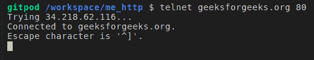
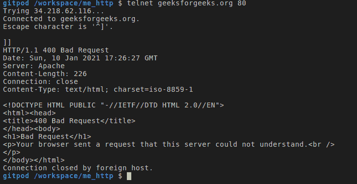

# 在 TCP 协议上构造一个简单的 HTTP 请求

> 原文:[https://www . geesforgeks . org/construct-a-simple-http-request on-TCP-protocol/](https://www.geeksforgeeks.org/construct-a-simple-http-request-on-tcp-protocol/)

**HTTP 请求:**

*   [HTTP](https://www.geeksforgeeks.org/difference-between-http-and-https/) 消息是服务器和客户端之间交换数据的方式。在这种情况下，有两种类型的消息，其中一种是 HTTP 客户端请求，另一种是来自服务器的响应。
*   文本形式的消息，以 [ASCII](https://www.geeksforgeeks.org/program-print-ascii-value-character/) 形式编码，跨越多行。在 HTTP/1.1 和早期版本的协议中，消息是通过连接公开发送的。在 HTTP/2 中，曾经人类可读的消息现在被分成 HTTP 帧，提供了优化和性能改进。
*   现在让我们通过实际创建一个 HTTP 请求和响应来看看它的组成部分。telnet 客户端帮助我们连接到互联网上的其他计算机。格式为 **telnet** 、**主机名**和**端口**。



**注–**

您也可以使用这个在线 telnet 客户端。

```
Opening a TCP connection to server via telnet
```

**在** [**上构建简单 HTTP 请求的步骤**](https://www.geeksforgeeks.org/tcp-ip-model/) **:**

**第一步:**

**HTTP** 的默认端口是 **80** ，telnet 命令让我们连接到[**geeksforgeeks.org**](https://www.geeksforgeeks.org/)**服务器上的 HTTP 端口。我们现在可以开始向服务器发送 HTTP 请求了。**

****第 2 步:****

**我们如何创建一个 HTTP 请求？让我们在这里查看 HTTP 协议定义文档，了解如何构建 HTTP 请求。**

```
**Request :**
    A request message from a client to server includes, within the 
    first line of that message, the method to be applied to the resource,
    the identifier of the resource, and the protocol version in use.

        Request    = Request-Line
                 *((  general-header
                 |    request-header
                 |    entity-header ) CRLF )
                CRLF
                [ message-body ]        

**Request-Line : **    
    The Request-Line begins with a method token, followed by the 
    Request-URL and the protocol version, and ending the CRLF.The
    elements are seperated by SP characters. No CR or LF is allowed
    except in the final CRLF sequence.

        Request-Line = Method SP Request-URI SP HTTP_Version CRLF
```

****HTTP 请求规范:****

**下面给出了显示 HTTP 请求规范的截图，供您参考。**

****

****HTTP 请求-响应组件:****

*   **从上图中，HTTP 通信的不同部分是:**
*   **请求行(HTTP 请求)**
*   **状态行和响应标题(HTTP 响应)**
*   **响应正文(HTTP 响应)**
*   **试着弄清楚这些响应头的含义&它们的用途是什么——首先，请参见最后修改、内容长度、内容类型**
*   **如果我们分析在上述通信过程中传入/传出计算机的网络数据包，我们将能够理解一些事情(192.168.43.197 是客户端计算机& 192.241.136.170 是服务器)**
*   **客户端向服务器发起一个 TCP 连接请求(第 1 行)——这是在我们执行 telnet 命令时执行的**
*   **HTTP 的通信是使用这个已建立的 TCP 连接进行的(参见下面列出了用于资源传输的协议的部分)**
*   **客户端向服务器发送 HTTP 请求行(第 6 行)，服务器用 HTTP 状态代码和数据进行响应，正如我们在前面的 telnet 输出中看到的**

****注–****

**我们还可以使用 Wire shark 分析网络数据包，这将由您完成。**